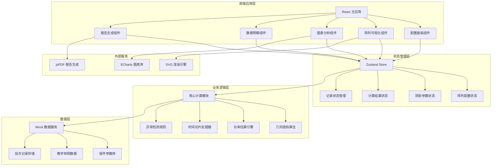

## 1. 架构设计



## 2. 技术描述

- **前端框架**：React@18 + TypeScript + Vite@5
- **状态管理**：Zustand@4（轻量级状态管理，支持跨组件同步）
- **样式方案**：TailwindCSS@3 + SCSS 模块
- **图表库**：ECharts@5（折线图、柱状图、饼图）
- **可视化**：原生 SVG + CSS 动画（光伏阵列渲染）
- **报告生成**：jsPDF + html2canvas
- **UI 组件**：Headless UI + 自定义组件库
- **后端**：无后端，纯前端 Mock 数据
- **数据存储**：LocalStorage + 内存状态

## 3. 路由定义

| 路由 | 页面 | 说明 |
|------|------|------|
| / | 主工作台 | 核心交互页面，包含所有功能模块 |
| /report/:batchId | 报告预览 | 查看指定批次的分析报告 |
| /help | 帮助文档 | 教学原理说明和操作指南 |

## 4. 核心数据模型

### 4.1 TypeScript 类型定义

```typescript
// 光伏组件配置
interface PVModule {
  id: string;
  position: { row: number; col: number };
  ratedPower: number;      // 额定功率 W
  efficiency: number;       // 转换效率 %
  bypassDiode: boolean;     // 是否有旁路二极管
  diodeCount: number;       // 二极管数量
}

// 阵列配置
interface ArrayConfig {
  rows: number;
  cols: number;
  connectionType: 'series' | 'parallel' | 'hybrid';  // 串联/并联/混合
  seriesPerString: number;  // 每串组件数
  parallelStrings: number;  // 并联串数
  modules: PVModule[];
}

// 阴影配置
interface ShadowConfig {
  sunAltitude: number;      // 太阳高度角 0-90°
  sunAzimuth: number;       // 太阳方位角 0-360°
  obstacles: Obstacle[];    // 遮挡物列表
}

interface Obstacle {
  id: string;
  type: 'rectangle' | 'circle' | 'polygon';
  position: { x: number; y: number };
  size: { width: number; height: number };
  opacity: number;
}

// 遮挡计算结果
interface ShadingResult {
  moduleId: string;
  shadingRate: number;      // 遮挡率 0-1
  affectedCells: number[];  // 受影响的电池片索引
}

// 功率计算结果
interface PowerResult {
  timestamp: number;
  moduleId: string;
  actualPower: number;      // 实际功率 W
  theoreticalPower: number; // 理论功率 W
  lossRate: number;         // 损失率 %
  lossReason: 'shading' | 'mismatch' | 'diode' | 'other';
  bypassDiodeActive: boolean;
}

// 记录状态
type RecordStatus = 'normal' | 'supplement' | 'withdrawn' | 'duplicate';
type DataQuality = 'normal' | 'pending' | 'anomaly';

// 分析记录
interface AnalysisRecord {
  id: string;
  batchId: string;
  timestamp: number;
  status: RecordStatus;
  quality: DataQuality;
  arrayConfig: ArrayConfig;
  shadowConfig: ShadowConfig;
  shadingResults: ShadingResult[];
  powerResults: PowerResult[];
  totalPower: number;
  totalLoss: number;
  anomalyFlags: string[];   // 异常标记
  remarks: string;
  createdAt: string;
  updatedAt: string;
}

// 批次信息
interface BatchInfo {
  id: string;
  name: string;
  recordCount: number;
  createdAt: string;
  status: 'draft' | 'finalized';
}
```

### 4.2 异常检测规则

```typescript
// 异常检测规则定义
const anomalyRules = {
  // 阴影时间错误：与日照时段不符
  SHADOW_TIME_ERROR: (record: AnalysisRecord) => {
    const hour = new Date(record.timestamp).getHours();
    return hour < 6 || hour > 18;
  },
  
  // 串并联混淆：配置与计算结果不符
  CONNECTION_MISMATCH: (record: AnalysisRecord) => {
    const { connectionType, seriesPerString, parallelStrings } = record.arrayConfig;
    // 检测电压电流逻辑矛盾
    return checkConnectionLogic(connectionType, seriesPerString, parallelStrings);
  },
  
  // 功率重复扣减：损失率异常
  DUPLICATE_LOSS: (record: AnalysisRecord) => {
    const totalLossRate = record.powerResults.reduce((sum, r) => sum + r.lossRate, 0);
    return totalLossRate > 100;  // 总损失率超过100%
  },
  
  // 缺字段检测
  MISSING_FIELDS: (record: AnalysisRecord) => {
    return !record.arrayConfig || !record.shadowConfig || !record.powerResults.length;
  },
  
  // 重复提交检测
  DUPLICATE_SUBMISSION: (record: AnalysisRecord, allRecords: AnalysisRecord[]) => {
    return allRecords.some(r => 
      r.id !== record.id &&
      r.batchId === record.batchId &&
      Math.abs(r.timestamp - record.timestamp) < 60000 &&  // 1分钟内
      r.totalPower === record.totalPower
    );
  }
};
```

## 5. 核心算法模块

### 5.1 几何遮挡算法

```typescript
/**
 * 计算组件遮挡率
 * @param modulePosition 组件位置
 * @param obstacles 遮挡物列表
 * @param sunAngle 太阳角度 { altitude, azimuth }
 * @returns 遮挡率 0-1
 */
function calculateShadingRate(
  modulePosition: { x: number; y: number; width: number; height: number },
  obstacles: Obstacle[],
  sunAngle: { altitude: number; azimuth: number }
): number {
  // 1. 计算阴影投影方向和长度
  const shadowLength = calculateShadowLength(sunAngle.altitude);
  const shadowDirection = calculateShadowDirection(sunAngle.azimuth);
  
  // 2. 计算每个遮挡物在组件上的投影
  const shadowAreas = obstacles.map(obstacle => 
    projectObstacleShadow(obstacle, shadowLength, shadowDirection)
  );
  
  // 3. 计算投影与组件的交集面积
  const totalIntersection = shadowAreas.reduce((sum, shadow) => 
    sum + calculateIntersectionArea(modulePosition, shadow), 0
  );
  
  // 4. 返回遮挡率
  return Math.min(1, totalIntersection / (modulePosition.width * modulePosition.height));
}
```

### 5.2 功率估算引擎

```typescript
/**
 * 计算光伏阵列总功率
 * @param arrayConfig 阵列配置
 * @param shadingResults 遮挡结果
 * @param irradiance 辐照度 W/m²
 * @returns 功率结果数组
 */
function calculateArrayPower(
  arrayConfig: ArrayConfig,
  shadingResults: ShadingResult[],
  irradiance: number = 1000
): PowerResult[] {
  return arrayConfig.modules.map(module => {
    const shading = shadingResults.find(s => s.moduleId === module.id);
    const shadingRate = shading?.shadingRate || 0;
    
    // 基础功率计算
    const theoreticalPower = module.ratedPower * (irradiance / 1000);
    
    // 考虑遮挡损失
    let actualPower = theoreticalPower * (1 - shadingRate * 0.9);  // 遮挡损失系数
    
    // 旁路二极管效应
    let bypassDiodeActive = false;
    if (module.bypassDiode && shadingRate > 0.3) {
      bypassDiodeActive = true;
      // 旁路二极管导通，减少失配损失
      actualPower = theoreticalPower * (1 - shadingRate * 0.5);
    }
    
    return {
      moduleId: module.id,
      actualPower,
      theoreticalPower,
      lossRate: ((theoreticalPower - actualPower) / theoreticalPower) * 100,
      lossReason: shadingRate > 0.5 ? 'shading' : 'mismatch',
      bypassDiodeActive
    };
  });
}
```

## 6. 状态同步机制

### 6.1 筛选联动逻辑

```typescript
// Zustand Store 设计
interface AppState {
  // 筛选条件
  filters: {
    dateRange: [Date, Date];
    status: RecordStatus[];
    quality: DataQuality[];
    batchId: string;
  };
  
  // 数据
  records: AnalysisRecord[];
  filteredRecords: AnalysisRecord[];
  
  // 操作
  setFilters: (filters: Partial<AppState['filters']>) => void;
  updateFilteredRecords: () => void;
  addRecord: (record: AnalysisRecord) => void;
  updateRecord: (id: string, updates: Partial<AnalysisRecord>) => void;
}

// 筛选变化时自动更新图表和表格
const useStore = create<AppState>((set, get) => ({
  setFilters: (filters) => {
    set(state => ({ filters: { ...state.filters, ...filters } }));
    get().updateFilteredRecords();
  },
  
  updateFilteredRecords: () => {
    const { records, filters } = get();
    const filtered = records.filter(record => {
      // 应用所有筛选条件
      return matchDateRange(record, filters.dateRange)
        && filters.status.includes(record.status)
        && filters.quality.includes(record.quality)
        && (filters.batchId ? record.batchId === filters.batchId : true);
    });
    set({ filteredRecords: filtered });
  }
}));
```

## 7. 报告生成规范

### 7.1 文件名格式

```
光伏阴影分析报告_批次{批次号}_{YYYYMMDD}_{HHMMSS}.pdf
例：光伏阴影分析报告_批次B001_20250530_143022.pdf
```

### 7.2 报告内容结构

1. **页眉**：报告标题、批次号、生成时间、水印
2. **概览**：总发电量、总损失率、异常数量统计
3. **阵列配置**：组件布局、串并联方式、二极管配置
4. **阴影分析**：遮挡热力图、遮挡率统计表
5. **功率曲线**：时间-功率图表、损失分解饼图
6. **异常清单**：待确认列表、异常列表、备注说明
7. **页脚**：页码、数据来源、免责声明
