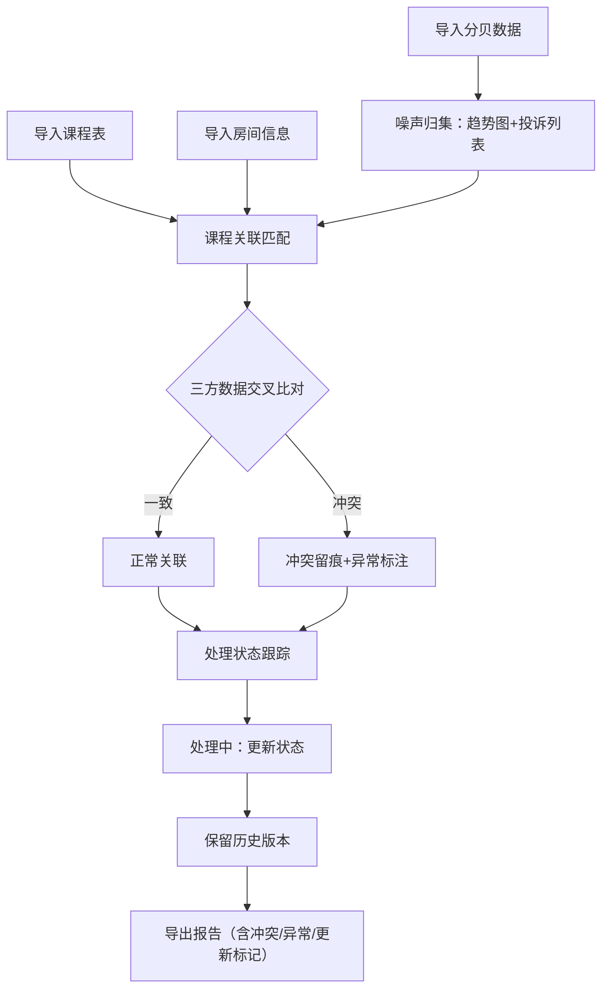
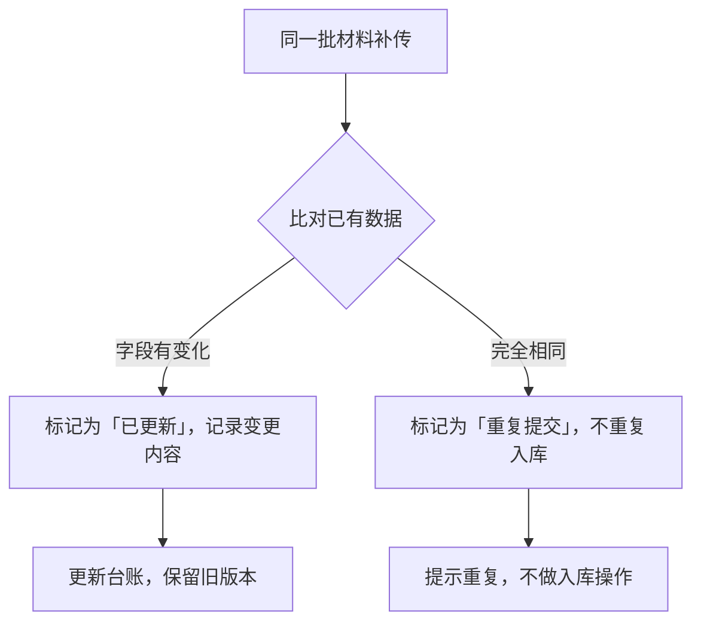

## 1. 产品概述

排练室噪声投诉台账——面向音乐学校教师的噪声管理工具，将分贝记录、房间信息与课程安排三源数据关联对齐，实现投诉的归集、冲突检测、处理跟踪与报告导出，解决排练扰民投诉中信息散落、证据链断裂、重复提交混淆的问题。

## 2. 核心功能

### 2.1 用户角色

| 角色 | 使用方式 | 核心权限 |
|------|----------|----------|
| 教师/管理员 | 直接使用 | 导入数据、查看图表与明细、处理冲突、导出报告 |

### 2.2 功能模块

1. **噪声归集页**：分贝数据导入（含样例）、噪声趋势图表、投诉列表与筛选、重复/更新标记
2. **课程关联页**：课程表导入、房间信息补全、三方数据冲突检测与留痕、关联匹配明细
3. **处理状态页**：投诉处理流程跟踪、时间错位/编号错误标注、历史版本保留、报告导出（含冲突信息）

### 2.3 页面详情

| 页面名称 | 模块名称 | 功能描述 |
|----------|----------|----------|
| 噪声归集 | 数据导入 | 支持导入分贝CSV/JSON样例数据，自动识别字段；支持同一批材料补传，标记更新项与重复项 |
| 噪声归集 | 噪声趋势图 | 按时间/房间展示分贝趋势折线图，高亮超标时段，点击可下钻到具体投诉明细 |
| 噪声归集 | 投诉列表 | 表格展示所有投诉记录，支持按房间/日期/分贝区间筛选，每条标记是否关联了课程和房间 |
| 课程关联 | 课程表导入 | 导入课程安排CSV/JSON，自动关联房间编号与时段 |
| 课程关联 | 房间信息补全 | 导入/编辑房间编号、位置、隔音等级等，为分贝数据补证据 |
| 课程关联 | 冲突检测 | 三方数据（分贝、房间、课程）交叉比对，检测时间错位、房间编号错误、数据矛盾，冲突先留痕再判断 |
| 处理状态 | 处理跟踪 | 展示每条投诉的处理状态（待处理/处理中/已处理），处理结果覆盖旧版时保留历史版本 |
| 处理状态 | 异常标注 | 自动标注时间错位、房间编号异常、三方不一致等异常项 |
| 处理状态 | 报告导出 | 导出CSV/JSON报告，内容包含冲突信息、异常标注、更新/重复标记，确保不遗漏 |

## 3. 核心流程

用户通过导入分贝数据建立投诉台账主体，再导入房间信息和课程表作为补充证据。系统自动进行三方数据交叉比对，检测冲突并留痕。用户可逐条处理投诉，更新处理状态，系统保留历史版本。最终用户可导出包含全部冲突与异常信息的完整报告。

数据补传流程：

## 4. 用户界面设计

### 4.1 设计风格

- **主色调**：深灰底色（#1a1a2e）搭配琥珀色强调（#e8a838），模拟音频设备VU表的工业感
- **辅助色**：暗红（#c0392b）用于超标/异常警示，暗绿（#27ae60）用于正常/已处理状态
- **按钮风格**：圆角矩形，略带阴影，hover时微亮
- **字体**：标题使用等宽字体（JetBrains Mono），正文使用无衬线字体（Noto Sans SC）
- **布局风格**：左侧精简导航栏 + 右侧主内容区，卡片式模块布局
- **图标风格**：线性图标，与lucide-react一致

### 4.2 页面设计概览

| 页面名称 | 模块名称 | UI元素 |
|----------|----------|--------|
| 噪声归集 | 数据导入 | 拖拽上传区域、导入按钮、样例数据一键加载按钮、导入结果摘要（新增/更新/重复计数） |
| 噪声归集 | 噪声趋势图 | 分贝趋势折线图（按房间着色）、超标线标注、时段筛选器、点击下钻弹窗 |
| 噪声归集 | 投诉列表 | 数据表格（房间、日期、分贝值、关联状态标签）、行内筛选器、分页、点击行展开明细 |
| 课程关联 | 课程表/房间导入 | 两组导入区域、匹配进度指示、导入结果摘要 |
| 课程关联 | 冲突检测面板 | 冲突列表卡片（冲突类型标签、涉及数据源、详情展开）、一键留痕按钮 |
| 处理状态 | 处理跟踪列表 | 状态标签列、操作按钮（更新状态）、历史版本折叠面板 |
| 处理状态 | 异常标注 | 行内红/黄标记、异常原因tooltip |
| 处理状态 | 报告导出 | 导出按钮（CSV/JSON切换）、导出预览摘要（含异常/冲突统计） |

### 4.3 响应式设计

- 桌面端优先设计，侧边栏可折叠
- 平板端：侧边栏收为图标，主内容区自适应
- 移动端：侧边栏变为底部Tab栏，图表简化，表格改为卡片列表

### 4.4 无3D场景
