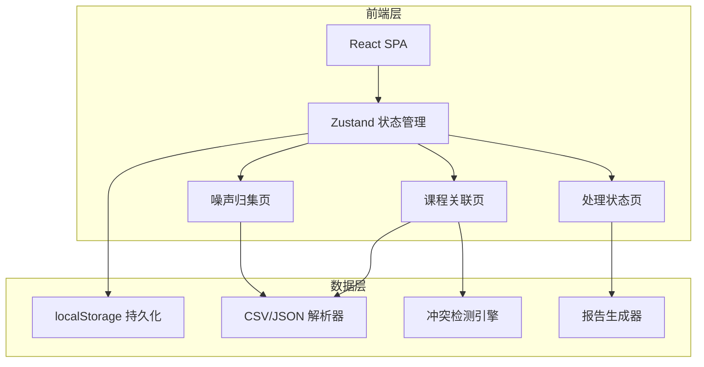
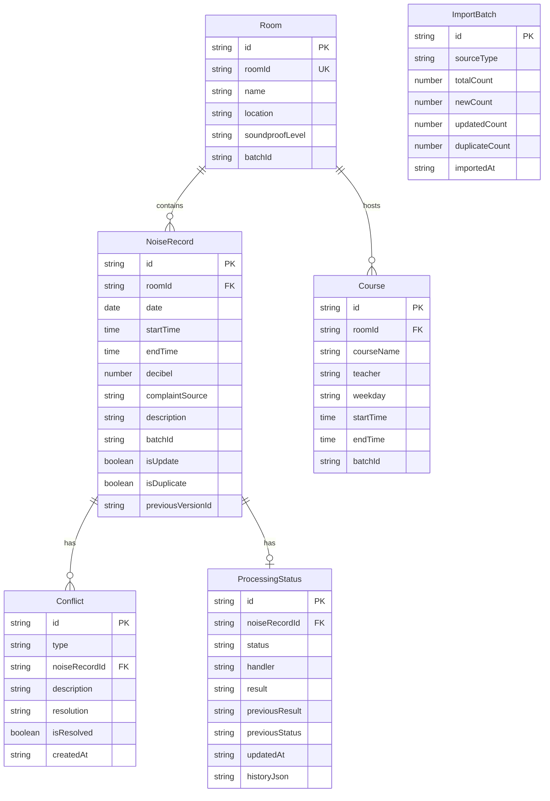

## 1. 架构设计



纯前端应用，所有数据存储在浏览器 localStorage，无需后端服务。

## 2. 技术说明

- **前端**：React@18 + TypeScript + Tailwind CSS@3 + Vite
- **初始化工具**：vite-init (react-ts 模板)
- **后端**：无（纯前端应用）
- **数据库**：localStorage（浏览器本地存储）
- **图表库**：recharts（轻量React图表库）
- **状态管理**：zustand
- **路由**：react-router-dom

## 3. 路由定义

| 路由 | 用途 |
|------|------|
| / | 噪声归集页（默认首页），展示分贝数据、趋势图、投诉列表 |
| /association | 课程关联页，课程表/房间导入与冲突检测 |
| /status | 处理状态页，投诉处理跟踪与报告导出 |

## 4. API定义

无后端API。所有数据操作通过 zustand store 管理，持久化到 localStorage。

## 5. 服务端架构

无服务端。

## 6. 数据模型

### 6.1 数据模型定义



### 6.2 数据定义

核心TypeScript类型：

```typescript
interface NoiseRecord {
  id: string;
  roomId: string;
  date: string;
  startTime: string;
  endTime: string;
  decibel: number;
  complaintSource: string;
  description: string;
  batchId: string;
  isUpdate: boolean;
  isDuplicate: boolean;
  previousVersionId: string | null;
}

interface Room {
  id: string;
  roomId: string;
  name: string;
  location: string;
  soundproofLevel: string;
  batchId: string;
}

interface Course {
  id: string;
  roomId: string;
  courseName: string;
  teacher: string;
  weekday: string;
  startTime: string;
  endTime: string;
  batchId: string;
}

interface Conflict {
  id: string;
  type: 'TIME_MISMATCH' | 'ROOM_NOT_FOUND' | 'DATA_INCONSISTENT';
  noiseRecordId: string;
  description: string;
  resolution: string;
  isResolved: boolean;
  createdAt: string;
}

interface ProcessingStatus {
  id: string;
  noiseRecordId: string;
  status: 'PENDING' | 'PROCESSING' | 'RESOLVED';
  handler: string;
  result: string;
  previousResult: string | null;
  previousStatus: string | null;
  updatedAt: string;
  history: StatusHistoryEntry[];
}

interface ImportBatch {
  id: string;
  sourceType: 'NOISE' | 'ROOM' | 'COURSE';
  totalCount: number;
  newCount: number;
  updatedCount: number;
  duplicateCount: number;
  importedAt: string;
}
```
