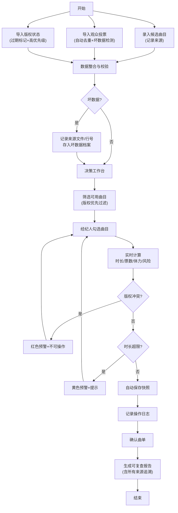

## 1. 产品概述

演出返场曲单决策系统是一款面向演出经纪人的本地Web工具，用于在安排返场曲目时综合考量观众反应、版权限制和乐手体力三大要素，实现数据可追溯、决策可复盘的曲单管理。

- **核心价值**：解决传统返场选曲凭经验、决策过程无记录、版权风险难追溯的痛点
- **目标用户**：演出经纪人、舞台总监、演出策划人员
- **使用场景**：演唱会、音乐会、Livehouse等演出的返场环节曲目决策

## 2. 核心特性

### 2.1 用户角色

| 角色 | 注册方式 | 核心权限 |
|------|----------|----------|
| 演出经纪人 | 本地系统无需注册 | 完整的曲单管理、投票导入、版权管理、决策导出权限 |

### 2.2 功能模块

1. **曲单管理面板**：候选曲目列表、曲单筛选、时长计算、状态标签
2. **数据导入中心**：观众投票导入、版权状态导入、候选曲目录入、来源追溯
3. **决策工作台**：选曲操作、体力评估、冲突检测、实时预览
4. **审计追溯中心**：操作历史、版本对比、决策日志、坏数据记录
5. **导出与复盘**：可复查结果导出、决策说明生成、历史回溯

### 2.3 页面详情

| 页面名称 | 模块名称 | 功能描述 |
|----------|----------|----------|
| 决策工作台 | 曲单筛选区 | 按版权状态、时长、投票数、体力消耗多维度筛选曲目 |
| 决策工作台 | 决策操作区 | 勾选/取消曲目，实时计算总时长、总票数、版权风险 |
| 决策工作台 | 数据来源区 | 显示每首曲目的投票来源、版权来源、录入来源 |
| 数据导入中心 | 投票导入 | 导入观众投票CSV，自动去重，记录坏数据行号和原始内容 |
| 数据导入中心 | 版权导入 | 导入版权状态表，标记过期版权，设置高优先级预警 |
| 数据导入中心 | 曲目录入 | 手动录入候选曲目，填写体力消耗等级、时长、备注 |
| 审计追溯中心 | 操作历史 | 按时间线展示所有改动，保留每次确认的完整快照 |
| 审计追溯中心 | 坏数据记录 | 汇总所有导入时检测到的异常数据，标明来源文件、行号、原始内容 |
| 审计追溯中心 | 决策日志 | 自动记录每次决策的理由和触发条件，便于复盘 |
| 导出与复盘 | 结果导出 | 导出包含筛选条件、去重规则、时长计算、版权状态的完整可复查报告 |

## 3. 核心流程

### 3.1 主流程描述

演出经纪人首先在数据导入中心录入候选曲目、导入观众投票和版权状态数据，系统自动检测坏数据并记录来源。然后进入决策工作台，系统根据版权状态（过期版权优先预警）、投票去重结果、时长限制自动筛选可用曲目。经纪人勾选曲目时，系统实时计算总时长、体力消耗和版权风险，所有操作自动记录审计日志。确认曲单后生成可复查导出报告，包含完整的数据来源追溯。

### 3.2 核心流程图

## 4. 界面设计

### 4.1 设计风格

- **主色调**：深炭灰 (#121212) 背景，舞台金 (#D4AF37) 作为主色点缀，警示红 (#E53935) 标记版权问题，预警橙 (#FB8C00) 标记时长/体力问题
- **按钮风格**：微立体、圆角8px，悬停时有微光效果，模拟舞台灯光
- **字体**：标题使用 "Noto Serif SC"（戏剧感衬线体），正文使用 "Noto Sans SC"（清晰易读），数字使用 "JetBrains Mono"（等宽易比对）
- **排版**：不对称卡片布局，数据来源区使用缩进式层级展示，时间线记录使用竖线连接
- **视觉元素**：微妙的噪点纹理背景，金色细边框，悬停时的柔光阴影

### 4.2 页面设计概览

| 页面名称 | 模块名称 | UI元素 |
|----------|----------|--------|
| 决策工作台 | 曲单筛选区 | 左侧垂直筛选面板，多条件组合，金色滑块控件 |
| 决策工作台 | 曲目列表区 | 卡片式布局，每卡显示：曲名、时长、投票数、体力等级、版权徽章、来源标签 |
| 决策工作台 | 实时计算区 | 顶部悬浮统计栏，金色数字实时跳动，风险项红字闪烁 |
| 决策工作台 | 数据来源区 | 点击曲目展开缩进面板，分三栏展示：投票来源明细、版权文件来源、录入人/时间 |
| 数据导入中心 | 导入区 | 拖拽上传区，上传后即时显示校验进度条，坏数据行红色高亮并显示原始内容 |
| 审计追溯中心 | 历史时间线 | 左侧时间轴，右侧操作卡片，每次确认显示完整快照对比 |
| 审计追溯中心 | 坏数据档案 | 表格展示：来源文件名、行号、原始内容、错误类型、检测时间 |
| 导出与复盘 | 报告预览 | 分页式预览，金色边框，可折叠的数据来源章节，可打印/导出PDF/CSV |

### 4.3 响应式设计

- **桌面优先**：1280px以上为主要设计目标，三栏布局（筛选+列表+详情）
- **平板适配**：1024px切换为两栏，筛选区可折叠
- **移动端**：768px以下单栏堆叠，底部悬浮操作栏

### 4.4 动效设计

- 页面加载：金色进度条从左到右，然后内容卡片依次淡入（stagger 80ms）
- 曲目勾选：卡片轻微上浮+金色边框高亮，统计数字滚动动画
- 版权预警：红色徽章脉冲动画（呼吸效果），不可操作时灰化
- 历史回溯：时间线节点点击时展开，内容从下往上滑入
