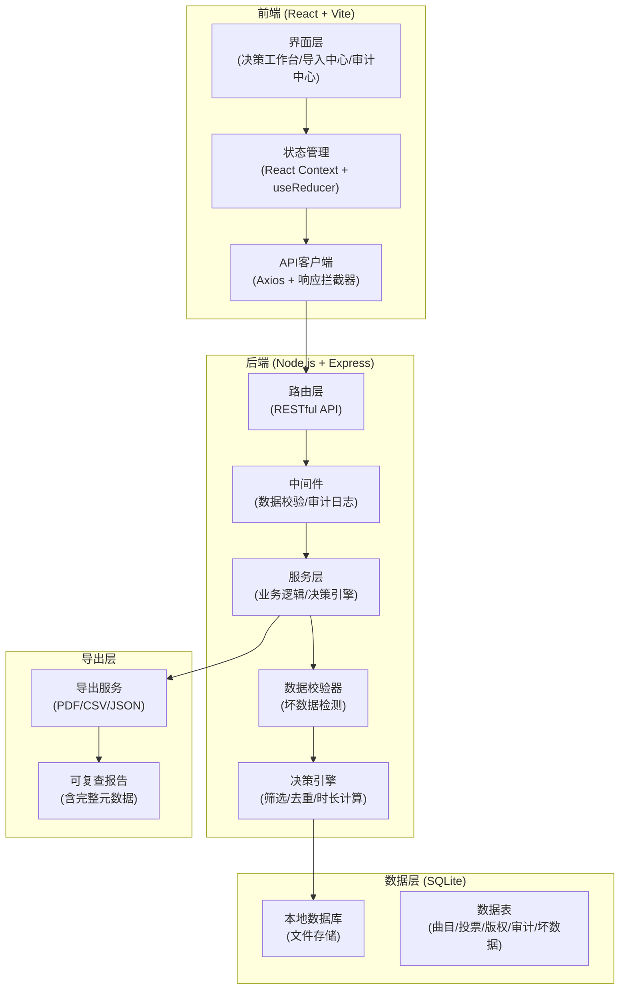
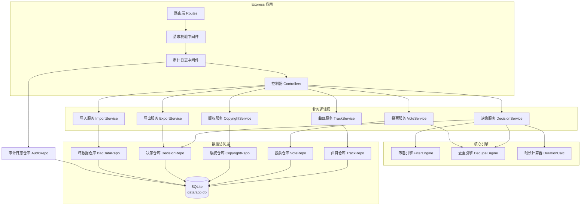
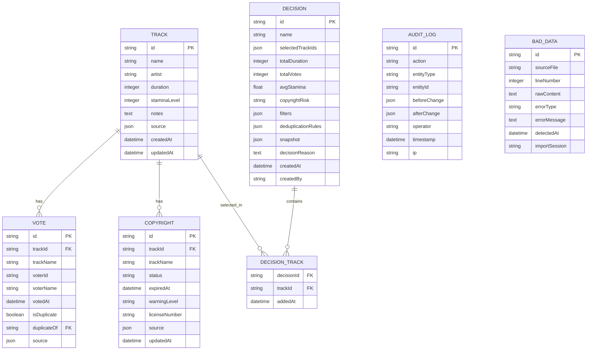

## 1. 架构设计



## 2. 技术选型

### 2.1 技术栈

| 层级 | 技术选型 | 版本 | 说明 |
|------|----------|------|------|
| 前端 | React | 18.x | 组件化UI框架 |
| 前端 | TypeScript | 5.x | 类型安全 |
| 前端 | Vite | 5.x | 构建工具 |
| 前端 | TailwindCSS | 3.x | 原子化CSS |
| 前端 | React Router | 6.x | 路由管理 |
| 后端 | Node.js | 20.x | 运行时 |
| 后端 | Express | 4.x | Web框架 |
| 后端 | better-sqlite3 | 9.x | 本地SQLite数据库（同步API，性能好） |
| 后端 | multer | 1.4.x | 文件上传处理 |
| 后端 | csv-parser | 3.x | CSV解析 |
| 后端 | dayjs | 1.x | 日期处理 |
| 导出 | pdfkit | 0.14.x | PDF生成 |
| 导出 | json2csv | 6.x | CSV导出 |

### 2.2 初始化方案

- **项目结构**：monorepo 结构，前端在 `client/`，后端在 `server/`
- **启动方式**：根目录 `npm run dev` 同时启动前后端（concurrently）
- **数据库**：首次启动自动创建 SQLite 文件 `data/app.db` 并执行初始化 DDL
- **本地端口**：前端 5173，后端 3001

## 3. 路由定义

### 3.1 前端路由

| 路由 | 页面 | 说明 |
|------|------|------|
| `/` | 决策工作台 | 主页面，曲单筛选、勾选、实时计算 |
| `/import` | 数据导入中心 | 曲目录入、投票/版权CSV导入 |
| `/audit` | 审计追溯中心 | 操作历史、坏数据档案、决策日志 |
| `/export/:id` | 导出与复盘 | 查看和导出指定决策的完整报告 |

### 3.2 后端 API 路由

| 方法 | 路径 | 说明 |
|------|------|------|
| GET | `/api/tracks` | 获取候选曲目列表（带筛选参数） |
| POST | `/api/tracks` | 新增候选曲目 |
| PUT | `/api/tracks/:id` | 更新曲目信息 |
| DELETE | `/api/tracks/:id` | 删除曲目 |
| POST | `/api/import/votes` | 导入观众投票CSV |
| POST | `/api/import/copyright` | 导入版权状态CSV |
| GET | `/api/votes` | 获取投票列表（含去重标记） |
| GET | `/api/copyright` | 获取版权状态列表 |
| GET | `/api/decisions` | 获取决策历史列表 |
| POST | `/api/decisions` | 保存当前决策（创建快照） |
| GET | `/api/decisions/:id` | 获取决策详情（含完整快照） |
| GET | `/api/decisions/:id/export` | 导出决策报告 |
| GET | `/api/audit/logs` | 获取操作审计日志 |
| GET | `/api/bad-data` | 获取坏数据档案列表 |
| GET | `/api/stats` | 获取实时统计数据 |
| POST | `/api/decisions/:id/toggle-track` | 决策中勾选/取消曲目 |

## 4. API 类型定义

```typescript
// 数据来源溯源
interface SourceInfo {
  sourceType: 'manual' | 'csv-import' | 'api';
  fileName?: string;
  lineNumber?: number;
  rawContent?: string;
  importedBy: string;
  importedAt: string;
}

// 候选曲目
interface Track {
  id: string;
  name: string;
  artist: string;
  duration: number; // 秒
  staminaLevel: 1 | 2 | 3 | 4 | 5; // 体力消耗等级
  notes?: string;
  source: SourceInfo;
  createdAt: string;
  updatedAt: string;
}

// 观众投票
interface Vote {
  id: string;
  trackId: string;
  trackName: string;
  voterId?: string;
  voterName?: string;
  votedAt: string;
  isDuplicate: boolean;
  duplicateOf?: string; // 重复投票的原始ID
  source: SourceInfo;
}

// 版权状态
interface Copyright {
  id: string;
  trackId: string;
  trackName: string;
  status: 'active' | 'expired' | 'pending' | 'restricted';
  expiredAt?: string;
  warningLevel: 'high' | 'medium' | 'low'; // 过期版权为high，不可被覆盖
  licenseNumber?: string;
  source: SourceInfo;
  updatedAt: string;
}

// 决策快照
interface Decision {
  id: string;
  name: string;
  selectedTrackIds: string[];
  totalDuration: number;
  totalVotes: number;
  avgStamina: number;
  copyrightRisk: 'none' | 'low' | 'medium' | 'high';
  filters: FilterCriteria; // 当时的筛选条件
  deduplicationRules: DedupeRule[]; // 当时的去重规则
  snapshot: {
    tracks: Track[];
    votes: Vote[];
    copyrights: Copyright[];
  };
  decisionReason?: string;
  createdAt: string;
  createdBy: string;
}

// 操作审计日志
interface AuditLog {
  id: string;
  action: 'create' | 'update' | 'delete' | 'import' | 'decision' | 'export';
  entityType: 'track' | 'vote' | 'copyright' | 'decision';
  entityId?: string;
  beforeChange?: any;
  afterChange?: any;
  operator: string;
  timestamp: string;
  ip?: string;
}

// 坏数据记录
interface BadDataRecord {
  id: string;
  sourceFile: string;
  lineNumber: number;
  rawContent: string;
  errorType: 'missing_field' | 'invalid_format' | 'invalid_duration' | 'duplicate' | 'unknown_track';
  errorMessage: string;
  detectedAt: string;
  importSession: string;
}

// 实时统计
interface Stats {
  totalTracks: number;
  totalVotes: number;
  expiredCopyrights: number;
  selectedCount: number;
  totalDuration: number;
  totalSelectedVotes: number;
  avgStamina: number;
  hasCopyrightRisk: boolean;
}

// 筛选条件
interface FilterCriteria {
  copyrightStatus?: ('active' | 'pending')[];
  minVotes?: number;
  maxDuration?: number;
  maxStamina?: number;
  searchKeyword?: string;
}

// 去重规则
interface DedupeRule {
  field: 'voterId' | 'voterName' | 'trackName';
  enabled: boolean;
}
```

## 5. 服务端架构



## 6. 数据模型

### 6.1 ER 图



### 6.2 DDL 语句

```sql
-- 曲目表
CREATE TABLE IF NOT EXISTS tracks (
  id TEXT PRIMARY KEY,
  name TEXT NOT NULL,
  artist TEXT NOT NULL,
  duration INTEGER NOT NULL,
  stamina_level INTEGER NOT NULL CHECK (stamina_level BETWEEN 1 AND 5),
  notes TEXT,
  source TEXT NOT NULL, -- JSON 存储 SourceInfo
  created_at TEXT NOT NULL DEFAULT (datetime('now')),
  updated_at TEXT NOT NULL DEFAULT (datetime('now'))
);

-- 投票表
CREATE TABLE IF NOT EXISTS votes (
  id TEXT PRIMARY KEY,
  track_id TEXT REFERENCES tracks(id),
  track_name TEXT NOT NULL,
  voter_id TEXT,
  voter_name TEXT,
  voted_at TEXT NOT NULL,
  is_duplicate INTEGER NOT NULL DEFAULT 0,
  duplicate_of TEXT REFERENCES votes(id),
  source TEXT NOT NULL, -- JSON 存储 SourceInfo
  created_at TEXT NOT NULL DEFAULT (datetime('now'))
);

-- 版权表
CREATE TABLE IF NOT EXISTS copyrights (
  id TEXT PRIMARY KEY,
  track_id TEXT REFERENCES tracks(id),
  track_name TEXT NOT NULL,
  status TEXT NOT NULL CHECK (status IN ('active', 'expired', 'pending', 'restricted')),
  expired_at TEXT,
  warning_level TEXT NOT NULL DEFAULT 'low' CHECK (warning_level IN ('high', 'medium', 'low')),
  license_number TEXT,
  source TEXT NOT NULL, -- JSON 存储 SourceInfo
  updated_at TEXT NOT NULL DEFAULT (datetime('now'))
);

-- 决策表（含完整快照）
CREATE TABLE IF NOT EXISTS decisions (
  id TEXT PRIMARY KEY,
  name TEXT NOT NULL,
  selected_track_ids TEXT NOT NULL, -- JSON array
  total_duration INTEGER NOT NULL,
  total_votes INTEGER NOT NULL,
  avg_stamina REAL NOT NULL,
  copyright_risk TEXT NOT NULL CHECK (copyright_risk IN ('none', 'low', 'medium', 'high')),
  filters TEXT NOT NULL, -- JSON FilterCriteria
  deduplication_rules TEXT NOT NULL, -- JSON DedupeRule[]
  snapshot TEXT NOT NULL, -- JSON 完整快照 {tracks, votes, copyrights}
  decision_reason TEXT,
  created_at TEXT NOT NULL DEFAULT (datetime('now')),
  created_by TEXT NOT NULL DEFAULT 'local'
);

-- 审计日志表
CREATE TABLE IF NOT EXISTS audit_logs (
  id TEXT PRIMARY KEY,
  action TEXT NOT NULL CHECK (action IN ('create', 'update', 'delete', 'import', 'decision', 'export')),
  entity_type TEXT NOT NULL CHECK (entity_type IN ('track', 'vote', 'copyright', 'decision')),
  entity_id TEXT,
  before_change TEXT, -- JSON
  after_change TEXT, -- JSON
  operator TEXT NOT NULL,
  timestamp TEXT NOT NULL DEFAULT (datetime('now')),
  ip TEXT
);

-- 坏数据表
CREATE TABLE IF NOT EXISTS bad_data (
  id TEXT PRIMARY KEY,
  source_file TEXT NOT NULL,
  line_number INTEGER NOT NULL,
  raw_content TEXT NOT NULL,
  error_type TEXT NOT NULL CHECK (error_type IN ('missing_field', 'invalid_format', 'invalid_duration', 'duplicate', 'unknown_track')),
  error_message TEXT NOT NULL,
  detected_at TEXT NOT NULL DEFAULT (datetime('now')),
  import_session TEXT NOT NULL
);

-- 决策-曲目关联表
CREATE TABLE IF NOT EXISTS decision_tracks (
  decision_id TEXT REFERENCES decisions(id),
  track_id TEXT REFERENCES tracks(id),
  added_at TEXT NOT NULL DEFAULT (datetime('now')),
  PRIMARY KEY (decision_id, track_id)
);

-- 索引
CREATE INDEX IF NOT EXISTS idx_votes_track_id ON votes(track_id);
CREATE INDEX IF NOT EXISTS idx_votes_is_duplicate ON votes(is_duplicate);
CREATE INDEX IF NOT EXISTS idx_copyrights_track_id ON copyrights(track_id);
CREATE INDEX IF NOT EXISTS idx_copyrights_warning_level ON copyrights(warning_level);
CREATE INDEX IF NOT EXISTS idx_audit_logs_timestamp ON audit_logs(timestamp);
CREATE INDEX IF NOT EXISTS idx_bad_data_import_session ON bad_data(import_session);
```

### 6.3 核心约束

1. **版权状态高优先级**：`warning_level = 'high'` 的记录（过期版权）永远不会被更新覆盖，导入新数据时若检测到已有 high 级警告，保留原值并记录冲突
2. **数据来源不可篡改**：`source` 字段在创建后不可修改，所有变更记录在 `audit_logs`
3. **投票去重留痕**：重复投票不会被删除，而是标记 `is_duplicate = 1` 并指向原始投票 `duplicate_of`
4. **决策快照完整**：每次保存决策时，完整序列化当时的 `tracks` / `votes` / `copyrights` 数据到 `snapshot` 字段，确保复盘时数据一致
5. **坏数据完整保留**：导入时的坏数据不丢弃，`raw_content` 保存原始行内容，`line_number` 记录行号
