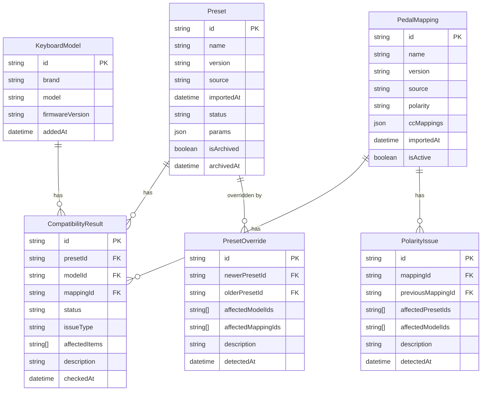

## 1. 架构设计

```mermaid
flowchart TD
    subgraph "前端层"
        "A[React SPA]" --> "B[Zustand 状态管理]"
        "A" --> "C[兼容性检查引擎]"
        "A" --> "D[图表组件]"
        "A" --> "E[导入/导出模块]"
    end
    subgraph "数据层"
        "B" --> "F[IndexedDB 本地存储]"
        "F" --> "G[预设数据集]"
        "F" --> "H[型号数据集]"
        "F" --> "I[映射数据集]"
        "F" --> "J[兼容性结论]"
    end
    subgraph "处理层"
        "C" --> "K[覆盖检测器]"
        "C" --> "L[型号兼容检查器]"
        "C" --> "M[极性反转检测器]"
        "K" --> "J"
        "L" --> "J"
        "M" --> "J"
    end
```

## 2. 技术说明

- 前端：React@18 + TypeScript + Tailwind CSS@3 + Vite
- 状态管理：Zustand
- 本地存储：IndexedDB（通过 idb 库）
- 图表：recharts
- 路由：react-router-dom@6
- 初始化工具：vite-init
- 后端：无（纯前端，数据存本地）

## 3. 路由定义

| 路由 | 用途 |
|------|------|
| / | 仓库总览页 - 统计卡片、兼容性图表、警告摘要 |
| /presets | 预设管理页 - 预设列表、导入、覆盖检测、归档 |
| /compatibility | 型号兼容页 - 型号列表、兼容矩阵、不兼容详情 |
| /pedals | 踏板映射页 - 映射列表、极性检测、版本对比 |
| /io | 导入导出页 - 批量导入、筛选导出 |

## 4. 数据模型

### 4.1 数据模型定义



### 4.2 数据定义语言

```typescript
interface Preset {
  id: string;
  name: string;
  version: string;
  source: string;
  importedAt: string;
  status: 'active' | 'archived' | 'overridden';
  params: Record<string, unknown>;
  isArchived: boolean;
  archivedAt: string | null;
}

interface KeyboardModel {
  id: string;
  brand: string;
  model: string;
  firmwareVersion: string;
  addedAt: string;
}

interface PedalMapping {
  id: string;
  name: string;
  version: string;
  source: string;
  polarity: 'normal' | 'reversed';
  ccMappings: Record<string, number>;
  importedAt: string;
  isActive: boolean;
}

interface CompatibilityResult {
  id: string;
  presetId: string;
  modelId: string;
  mappingId: string;
  status: 'compatible' | 'incompatible' | 'polarity_warning' | 'override_pending';
  issueType: 'override' | 'model_incompatible' | 'polarity_reversed' | null;
  affectedItems: string[];
  description: string;
  checkedAt: string;
}

interface PresetOverride {
  id: string;
  newerPresetId: string;
  olderPresetId: string;
  affectedModelIds: string[];
  affectedMappingIds: string[];
  description: string;
  detectedAt: string;
}

interface PolarityIssue {
  id: string;
  mappingId: string;
  previousMappingId: string | null;
  affectedPresetIds: string[];
  affectedModelIds: string[];
  description: string;
  detectedAt: string;
}
```

## 5. 兼容性检查引擎

### 5.1 检查流程

1. **覆盖检测器**：扫描所有活跃预设，同名且参数不同则生成 PresetOverride 记录，标注影响的型号和映射
2. **型号兼容检查器**：遍历 预设×型号 组合，基于已知的兼容性规则判断，不兼容时生成 CompatibilityResult 记录
3. **极性反转检测器**：对比同一踏板的不同映射版本，极性变化时生成 PolarityIssue 记录，标注影响的预设和型号

### 5.2 结论影响规则

- 预设归档 → 该预设从活跃检查中移除，相关 CompatibilityResult 状态更新
- 型号不兼容 → 对应预设-型号组合结论为"不可用"
- 踏板极性反转 → 受影响的预设-型号-映射组合结论为"极性警告"
- 覆盖存在 → 被覆盖的预设结论为"待确认"

### 5.3 筛选导出一致性

- 全局筛选状态存储在 Zustand store 中
- 列表和图表组件从同一筛选状态派生数据
- 导出时读取当前筛选状态，仅导出筛选后的数据子集
- 导出文件包含筛选条件元数据
