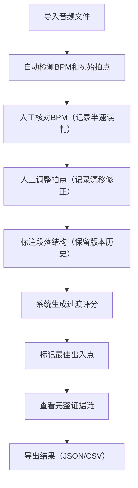

## 1. 产品概述

DJ过渡拍点助手是一款面向演出DJ的专业工具，帮助DJ快速定位每首歌曲适合混进混出的拍点位置，避免现场接歌失误。系统将音频文件、BPM检测、拍点标注、段落分析、过渡评分等信息完整关联，确保从摘要到明细的数据链路完整可追溯。

- **核心问题**：人工核对BPM半速误判、拍点漂移时容易凭印象，段落标签易被新版本覆盖
- **目标用户**：演出DJ、歌单整理人员、现场执行团队
- **核心价值**：保留完整证据链，支持5分钟快速上手，让交接和复盘清晰高效

## 2. 核心功能

### 2.1 功能模块

| 模块 | 核心能力 |
|------|----------|
| 音频导入 | 拖拽/点击导入多首音频，自动生成波形图 |
| BPM与拍点 | 自动检测BPM，支持手动标记和调整拍点，记录半速误判证据 |
| 段落标注 | Intro/Outro/Breakdown/Drop等段落标记，支持版本历史 |
| 过渡评分 | 基于BPM匹配度、拍点对齐度、段落适配度的综合评分 |
| 证据保留 | BPM调整记录、拍点漂移修正、段落标签历史完整留存 |
| 数据导出 | 支持JSON/CSV格式导出完整数据和分析结果 |

### 2.2 页面详情

| 页面名称 | 模块名称 | 功能描述 |
|-----------|-------------|---------------------|
| 歌单总览页 | 歌曲列表 | 展示所有导入歌曲的摘要信息（歌名、BPM、最佳出入点、过渡评分），支持点击进入明细 |
| 歌单总览页 | 批量操作 | 批量选择、批量导出、批量删除 |
| 歌曲详情页 | 波形可视化 | 音频波形展示，时间轴缩放，拍点和段落叠加显示 |
| 歌曲详情页 | BPM检测区 | 自动检测BPM值，半速/倍速修正按钮，检测历史记录 |
| 歌曲详情页 | 拍点标注区 | 可视化拍点标记，支持添加/删除/拖拽调整，漂移修正记录 |
| 歌曲详情页 | 段落标注区 | 段落类型选择，起止时间标记，版本历史对比 |
| 歌曲详情页 | 过渡评分区 | 出入点推荐，评分维度拆解，与其他歌曲匹配预览 |
| 操作历史页 | 变更记录 | 所有操作的完整审计日志，支持按时间、操作类型筛选 |
| 快速上手指引 | 5分钟教程 | 步骤化引导完成第一次完整操作流程 |

## 3. 核心流程

DJ导入音频后，系统自动检测BPM和初始拍点，人工核对并修正（系统记录所有调整证据），然后标注段落结构，最后系统生成过渡评分和推荐出入点，所有数据可一键导出。

## 4. 用户界面设计

### 4.1 设计风格
- **设计方向**：专业暗色调音乐制作风格，适合长时间使用
- **主色调**：深灰蓝背景（#0f172a），霓虹青色高亮（#06b6d4），洋红强调色（#ec4899）
- **按钮风格**：圆角8px，悬停发光效果，点击有微缩反馈
- **字体**：显示器字体用 JetBrains Mono，正文字体用 Inter
- **布局**：左侧导航 + 主内容区 + 右侧属性面板，三栏布局
- **图标**：lucide-react 线性图标，配合音乐相关emoji

### 4.2 页面设计概述

| 页面名称 | 模块名称 | UI Elements |
|-----------|-------------|-------------|
| 歌单总览页 | 歌曲列表 | 卡片式布局，波形缩略图，评分用彩色进度条展示，hover时有微光效果 |
| 歌曲详情页 | 波形可视化 | 深色背景上的渐变波形，拍点用青色竖线标记，段落用不同颜色区块覆盖 |
| 歌曲详情页 | 证据面板 | 时间线式布局，每条变更记录带时间戳和操作人，可展开查看变更前后对比 |
| 操作历史页 | 变更记录 | 表格形式，支持筛选和搜索，关键变更用红色高亮标记 |

### 4.3 响应式
- **桌面端优先**：1280px及以上为完整三栏布局
- **平板端**：右侧属性面板改为底部抽屉
- **移动端**：简化为单页流式布局，核心功能保留

### 4.4 动画与交互
- 波形图加载时用渐入动画
- 拍点标记点击时有脉冲扩散效果
- 页面切换用淡入淡出过渡
- 证据记录展开/收起用平滑高度动画
