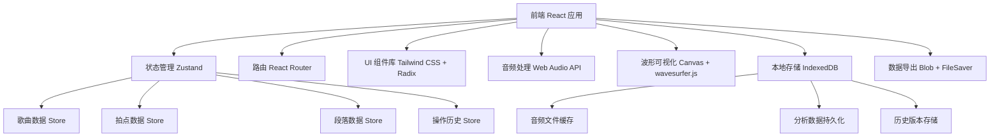
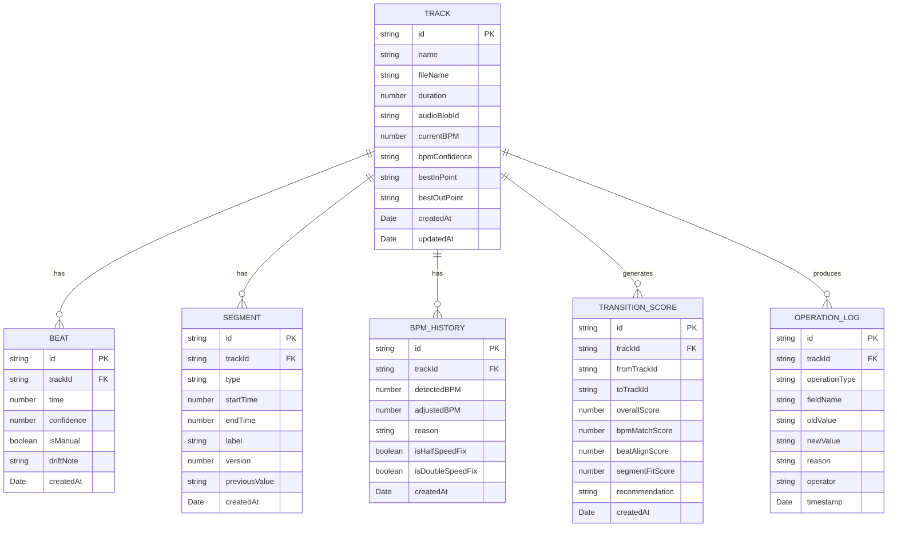

## 1. 架构设计



## 2. 技术描述

- **前端框架**：React 18 + TypeScript
- **构建工具**：Vite 5
- **样式方案**：Tailwind CSS 3
- **状态管理**：Zustand 4
- **路由**：React Router DOM 6
- **UI 组件**：Radix UI（无障碍组件）+ lucide-react（图标）
- **音频处理**：Web Audio API（原生）+ 自研BPM检测算法
- **波形可视化**：wavesurfer.js 7 + Canvas 自定义绘制
- **本地存储**：IndexedDB（idb 库封装）
- **数据导出**：原生 Blob API + file-saver
- **后端**：纯前端应用，无后端依赖
- **数据库**：浏览器端 IndexedDB，数据完全本地存储

## 3. 路由定义

| 路由 | 页面 | 用途 |
|-------|------|------|
| / | 歌单总览页 | 歌曲列表展示、导入入口、批量操作 |
| /track/:id | 歌曲详情页 | 波形可视化、BPM/拍点/段落编辑、过渡评分 |
| /history | 操作历史页 | 完整审计日志、证据链查询 |
| /guide | 快速上手指引 | 5分钟教程、步骤引导 |

## 4. 数据模型

### 4.1 数据模型定义



### 4.2 TypeScript 类型定义

```typescript
// 歌曲信息
interface Track {
  id: string;
  name: string;
  fileName: string;
  duration: number;
  audioBlobId: string;
  currentBPM: number;
  bpmConfidence: 'low' | 'medium' | 'high';
  bestInPoint?: number;
  bestOutPoint?: number;
  createdAt: Date;
  updatedAt: Date;
}

// 拍点
interface Beat {
  id: string;
  trackId: string;
  time: number;
  confidence: number;
  isManual: boolean;
  driftNote?: string;
  createdAt: Date;
}

// 段落
interface Segment {
  id: string;
  trackId: string;
  type: 'intro' | 'outro' | 'breakdown' | 'drop' | 'build' | 'verse' | 'chorus';
  startTime: number;
  endTime: number;
  label?: string;
  version: number;
  previousValue?: string;
  createdAt: Date;
}

// BPM历史记录
interface BPMHistory {
  id: string;
  trackId: string;
  detectedBPM: number;
  adjustedBPM: number;
  reason: string;
  isHalfSpeedFix: boolean;
  isDoubleSpeedFix: boolean;
  createdAt: Date;
}

// 过渡评分
interface TransitionScore {
  id: string;
  trackId: string;
  fromTrackId?: string;
  toTrackId?: string;
  overallScore: number;
  bpmMatchScore: number;
  beatAlignScore: number;
  segmentFitScore: number;
  recommendation: string;
  createdAt: Date;
}

// 操作日志
interface OperationLog {
  id: string;
  trackId: string;
  operationType: 'bpm' | 'beat' | 'segment' | 'inpoint' | 'outpoint' | 'delete';
  fieldName: string;
  oldValue: string;
  newValue: string;
  reason?: string;
  operator: string;
  timestamp: Date;
}
```

## 5. 核心模块设计

### 5.1 Store 模块（Zustand）

| Store | 职责 | 核心方法 |
|-------|------|----------|
| useTrackStore | 歌曲管理 | addTrack, updateTrack, deleteTrack, getTrackById |
| useBeatStore | 拍点管理 | addBeat, updateBeat, deleteBeat, getBeatsByTrackId |
| useSegmentStore | 段落管理 | addSegment, updateSegment, getSegmentsByTrackId |
| useHistoryStore | 历史记录 | addLog, getLogsByTrackId, getLogsByOperationType |
| useScoreStore | 过渡评分 | calculateScore, getScoresByTrackId |

### 5.2 核心工具函数

| 模块 | 函数 | 用途 |
|------|------|------|
| audioAnalyzer | detectBPM | 基于Web Audio API的BPM自动检测 |
| audioAnalyzer | detectBeats | 初始拍点检测算法 |
| waveformRenderer | drawWaveform | Canvas波形绘制 |
| waveformRenderer | drawBeats | 拍点标记叠加绘制 |
| waveformRenderer | drawSegments | 段落区块叠加绘制 |
| evidenceManager | recordChange | 记录所有变更并保留证据 |
| evidenceManager | getEvidenceChain | 生成从摘要到明细的完整证据链 |
| exportManager | exportToJSON | JSON格式导出 |
| exportManager | exportToCSV | CSV格式导出 |
| transitionScorer | calculateTransitionScore | 计算两首歌的过渡匹配评分 |

## 6. 性能与存储考虑

- **音频文件存储**：使用 IndexedDB 存储原始音频 Blob，支持大文件（最大 2GB）
- **波形缓存**：预渲染波形数据并缓存，避免重复计算
- **虚拟滚动**：歌曲列表和历史记录使用虚拟滚动，支持1000+条数据流畅展示
- **懒加载**：音频详情页按需加载波形数据和分析结果
- **增量保存**：操作历史采用增量记录，只保存变更字段而非完整对象
