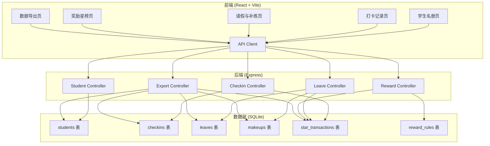
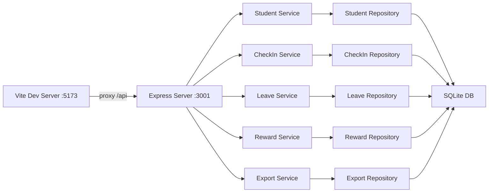
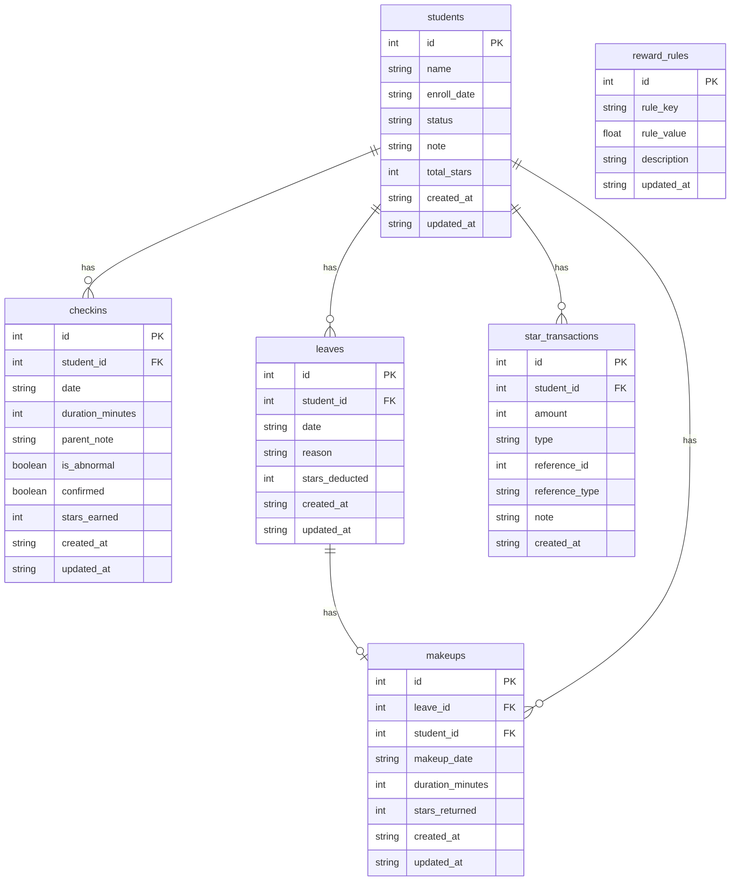

## 1. 架构设计



## 2. 技术说明

- **前端**：React@18 + TailwindCSS@3 + Vite
- **初始化工具**：Vite (react-ts template)
- **后端**：Express@4，与前端同一项目，`/server` 目录
- **数据库**：SQLite (better-sqlite3)，数据文件存储在项目根目录 `data/piano_ledger.db`，重启后数据完整保留
- **前后端通信**：REST API，前端通过 fetch 调用后端接口
- **启动方式**：`npm run dev` 同时启动 Vite 开发服务器和 Express 后端（使用 concurrently）

## 3. 路由定义

| 路由 | 用途 |
|------|------|
| `/` | 学生名册页 |
| `/checkin` | 打卡记录页 |
| `/leave` | 请假与补练页 |
| `/rewards` | 奖励星榜页 |
| `/export` | 数据导出页 |

## 4. API 定义

### 4.1 学生管理

```typescript
// GET /api/students
interface Student {
  id: number;
  name: string;
  enroll_date: string;
  status: "active" | "archived";
  note: string;
  total_stars: number;
}
interface GetStudentsResponse {
  students: Student[];
}

// POST /api/students
interface CreateStudentRequest {
  name: string;
  enroll_date: string;
  note?: string;
}
interface CreateStudentResponse {
  student: Student;
}

// PUT /api/students/:id
interface UpdateStudentRequest {
  name?: string;
  enroll_date?: string;
  status?: "active" | "archived";
  note?: string;
}
interface UpdateStudentResponse {
  student: Student;
}
```

### 4.2 打卡记录

```typescript
// GET /api/checkins?date=YYYY-MM-DD
interface Checkin {
  id: number;
  student_id: number;
  date: string;
  duration_minutes: number;
  parent_note: string;
  is_abnormal: boolean;
  confirmed: boolean;
  stars_earned: number;
}
interface GetCheckinsResponse {
  checkins: Checkin[];
}

// POST /api/checkins/batch
interface BatchCheckinRequest {
  date: string;
  records: {
    student_id: number;
    duration_minutes: number;
    parent_note?: string;
  }[];
}
interface BatchCheckinResponse {
  checkins: Checkin[];
  warnings: { student_id: number; reason: string }[];
}

// PUT /api/checkins/:id/confirm
interface ConfirmCheckinResponse {
  checkin: Checkin;
  star_transaction: StarTransaction;
}
```

### 4.3 请假与补练

```typescript
// GET /api/leaves?student_id=&month=
interface Leave {
  id: number;
  student_id: number;
  date: string;
  reason: string;
  stars_deducted: number;
  has_makeup: boolean;
}
interface GetLeavesResponse {
  leaves: Leave[];
}

// POST /api/leaves
interface CreateLeaveRequest {
  student_id: number;
  date: string;
  reason: string;
}
interface CreateLeaveResponse {
  leave: Leave;
  star_transaction: StarTransaction;
}

// POST /api/makeups
interface CreateMakeupRequest {
  leave_id: number;
  makeup_date: string;
  duration_minutes: number;
}
interface CreateMakeupResponse {
  makeup: Makeup;
  star_transaction: StarTransaction;
}
interface Makeup {
  id: number;
  leave_id: number;
  makeup_date: string;
  duration_minutes: number;
  stars_returned: number;
}

// GET /api/makeups/check-duplicate?leave_id=
interface DuplicateCheckResponse {
  is_duplicate: boolean;
  existing_makeup: Makeup | null;
}
```

### 4.4 奖励规则与流水

```typescript
// GET /api/rewards/rules
interface RewardRule {
  id: number;
  rule_key: string;
  rule_value: number;
  description: string;
}
interface GetRulesResponse {
  rules: RewardRule[];
}

// PUT /api/rewards/rules
interface UpdateRulesRequest {
  rules: { rule_key: string; rule_value: number }[];
}
interface UpdateRulesResponse {
  rules: RewardRule[];
}

// GET /api/rewards/transactions?student_id=&type=&from=&to=
interface StarTransaction {
  id: number;
  student_id: number;
  amount: number;
  type: "checkin_earn" | "leave_deduct" | "makeup_return" | "manual_adjust";
  reference_id: number;
  reference_type: "checkin" | "leave" | "makeup" | "manual";
  note: string;
  created_at: string;
}
interface GetTransactionsResponse {
  transactions: StarTransaction[];
  total_count: number;
}

// GET /api/rewards/summary
interface RewardSummary {
  student_id: number;
  student_name: string;
  total_stars: number;
  rank: number;
}
interface GetSummaryResponse {
  summary: RewardSummary[];
}
```

### 4.5 数据导出

```typescript
// POST /api/export
interface ExportRequest {
  type: "checkins" | "transactions" | "leaves_makeups";
  from: string;
  to: string;
}
interface ExportResponse {
  download_url: string;
  record_count: number;
  db_total_count: number;
  is_consistent: boolean;
}
```

## 5. 服务器架构图



## 6. 数据模型

### 6.1 数据模型定义



### 6.2 数据定义语言

```sql
CREATE TABLE IF NOT EXISTS students (
  id INTEGER PRIMARY KEY AUTOINCREMENT,
  name TEXT NOT NULL,
  enroll_date TEXT NOT NULL,
  status TEXT NOT NULL DEFAULT 'active',
  note TEXT DEFAULT '',
  total_stars INTEGER NOT NULL DEFAULT 0,
  created_at TEXT NOT NULL DEFAULT (datetime('now', 'localtime')),
  updated_at TEXT NOT NULL DEFAULT (datetime('now', 'localtime'))
);

CREATE TABLE IF NOT EXISTS checkins (
  id INTEGER PRIMARY KEY AUTOINCREMENT,
  student_id INTEGER NOT NULL,
  date TEXT NOT NULL,
  duration_minutes INTEGER NOT NULL DEFAULT 0,
  parent_note TEXT DEFAULT '',
  is_abnormal INTEGER NOT NULL DEFAULT 0,
  confirmed INTEGER NOT NULL DEFAULT 0,
  stars_earned INTEGER NOT NULL DEFAULT 0,
  created_at TEXT NOT NULL DEFAULT (datetime('now', 'localtime')),
  updated_at TEXT NOT NULL DEFAULT (datetime('now', 'localtime')),
  FOREIGN KEY (student_id) REFERENCES students(id),
  UNIQUE(student_id, date)
);

CREATE TABLE IF NOT EXISTS leaves (
  id INTEGER PRIMARY KEY AUTOINCREMENT,
  student_id INTEGER NOT NULL,
  date TEXT NOT NULL,
  reason TEXT DEFAULT '',
  stars_deducted INTEGER NOT NULL DEFAULT 0,
  created_at TEXT NOT NULL DEFAULT (datetime('now', 'localtime')),
  updated_at TEXT NOT NULL DEFAULT (datetime('now', 'localtime')),
  FOREIGN KEY (student_id) REFERENCES students(id)
);

CREATE TABLE IF NOT EXISTS makeups (
  id INTEGER PRIMARY KEY AUTOINCREMENT,
  leave_id INTEGER NOT NULL,
  student_id INTEGER NOT NULL,
  makeup_date TEXT NOT NULL,
  duration_minutes INTEGER NOT NULL DEFAULT 0,
  stars_returned INTEGER NOT NULL DEFAULT 0,
  created_at TEXT NOT NULL DEFAULT (datetime('now', 'localtime')),
  updated_at TEXT NOT NULL DEFAULT (datetime('now', 'localtime')),
  FOREIGN KEY (leave_id) REFERENCES leaves(id),
  FOREIGN KEY (student_id) REFERENCES students(id),
  UNIQUE(leave_id)
);

CREATE TABLE IF NOT EXISTS star_transactions (
  id INTEGER PRIMARY KEY AUTOINCREMENT,
  student_id INTEGER NOT NULL,
  amount INTEGER NOT NULL,
  type TEXT NOT NULL,
  reference_id INTEGER NOT NULL,
  reference_type TEXT NOT NULL,
  note TEXT DEFAULT '',
  created_at TEXT NOT NULL DEFAULT (datetime('now', 'localtime')),
  FOREIGN KEY (student_id) REFERENCES students(id)
);

CREATE TABLE IF NOT EXISTS reward_rules (
  id INTEGER PRIMARY KEY AUTOINCREMENT,
  rule_key TEXT NOT NULL UNIQUE,
  rule_value REAL NOT NULL,
  description TEXT DEFAULT '',
  updated_at TEXT NOT NULL DEFAULT (datetime('now', 'localtime'))
);

INSERT OR IGNORE INTO reward_rules (rule_key, rule_value, description) VALUES
  ('stars_per_minute', 1, '每练琴1分钟获得星星数'),
  ('leave_deduction', 5, '请假一次扣除星星数'),
  ('makeup_return_rate', 1, '补练返还倍率（补练时长 × 此倍率 × 每分钟星数）'),
  ('abnormal_threshold', 120, '时长异常阈值（分钟），超过此值标黄警告');

CREATE INDEX IF NOT EXISTS idx_checkins_student_date ON checkins(student_id, date);
CREATE INDEX IF NOT EXISTS idx_leaves_student_date ON leaves(student_id, date);
CREATE INDEX IF NOT EXISTS idx_makeups_leave_id ON makeups(leave_id);
CREATE INDEX IF NOT EXISTS idx_star_transactions_student ON star_transactions(student_id);
CREATE INDEX IF NOT EXISTS idx_star_transactions_type ON star_transactions(type);
```
