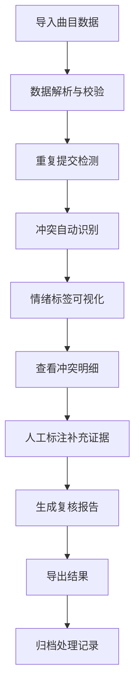

## 1. 产品概述
曲库情绪标签复核工具是面向音乐App运营团队的内部协作工具，解决算法情绪标签、人工修正、版权下架三类数据的一致性校验问题。通过可视化对比、时间线追溯、冲突明细展示，帮助运营同事高效完成标签复核工作，并支持复盘追溯。

## 2. 核心功能

### 2.1 用户角色
| 角色 | 注册方式 | 核心权限 |
|------|----------|----------|
| 运营用户 | 内部系统登录 | 导入数据、查看图表、查看明细、下载结果、人工标注 |
| 管理员 | 内部系统登录 | 全部操作权限、配置管理 |

### 2.2 功能模块
1. **首页仪表盘**：数据概览、导入入口、复核进度
2. **数据导入页**：样例数据导入、补传识别、重复提交检测
3. **标签对比页**：情绪标签可视化、算法vs人工对比、冲突检测
4. **明细追溯页**：时间线展示、冲突队列、版权联动、处理记录
5. **结果导出页**：复核报告生成、多格式下载、更新对比清单

### 2.3 页面详情
| 页面名称 | 模块名称 | 功能描述 |
|----------|----------|----------|
| 首页仪表盘 | 数据概览卡片 | 展示总曲目数、冲突数、已处理数、版权下架数等核心指标 |
| 首页仪表盘 | 快捷操作区 | 导入数据、查看待处理、导出结果的快捷入口 |
| 数据导入页 | 文件上传区 | 支持拖拽上传CSV/Excel文件，解析曲目、算法标签、人工标签、版权状态 |
| 数据导入页 | 补传识别模块 | 自动检测重复提交，高亮显示新增/更新/无变化的曲目 |
| 标签对比页 | 情绪分布图 | 雷达图/柱状图展示算法标签和人工标签的情绪分布对比 |
| 标签对比页 | 冲突列表 | 列出标签不一致的曲目，标注冲突类型（算法vs人工、版权冲突） |
| 标签对比页 | 人工标注区 | 支持对冲突曲目进行人工标注，作为补充证据留存 |
| 明细追溯页 | 时间线组件 | 按时间顺序展示标签版本、人工修正、版权下架、推荐记录 |
| 明细追溯页 | 版本印证区 | 展示标签结论与冲突队列、版权联动的对应关系 |
| 明细追溯页 | 处理记录 | 展示每一步处理的操作人员、时间、理由，支持复盘 |
| 结果导出页 | 导出配置 | 选择导出格式（Excel/CSV/PDF）、字段范围、时间范围 |
| 结果导出页 | 更新清单 | 清晰列出本次复核中新增、更新、删除、无变化的曲目清单 |

## 3. 核心流程

用户导入曲目数据（含算法标签、人工标签、版权状态）→ 系统自动检测冲突与重复提交 → 可视化展示情绪标签分布与差异 → 用户点击冲突曲目查看时间线明细 → 对不一致曲目进行人工标注补充证据 → 系统生成复核报告 → 用户导出结果。

## 4. 用户界面设计

### 4.1 设计风格
- **主色调**：深海蓝 #0F172A 作为主背景，搭配霓虹紫 #7C3AED 作为强调色
- **辅助色**：珊瑚红 #EF4444 标识冲突，翠绿 #10B981 标识一致，琥珀黄 #F59E0B 标识待处理
- **按钮风格**：微圆角（4px）、轻微投影、悬停时亮度提升
- **字体**：标题使用 Space Grotesk，正文使用 Inter，等宽数据使用 JetBrains Mono
- **布局风格**：侧边导航 + 卡片式内容区，采用深色模式设计
- **图标风格**：使用 Lucide 线性图标，状态图标使用填充样式增强辨识度

### 4.2 页面设计概述
| 页面名称 | 模块名称 | UI元素 |
|----------|----------|--------|
| 首页仪表盘 | 数据概览卡片 | 渐变背景卡片、数值动画、趋势小图表、状态色标 |
| 首页仪表盘 | 快捷操作区 | 大尺寸图标按钮、悬停浮起效果、操作指引提示 |
| 数据导入页 | 文件上传区 | 虚线边框拖放区、文件图标动画、上传进度条、解析预览 |
| 数据导入页 | 补传识别模块 | 三列对比布局（新增/更新/无变化）、差异高亮、批量操作 |
| 标签对比页 | 情绪分布图 | 双色对比雷达图、交互式数据点、图例切换、数据筛选 |
| 标签对比页 | 冲突列表 | 斑马纹表格、状态标签、操作按钮固定在右侧、行悬停展开 |
| 标签对比页 | 人工标注区 | 侧边抽屉式面板、富文本输入、证据附件上传、时间戳记录 |
| 明细追溯页 | 时间线组件 | 垂直时间轴、节点图标区分事件类型、时间倒序/正序切换 |
| 明细追溯页 | 版本印证区 | 关联数据高亮、对照线连接、放大查看细节 |
| 结果导出页 | 导出配置 | 表单项分组、实时预览导出内容、文件大小估算 |
| 结果导出页 | 更新清单 | 可折叠分组、差异对比高亮、一键复制变更列表 |

### 4.3 响应式
采用桌面优先设计，主内容区最小宽度1280px，侧边栏可折叠适配小屏。表格组件支持横向滚动，图表组件自适应容器宽度。

### 4.4 动效设计
- 页面加载：元素错峰渐入（staggered fade-in），延迟间隔80ms
- 数据更新：数值平滑过渡动画，新数据从底部滑入
- 状态变化：冲突解决时绿色光晕扩散效果
- 时间线：节点点击时展开动画，连接线渐显
- 交互反馈：按钮点击缩放反馈（scale: 0.98），悬停状态过渡150ms
