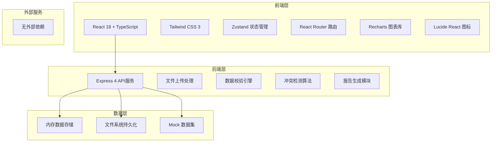
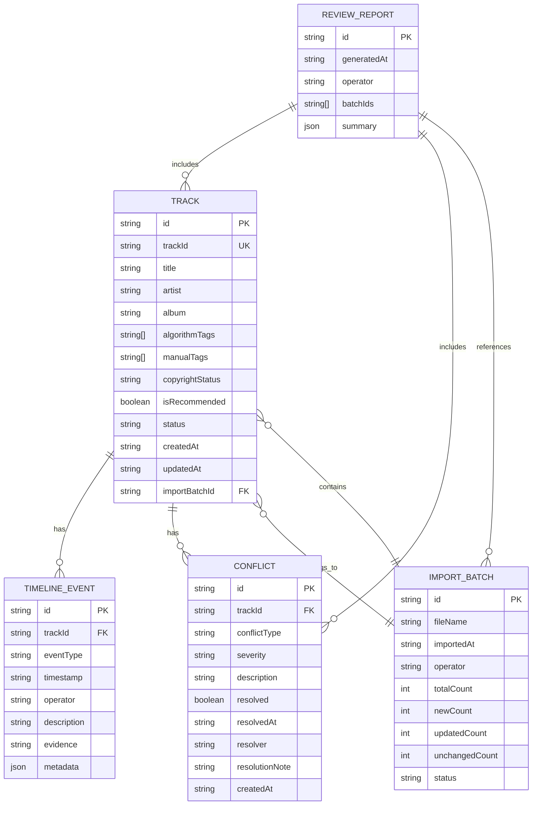

## 1. 架构设计



## 2. 技术描述
- **前端**: React@18 + TypeScript + Vite + Tailwind CSS@3 + Zustand + React Router + Recharts
- **初始化工具**: vite-init (react-express-ts 模板)
- **后端**: Express@4 + TypeScript
- **数据存储**: 内存存储 + JSON文件持久化，无需数据库
- **文件处理**: xlsx库处理Excel/CSV导入，jsPDF处理PDF导出
- **图表可视化**: Recharts 实现雷达图、柱状图、时间线图表

## 3. 路由定义

| 路由 | 页面 | 用途 |
|------|------|------|
| / | Dashboard | 首页仪表盘，数据概览和快捷操作 |
| /import | ImportPage | 数据导入页，文件上传和补传识别 |
| /compare | ComparePage | 标签对比页，情绪分布可视化和冲突列表 |
| /detail/:id | DetailPage | 明细追溯页，时间线和处理记录 |
| /export | ExportPage | 结果导出页，报告生成和下载 |

## 4. API 定义

### 4.1 TypeScript 类型定义

```typescript
// 情绪标签类型
type EmotionTag = 'happy' | 'sad' | 'energetic' | 'calm' | 'romantic' | 'angry' | 'nostalgic' | 'hopeful';

// 曲目状态
type TrackStatus = 'active' | 'removed' | 'pending';

// 冲突类型
type ConflictType = 'algorithm_vs_manual' | 'copyright_vs_recommend' | 'manual_lost' | 'version_mismatch';

// 变更类型
type ChangeType = 'new' | 'updated' | 'unchanged' | 'removed';

// 事件类型
type EventType = 'algorithm_tag' | 'manual_tag' | 'copyright_remove' | 'recommend' | 'manual_correction' | 'review_note';

// 曲目数据
interface Track {
  id: string;
  trackId: string;
  title: string;
  artist: string;
  album: string;
  algorithmTags: EmotionTag[];
  manualTags: EmotionTag[];
  copyrightStatus: 'active' | 'removed';
  isRecommended: boolean;
  status: TrackStatus;
  createdAt: string;
  updatedAt: string;
  importBatchId: string;
}

// 时间线事件
interface TimelineEvent {
  id: string;
  trackId: string;
  eventType: EventType;
  timestamp: string;
  operator: string;
  description: string;
  evidence?: string;
  metadata?: Record<string, any>;
}

// 冲突记录
interface Conflict {
  id: string;
  trackId: string;
  conflictType: ConflictType;
  severity: 'low' | 'medium' | 'high';
  description: string;
  resolved: boolean;
  resolvedAt?: string;
  resolver?: string;
  resolutionNote?: string;
  createdAt: string;
}

// 导入批次
interface ImportBatch {
  id: string;
  fileName: string;
  importedAt: string;
  operator: string;
  totalCount: number;
  newCount: number;
  updatedCount: number;
  unchangedCount: number;
  status: 'processing' | 'completed' | 'failed';
}

// 复核报告
interface ReviewReport {
  id: string;
  generatedAt: string;
  operator: string;
  batchIds: string[];
  summary: {
    totalTracks: number;
    conflictTracks: number;
    resolvedConflicts: number;
    unresolvedConflicts: number;
    copyrightRemoved: number;
    manualCorrections: number;
  };
  tracks: Track[];
  conflicts: Conflict[];
  changes: {
    trackId: string;
    changeType: ChangeType;
    changes: Record<string, { old: any; new: any }>;
  }[];
}
```

### 4.2 API 接口定义

| 方法 | 路径 | 描述 | 请求 | 响应 |
|------|------|------|------|------|
| GET | /api/tracks | 获取曲目列表 | query: page, pageSize, status, hasConflict | { data: Track[], total: number } |
| GET | /api/tracks/:id | 获取单条曲目详情 | - | Track & { timeline: TimelineEvent[], conflicts: Conflict[] } |
| POST | /api/tracks/:id/manual-tag | 添加人工标签 | { tags: EmotionTag[], note: string, operator: string } | { success: boolean, track: Track } |
| POST | /api/import | 导入数据 | multipart/form-data: file, operator | ImportBatch & { preview: { new: Track[], updated: Track[], unchanged: Track[] } } |
| GET | /api/import/batches | 获取导入批次列表 | - | ImportBatch[] |
| GET | /api/conflicts | 获取冲突列表 | query: resolved, conflictType, trackId | Conflict[] |
| POST | /api/conflicts/:id/resolve | 解决冲突 | { resolutionNote: string, operator: string } | Conflict |
| GET | /api/timeline/:trackId | 获取曲目时间线 | - | TimelineEvent[] |
| POST | /api/export | 导出报告 | { format: 'xlsx' | 'csv' | 'pdf', batchIds?: string[] } | { url: string, filename: string } |
| GET | /api/stats/dashboard | 获取仪表盘统计 | - | { totalTracks, conflictCount, resolvedCount, copyrightRemoved, pendingCount, emotionDistribution } |

## 5. 数据模型



## 6. 核心算法逻辑

### 6.1 冲突检测算法
1. **算法vs人工标签冲突**: 比较 `algorithmTags` 和 `manualTags`，计算交集占比，低于60%标记为冲突
2. **版权vs推荐冲突**: `copyrightStatus === 'removed'` 且 `isRecommended === true` 标记为高优先级冲突
3. **人工修正丢失检测**: 检查时间线，存在 `manual_correction` 事件后又出现更早的 `algorithm_tag` 事件
4. **版本不匹配**: 同一曲目多个标签版本，检查最新版本结论是否与冲突队列、版权联动明细一致

### 6.2 重复提交检测
通过 `trackId` 匹配历史数据，逐字段对比：
- 新 `trackId`: `changeType = 'new'`
- `trackId` 存在且字段有变化: `changeType = 'updated'`，记录具体变更字段
- `trackId` 存在且无变化: `changeType = 'unchanged'`

### 6.3 时间线排序与印证
1. 按 `timestamp` 升序排列所有事件
2. 检测事件顺序异常（如人工修正晚于后续算法标签覆盖）
3. 版本结论与前后事件关联验证，标注印证或矛盾关系
