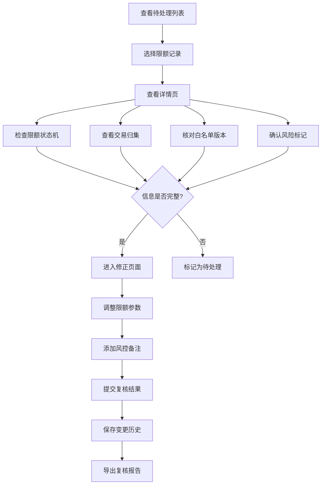

## 1. 产品概述

数字钱包限额复核系统是支付团队用于处理企业钱包限额问题的内部工具，解决日限额、单笔限额和临时白名单互相覆盖导致的复核混乱问题。目标用户为支付团队复核人员，核心价值是建立清晰的限额状态机、完整的历史追溯机制和可靠的复核流程。

## 2. 核心 Features

### 2.1 用户角色
| 角色 | 注册方式 | 核心权限 |
|------|----------|----------|
| 复核人员 | 内部系统账号 | 查看列表、详情、修正限额、导出报告 |
| 管理员 | 内部系统账号 | 全部权限 + 白名单配置 |

### 2.2 Feature Module
1. **限额复核列表页**：限额记录列表、筛选、搜索、状态统计
2. **限额详情页**：限额信息、交易归集、白名单版本、历史变更、风险标记
3. **限额修正页**：限额调整、备注记录、状态变更
4. **报告导出**：复核报告生成、历史导出记录

### 2.3 Page Details
| 页面名称 | 模块名称 | Feature description |
|----------|----------|---------------------|
| 限额复核列表 | 状态统计卡片 | 待处理、处理中、已通过、已拒绝、待确认数量统计 |
| 限额复核列表 | 筛选搜索 | 按钱包账户、状态、时间范围、风险等级筛选 |
| 限额复核列表 | 记录列表 | 显示核心信息：账户、日限额、单笔限额、白名单状态、风险标记 |
| 限额详情页 | 限额状态机 | 可视化展示限额状态流转历史 |
| 限额详情页 | 交易归集 | 当日交易汇总、累计金额、异常交易标记 |
| 限额详情页 | 白名单版本 | 白名单历史版本对比、生效/过期时间 |
| 限额详情页 | 历史回看 | 完整的变更记录、修改前后对比 |
| 限额修正页 | 限额调整 | 修改日限额、单笔限额、临时白名单 |
| 限额修正页 | 风控备注 | 记录复核意见、风险评估说明 |
| 报告导出 | 报告生成 | 生成复核报告、支持多种格式导出 |
| 报告导出 | 导出历史 | 记录所有导出操作、可追溯导出内容 |

## 3. 核心 Process

复核人员登录系统后，首先查看待处理限额记录列表，选择一条记录进入详情页。在详情页查看限额状态机、交易归集数据、白名单版本历史和风险标记，确认无误后进入修正页面进行限额调整，添加风控备注后提交。系统自动保存完整变更历史，最后可导出复核报告。

## 4. User Interface Design

### 4.1 Design Style
- **主色调**：深蓝色系（#1e3a5f），代表专业、可靠
- **辅助色**：橙色（#f59e0b）用于待处理，绿色（#10b981）用于正常，红色（#ef4444）用于风险
- **按钮风格**：圆角矩形，简洁硬朗，hover 时有轻微阴影
- **字体**：使用 JetBrains Mono 等宽字体展示数字数据，系统字体展示文本
- **布局风格**：左侧导航 + 右侧内容区，卡片式布局，数据密集但层次清晰
- **图标风格**：线性图标，简洁专业

### 4.2 Page Design Overview
| Page Name | Module Name | UI Elements |
|-----------|-------------|-------------|
| 限额复核列表 | 状态统计 | 彩色卡片、数字动效、图标 |
| 限额复核列表 | 数据表格 | 斑马纹、悬停高亮、状态标签 |
| 限额详情页 | 状态机 | 时间线、状态节点、连接线、动画 |
| 限额详情页 | 交易归集 | 数据卡片、饼图/柱状图、异常标记 |
| 限额详情页 | 白名单版本 | 版本对比表、时间轴、生效状态 |
| 限额修正页 | 表单 | 分组输入、实时校验、历史对比 |
| 报告导出 | 导出面板 | 格式选择、预览、进度条 |

### 4.3 Responsiveness
- Desktop-first 设计，主显示区域最小宽度 1280px
- 表格支持横向滚动，保证数据完整性
- 侧边栏可折叠，最大化内容区域

## 5. 特殊约束

### 5.1 数据一致性
- 所有状态变更必须记录完整历史
- 刷新或重启后数据完全一致
- 导出数字与页面显示必须精确匹配

### 5.2 风险处理
- 白名单过期、累计限额漏算、重复交易放行时，自动标记为待处理
- 不自动生成假结论，需要人工确认
- 所有修改操作必须留痕
