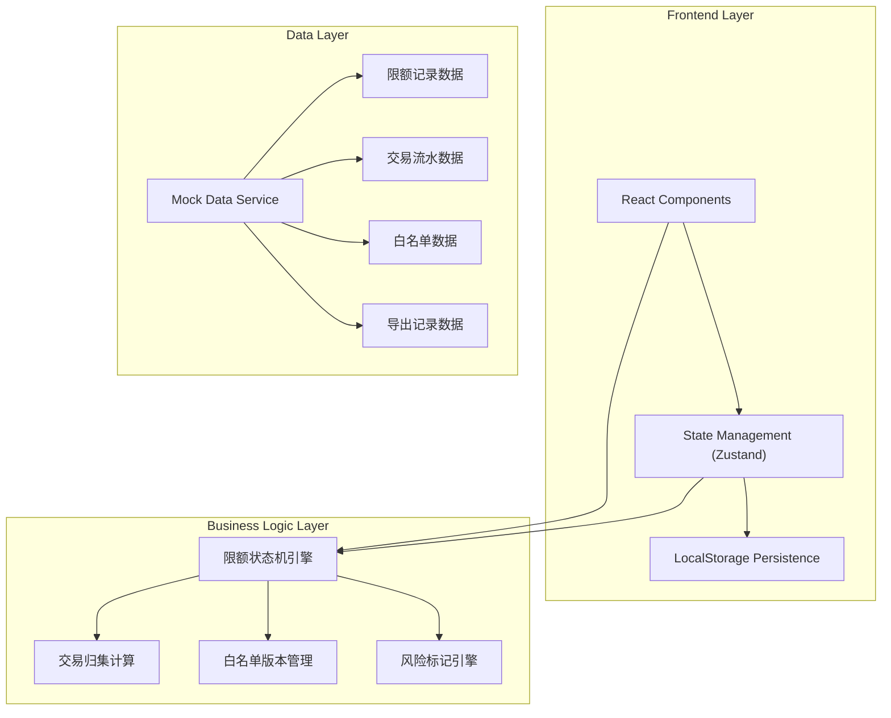
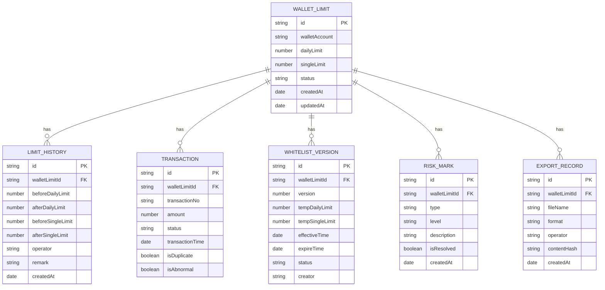

## 1. Architecture Design



## 2. Technology Description

- **Frontend**: React@18 + TypeScript + tailwindcss@3 + vite@5
- **State Management**: Zustand (轻量级状态管理，支持持久化)
- **UI 组件库**: Headless UI + Heroicons
- **图表可视化**: Recharts
- **数据持久化**: localStorage + Zustand persist middleware
- **日期处理**: date-fns
- **文件导出**: json2csv + xlsx

## 3. Route Definitions

| Route | Purpose |
|-------|---------|
| / | 限额复核列表页 |
| /detail/:id | 限额详情页 |
| /edit/:id | 限额修正页 |
| /export | 报告导出页 |

## 4. Data Model

### 4.1 Data Model Definition



### 4.2 TypeScript Type Definitions

```typescript
// 限额状态枚举
type LimitStatus = 'pending' | 'processing' | 'approved' | 'rejected' | 'to_confirm';

// 风险等级
type RiskLevel = 'low' | 'medium' | 'high' | 'critical';

// 钱包限额
interface WalletLimit {
  id: string;
  walletAccount: string;
  walletName: string;
  dailyLimit: number;
  singleLimit: number;
  usedDailyLimit: number;
  status: LimitStatus;
  riskLevel: RiskLevel;
  createdAt: string;
  updatedAt: string;
}

// 历史记录
interface LimitHistory {
  id: string;
  walletLimitId: string;
  beforeDailyLimit: number;
  afterDailyLimit: number;
  beforeSingleLimit: number;
  afterSingleLimit: number;
  operator: string;
  remark: string;
  createdAt: string;
}

// 交易记录
interface Transaction {
  id: string;
  walletLimitId: string;
  transactionNo: string;
  amount: number;
  status: 'success' | 'failed' | 'pending';
  transactionTime: string;
  isDuplicate: boolean;
  isAbnormal: boolean;
}

// 白名单版本
interface WhitelistVersion {
  id: string;
  walletLimitId: string;
  version: number;
  tempDailyLimit: number;
  tempSingleLimit: number;
  effectiveTime: string;
  expireTime: string;
  status: 'active' | 'expired' | 'pending';
  creator: string;
}

// 风险标记
interface RiskMark {
  id: string;
  walletLimitId: string;
  type: 'whitelist_expired' | 'limit_exceeded' | 'duplicate_transaction' | 'calculation_missing' | 'other';
  level: RiskLevel;
  description: string;
  isResolved: boolean;
  createdAt: string;
}

// 导出记录
interface ExportRecord {
  id: string;
  walletLimitId: string;
  fileName: string;
  format: 'csv' | 'xlsx' | 'pdf';
  operator: string;
  contentHash: string;
  createdAt: string;
}
```

## 5. Core Business Logic

### 5.1 限额状态机

```
pending → processing → approved/rejected → to_confirm
   ↓           ↓            ↓
to_confirm  to_confirm   to_confirm
```

### 5.2 风险检测规则

1. **白名单过期**: 白名单版本 expireTime < 当前时间 → 自动标记为待处理
2. **累计限额漏算**: usedDailyLimit > dailyLimit * 0.9 → 高风险标记
3. **重复交易**: 同一交易号出现多次 → 自动标记待处理
4. **异常交易**: 单笔金额 > singleLimit * 1.5 → 高风险标记
