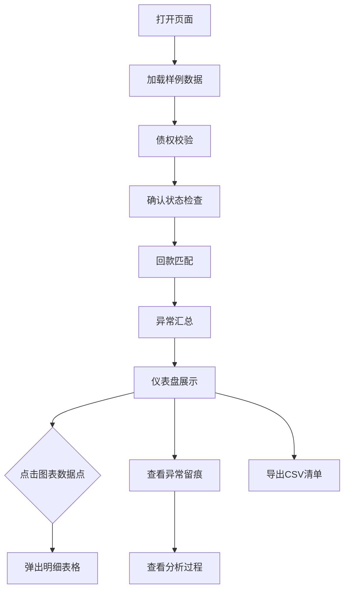

## 1. 产品概述

保理应收账款转让分析工具，面向供应链金融运营人员，解决发票、回款、买方确认材料时间不同步导致的对账难题。核心价值在于自动发现发票重复转让、买方未确认、回款错配等异常，每一步分析留痕可追溯，点击图表即可下钻到明细，最终可导出完整清单供领导或同事复核。

## 2. 核心功能

### 2.1 用户角色

| 角色 | 使用方式 | 核心权限 |
|------|----------|----------|
| 运营人员 | 直接打开网页 | 导入样例数据、执行分析、查看图表与明细、导出清单 |

### 2.2 功能模块

1. **仪表盘页面**：总览卡片（债权总额、确认率、回款匹配率、异常数）+ 4 个可交互图表（债权校验分布、确认状态分布、回款匹配分布、异常类型分布）
2. **明细页面**：点击图表数据点后展示对应明细表格，支持筛选和排序
3. **异常留痕页面**：按时间线展示每步分析的中间结果和异常记录，可展开查看详情
4. **清单导出**：一键导出分析结果为 CSV

### 2.3 页面详情

| 页面名称 | 模块名称 | 功能描述 |
|----------|----------|----------|
| 仪表盘 | 总览卡片 | 展示债权总额、已确认/未确认金额、已匹配/未匹配回款、异常条目数 |
| 仪表盘 | 债权校验图表 | 饼图展示正常/重复/金额异常发票，点击扇区弹出明细 |
| 仪表盘 | 确认状态图表 | 柱状图展示已确认/未确认/部分确认，点击柱体弹出明细 |
| 仪表盘 | 回款匹配图表 | 堆叠柱状图展示已匹配/未匹配/错配，点击弹出明细 |
| 仪表盘 | 异常类型图表 | 横向条形图展示各类异常数量，点击弹出明细 |
| 明细弹窗 | 明细表格 | 展示选中类别的完整行数据，支持列排序和筛选 |
| 异常留痕 | 时间线 | 按分析步骤展示中间结果，异常项标红可展开 |
| 异常留痕 | 留痕详情 | 展示单条异常的原始数据、校验规则、影响说明 |

## 3. 核心流程

用户打开页面 → 加载内置样例数据 → 自动执行四步分析（债权校验 → 确认状态 → 回款匹配 → 异常汇总）→ 仪表盘展示结果 → 点击图表数据点查看明细 → 在异常留痕页查看分析过程 → 导出清单

## 4. 用户界面设计

### 4.1 设计风格

- 主色调：深蓝灰 (#1a1f2e) 背景 + 暖白 (#f0ece4) 前景，专业金融工具感
- 强调色：翡翠绿 (#22c55e) 正常状态 / 琥珀黄 (#f59e0b) 警告 / 珊瑚红 (#ef4444) 异常
- 按钮：圆角微弧 (rounded-lg)，带微妙阴影，hover 时阴影加深
- 字体：DM Sans 做正文，JetBrains Mono 做数据数字
- 布局：左侧窄导航栏 + 右侧内容区，卡片式模块
- 图标：lucide-react 图标库

### 4.2 页面设计概览

| 页面名称 | 模块名称 | UI 元素 |
|----------|----------|----------|
| 仪表盘 | 总览卡片 | 4 张统计卡片，左上角带图标，大号数字 + 小号标签 |
| 仪表盘 | 图表区 | 2x2 网格布局，每格一个图表，深色卡片内浅色图表 |
| 明细弹窗 | 弹窗 | 右侧滑入抽屉，表头固定，行可高亮 |
| 异常留痕 | 时间线 | 左侧竖线 + 圆点，右侧卡片，异常项红色边框 |
| 清单导出 | 导出按钮 | 顶部工具栏按钮，点击生成 CSV 下载 |

### 4.3 响应式设计

桌面优先，最小支持 1280px 宽度。图表区在窄屏下改为单列。

## 5. 样例数据设计

样例数据包含 6 组材料，刻意设计以下异常场景：

| 异常类型 | 具体设计 |
|----------|----------|
| 发票重复转让 | 同一张发票出现在两次转让申请中 |
| 买方未确认 | 某笔转让无买方确认记录 |
| 回款错配 | 回款金额与发票金额不一致，或回款指向错误发票 |
| 缺项 | 某笔转让缺少合同附件或核验报告 |
| 手工更正 | 核验报告中有手工修改痕迹（金额字段被覆写） |
| 隐蔽异常 | 数据格式正常但金额合计与转让总额不符 |
