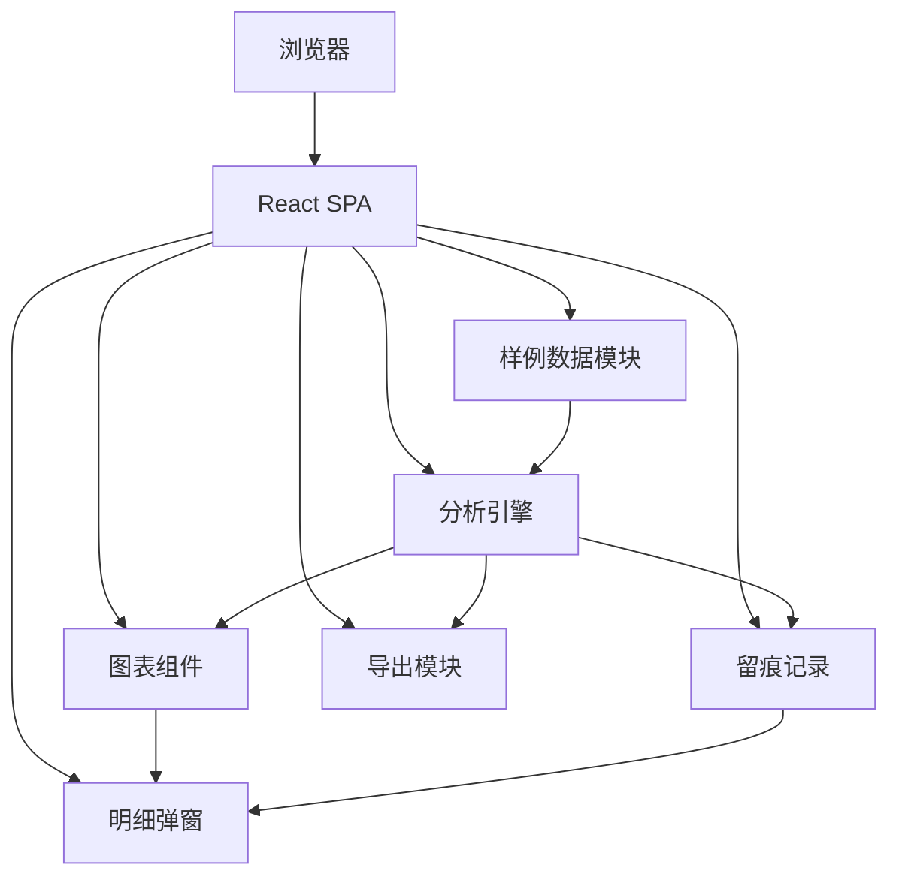

## 1. 架构设计

纯前端单页应用，所有数据与分析逻辑在浏览器端完成，无需后端服务。



## 2. 技术选型

- 前端：React@18 + TypeScript + Tailwind CSS@3 + Vite
- 状态管理：Zustand
- 图表：Recharts（支持点击事件回调）
- 路由：React Router DOM
- 初始化工具：vite-init (react-ts 模板)
- 后端：无
- 数据：内置 Mock 数据，无需数据库

## 3. 路由定义

| 路由 | 用途 |
|------|------|
| / | 仪表盘主页，展示总览卡片和四个图表 |
| /trace | 异常留痕页面，展示分析过程时间线 |

## 4. 数据模型

### 4.1 核心数据结构

```typescript
interface Invoice {
  id: string
  invoiceNo: string
  amount: number
  seller: string
  buyer: string
  issueDate: string
  dueDate: string
  status: "normal" | "duplicate" | "amount_mismatch"
}

interface TransferApplication {
  id: string
  transferNo: string
  invoiceIds: string[]
  totalAmount: number
  applyDate: string
  hasContract: boolean
  hasVerificationReport: boolean
}

interface BuyerConfirmation {
  id: string
  transferNo: string
  confirmDate: string | null
  confirmedAmount: number
  status: "confirmed" | "unconfirmed" | "partial"
}

interface RepaymentFlow {
  id: string
  flowNo: string
  invoiceNo: string
  amount: number
  repayDate: string
  matched: boolean
  mismatchType?: "amount" | "wrong_invoice" | "over_payment"
}

interface AnomalyRecord {
  id: string
  step: "creditor_check" | "confirm_status" | "repayment_match" | "summary"
  category: string
  severity: "error" | "warning" | "info"
  sourceId: string
  description: string
  impact: string
  timestamp: string
  detail: Record<string, unknown>
}
```

### 4.2 分析引擎输出

```typescript
interface AnalysisResult {
  summary: {
    totalAmount: number
    confirmedAmount: number
    matchedAmount: number
    anomalyCount: number
  }
  creditorCheck: {
    normal: number
    duplicate: number
    amountMismatch: number
  }
  confirmStatus: {
    confirmed: number
    unconfirmed: number
    partial: number
  }
  repaymentMatch: {
    matched: number
    unmatched: number
    mismatched: number
  }
  anomalies: AnomalyRecord[]
}
```

## 5. 文件结构

```
src/
  components/
    Dashboard/
      SummaryCards.tsx
      CreditorCheckChart.tsx
      ConfirmStatusChart.tsx
      RepaymentMatchChart.tsx
      AnomalyTypeChart.tsx
    DetailDrawer.tsx
    TraceTimeline.tsx
    Layout.tsx
  data/
    sampleData.ts
  engine/
    analyzer.ts
    types.ts
  store/
    useAnalysisStore.ts
  pages/
    DashboardPage.tsx
    TracePage.tsx
  utils/
    csvExport.ts
  App.tsx
  main.tsx
```
