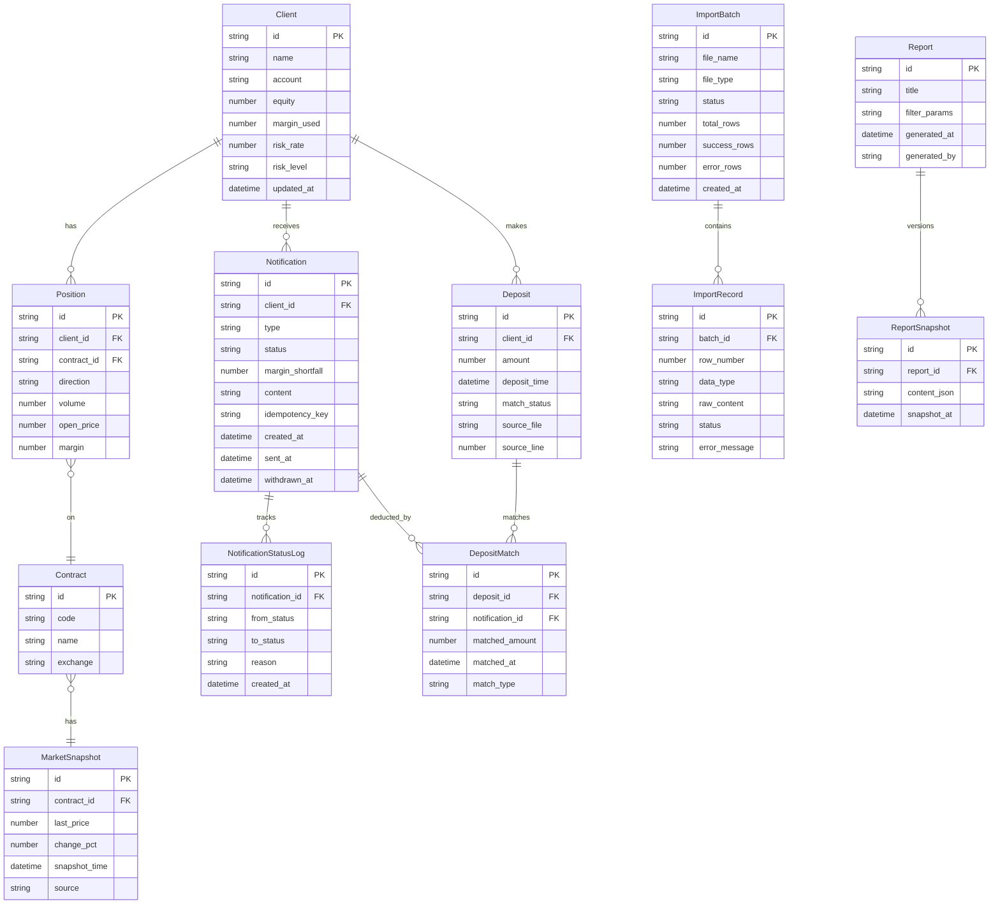

## 1. 架构设计

```mermaid
flowchart TB
    subgraph "前端层"
        "React + TypeScript"
        "Tailwind CSS"
        "Zustand 状态管理"
    end
    subgraph "后端层"
        "Express + TypeScript"
        "业务逻辑服务"
    end
    subgraph "数据层"
        "SQLite 数据库"
        "文件导入存储"
    end
    "React + TypeScript" --> "Express + TypeScript"
    "Express + TypeScript" --> "SQLite 数据库"
    "Express + TypeScript" --> "文件导入存储"
```

## 2. 技术说明

- 前端: React@18 + tailwindcss@3 + vite
- 初始化工具: vite-init
- 后端: Express@4 + TypeScript (ESM)
- 数据库: SQLite (better-sqlite3)，零配置嵌入
- 状态管理: Zustand
- 路由: react-router-dom
- 图标: lucide-react
- 文件解析: xlsx (Excel导入)、csv-parse
- 导出: xlsx (Excel导出)
- 图表: recharts

## 3. 路由定义

| 路由 | 用途 |
|------|------|
| / | 风险总览页：看板+行情+客户列表+待催队列 |
| /notifications | 通知管理页：起草/发送/撤回/历史 |
| /import | 数据导入页：多文件上传+校验+合并 |
| /deposits | 入金流水页：记录+匹配+异常 |
| /reports | 催缴报告页：生成/导出/回看 |

## 4. API 定义

### 4.1 客户与风险

```
GET    /api/clients              获取客户列表（支持筛选、分页）
GET    /api/clients/:id          获取客户详情（持仓+风险率+通知历史）
GET    /api/clients/:id/risk     获取客户实时风险率
```

### 4.2 行情快照

```
GET    /api/market/snapshot      获取行情快照（含数据时点）
POST   /api/market/import        导入行情数据
```

### 4.3 通知管理

```
GET    /api/notifications         获取通知列表（支持筛选）
POST   /api/notifications         创建通知（幂等检查：同客户同日同类型）
PUT    /api/notifications/:id     更新通知（草稿编辑）
POST   /api/notifications/:id/send    发送通知
POST   /api/notifications/:id/withdraw 撤回通知
GET    /api/notifications/check-dup   幂等检查
```

### 4.4 数据导入

```
POST   /api/import/upload         上传多个文件（multipart/form-data）
GET    /api/import/:batchId/status 获取导入批次状态和校验结果
POST   /api/import/:batchId/confirm 确认导入（增量合并）
DELETE /api/import/:batchId/cancel  取消导入
```

### 4.5 入金流水

```
GET    /api/deposits              获取入金记录列表
POST   /api/deposits              录入入金记录
POST   /api/deposits/match        触发自动匹配
POST   /api/deposits/:id/manual-match 手动匹配
GET    /api/deposits/unmatched    获取未匹配入金
```

### 4.6 催缴报告

```
POST   /api/reports/generate      生成催缴报告
GET    /api/reports               获取报告列表
GET    /api/reports/:id           获取报告详情
GET    /api/reports/:id/export    导出报告（?format=csv|xlsx）
GET    /api/reports/histories     获取报告历史快照
```

## 5. 服务端架构

```mermaid
flowchart LR
    "Controller" --> "Service"
    "Service" --> "Repository"
    "Repository" --> "SQLite"
    "Service" --> "校验器"
    "Service" --> "计算引擎"
    "Service" --> "匹配引擎"
```

### 核心服务模块

- **RiskCalculator**: 风险率计算引擎（权益/保证金占用）
- **NotificationService**: 通知管理（幂等key=客户ID+日期+类型）
- **DepositMatcher**: 入金匹配引擎（按客户+金额+时间窗口匹配）
- **ImportService**: 导入服务（解析+校验+增量合并）
- **ReportService**: 报告生成与导出

### 错误处理策略

- 所有业务错误封装为 `BusinessError`，包含：来源文件名、原始行号、对象标识、可读原因
- 数据校验失败不中断整批导入，收集所有错误后统一返回
- 数据库操作使用事务，失败时完整回滚
- 前端统一错误展示，按严重程度分三级：警告（可继续）、错误（需处理）、致命（需联系技术）

## 6. 数据模型

### 6.1 数据模型定义



### 6.2 数据定义语言

```sql
CREATE TABLE clients (
    id TEXT PRIMARY KEY,
    name TEXT NOT NULL,
    account TEXT NOT NULL UNIQUE,
    equity REAL NOT NULL DEFAULT 0,
    margin_used REAL NOT NULL DEFAULT 0,
    risk_rate REAL NOT NULL DEFAULT 0,
    risk_level TEXT NOT NULL DEFAULT 'safe',
    updated_at TEXT NOT NULL DEFAULT (datetime('now'))
);

CREATE TABLE positions (
    id TEXT PRIMARY KEY,
    client_id TEXT NOT NULL REFERENCES clients(id),
    contract_id TEXT NOT NULL REFERENCES contracts(id),
    direction TEXT NOT NULL CHECK(direction IN ('long','short')),
    volume REAL NOT NULL,
    open_price REAL NOT NULL,
    margin REAL NOT NULL DEFAULT 0
);

CREATE TABLE contracts (
    id TEXT PRIMARY KEY,
    code TEXT NOT NULL UNIQUE,
    name TEXT NOT NULL,
    exchange TEXT NOT NULL
);

CREATE TABLE market_snapshots (
    id TEXT PRIMARY KEY,
    contract_id TEXT NOT NULL REFERENCES contracts(id),
    last_price REAL NOT NULL,
    change_pct REAL NOT NULL DEFAULT 0,
    snapshot_time TEXT NOT NULL,
    source TEXT NOT NULL DEFAULT 'manual'
);

CREATE TABLE notifications (
    id TEXT PRIMARY KEY,
    client_id TEXT NOT NULL REFERENCES clients(id),
    type TEXT NOT NULL CHECK(type IN ('margin_call','warning','force_liquidation')),
    status TEXT NOT NULL CHECK(status IN ('draft','sent','confirmed','withdrawn','partially_deducted','settled')),
    margin_shortfall REAL NOT NULL DEFAULT 0,
    content TEXT,
    idempotency_key TEXT NOT NULL UNIQUE,
    created_at TEXT NOT NULL DEFAULT (datetime('now')),
    sent_at TEXT,
    withdrawn_at TEXT
);

CREATE TABLE notification_status_logs (
    id TEXT PRIMARY KEY,
    notification_id TEXT NOT NULL REFERENCES notifications(id),
    from_status TEXT NOT NULL,
    to_status TEXT NOT NULL,
    reason TEXT,
    created_at TEXT NOT NULL DEFAULT (datetime('now'))
);

CREATE TABLE deposits (
    id TEXT PRIMARY KEY,
    client_id TEXT NOT NULL REFERENCES clients(id),
    amount REAL NOT NULL,
    deposit_time TEXT NOT NULL,
    match_status TEXT NOT NULL DEFAULT 'unmatched' CHECK(match_status IN ('unmatched','partially_matched','matched')),
    source_file TEXT,
    source_line INTEGER
);

CREATE TABLE deposit_matches (
    id TEXT PRIMARY KEY,
    deposit_id TEXT NOT NULL REFERENCES deposits(id),
    notification_id TEXT NOT NULL REFERENCES notifications(id),
    matched_amount REAL NOT NULL,
    matched_at TEXT NOT NULL DEFAULT (datetime('now')),
    match_type TEXT NOT NULL DEFAULT 'auto' CHECK(match_type IN ('auto','manual'))
);

CREATE TABLE import_batches (
    id TEXT PRIMARY KEY,
    file_name TEXT NOT NULL,
    file_type TEXT NOT NULL,
    status TEXT NOT NULL DEFAULT 'pending' CHECK(status IN ('pending','validating','confirmed','cancelled')),
    total_rows INTEGER NOT NULL DEFAULT 0,
    success_rows INTEGER NOT NULL DEFAULT 0,
    error_rows INTEGER NOT NULL DEFAULT 0,
    created_at TEXT NOT NULL DEFAULT (datetime('now'))
);

CREATE TABLE import_records (
    id TEXT PRIMARY KEY,
    batch_id TEXT NOT NULL REFERENCES import_batches(id),
    row_number INTEGER NOT NULL,
    data_type TEXT NOT NULL,
    raw_content TEXT NOT NULL,
    status TEXT NOT NULL DEFAULT 'pending' CHECK(status IN ('pending','success','error','skipped')),
    error_message TEXT
);

CREATE TABLE reports (
    id TEXT PRIMARY KEY,
    title TEXT NOT NULL,
    filter_params TEXT NOT NULL,
    generated_at TEXT NOT NULL DEFAULT (datetime('now')),
    generated_by TEXT NOT NULL
);

CREATE TABLE report_snapshots (
    id TEXT PRIMARY KEY,
    report_id TEXT NOT NULL REFERENCES reports(id),
    content_json TEXT NOT NULL,
    snapshot_at TEXT NOT NULL DEFAULT (datetime('now'))
);

CREATE INDEX idx_positions_client ON positions(client_id);
CREATE INDEX idx_notifications_client ON notifications(client_id);
CREATE INDEX idx_notifications_idempotency ON notifications(idempotency_key);
CREATE INDEX idx_notifications_status ON notifications(status);
CREATE INDEX idx_deposits_client ON deposits(client_id);
CREATE INDEX idx_deposits_match_status ON deposits(match_status);
CREATE INDEX idx_deposit_matches_notification ON deposit_matches(notification_id);
CREATE INDEX idx_market_snapshots_contract_time ON market_snapshots(contract_id, snapshot_time);
CREATE INDEX idx_import_records_batch ON import_records(batch_id);
CREATE INDEX idx_notification_logs_notification ON notification_status_logs(notification_id);
CREATE INDEX idx_report_snapshots_report ON report_snapshots(report_id);
```
