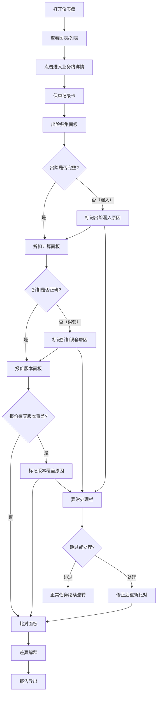

## 1. 产品概述

车险续保报价比对系统——为车险团队解决续保过程中出险记录、折扣系数与渠道报价三者经常对不上的问题。以图表为入口，将保单记录、出险明细、报价单、渠道规则、客户备注、比对报告串联在同一条业务线上，确保图、明细、报告三边口径一致；遇到出险漏入、折扣误套、报价版本覆盖等异常不中断整批任务，正常的先走完，有问题的留清楚原因。

**核心用户**：车险续保专员、团队主管
**核心价值**：减少报价比对中的人工核查遗漏，让异常可追溯、差异可解释、报告可导出

## 2. 核心功能

### 2.1 用户角色

| 角色 | 权限说明 |
|------|----------|
| 续保专员 | 查看仪表盘、处理续保任务、导出比对报告 |
| 团队主管 | 全部续保专员权限 + 查看团队汇总数据、审批异常处理 |

### 2.2 功能模块

1. **仪表盘页面**：续保任务状态分布图、报价匹配率图、异常类型分布图、待处理任务列表——每个图表元素均可点击跳转至对应业务线
2. **业务线详情页面**：以单一客户续保为轴，从左到右展示"保单→出险→折扣→报价→比对→报告"完整链路，所有数据同页同线

### 2.3 页面详情

| 页面名称 | 模块名称 | 功能说明 |
|----------|----------|----------|
| 仪表盘 | 续保状态总览图 | 环形图展示待处理/处理中/已完成/异常状态分布，点击扇区跳转业务线列表 |
| 仪表盘 | 报价匹配率图 | 柱状图展示各渠道报价与系统计算的匹配/偏差比例，点击柱体进入对应业务线 |
| 仪表盘 | 异常类型分布图 | 水平条形图展示出险漏入/折扣误套/版本覆盖/其他异常的占比，点击条目进入异常业务线 |
| 仪表盘 | 待处理任务列表 | 表格列出最新待处理续保任务，含客户名、车牌、状态、异常标记，点击行进入业务线详情 |
| 业务线详情 | 保单记录卡 | 展示上年保单核心字段：险种、保额、保费、起止日期、NCD系数 |
| 业务线详情 | 出险归集面板 | 列出所有出险记录，标注是否已纳入折扣计算；漏入项以红色警告标记 |
| 业务线详情 | 折扣计算面板 | 展示NCD系数推导过程、渠道专属折扣叠加逻辑，误套折扣以橙色警告标记 |
| 业务线详情 | 报价版本面板 | 时间线展示各渠道各版本报价，版本覆盖以黄色警告标记，支持任意两版本差异对比 |
| 业务线详情 | 比对面板 | 自动比对保单/出险/折扣/报价四端数据，差异项以结构化方式解释原因 |
| 业务线详情 | 客户备注面板 | 展示客户沟通备注，支持新增备注 |
| 业务线详情 | 报告导出 | 一键生成比对报告（含差异解释），支持PDF导出 |
| 业务线详情 | 异常处理栏 | 当业务线存在异常时，展示异常原因、建议操作、跳过/标记已处理按钮 |

## 3. 核心流程

用户打开仪表盘 → 通过图表或列表进入某条业务线 → 沿保单→出险→折扣→报价→比对链路逐一核查 → 发现异常则标记原因并决定跳过或处理 → 比对完成后导出报告。批量任务中，正常任务自动走完，异常任务停留在异常栏等待处理。

## 4. 用户界面设计

### 4.1 设计风格

- **主色调**：深蓝灰（#1e293b）为底，强调专业与沉稳；辅助色为青蓝（#0ea5e9）与琥珀橙（#f59e0b）用于状态与异常高亮
- **按钮风格**：圆角微凸（rounded-lg + subtle shadow），主操作用实心青蓝，次要操作用描边
- **字体**：标题用 Noto Sans SC Bold，正文用 Noto Sans SC Regular，数据/代码用 JetBrains Mono
- **布局**：左侧固定导航 + 右侧内容区，内容区采用卡片式流式布局
- **图标**：Lucide Icons，风格统一为线性描边
- **异常标记色彩**：出险漏入=红色（#ef4444），折扣误套=橙色（#f97316），版本覆盖=黄色（#eab308），正常=绿色（#22c55e）

### 4.2 页面设计概览

| 页面名称 | 模块名称 | UI元素 |
|----------|----------|--------|
| 仪表盘 | 续保状态总览图 | 环形图居左上，带中心数字、图例、扇区hover放大动效 |
| 仪表盘 | 报价匹配率图 | 柱状图居右上，柱体hover显示匹配/偏差详情 |
| 仪表盘 | 异常类型分布图 | 水平条形图居左下，条目可点击 |
| 仪表盘 | 待处理任务列表 | 表格居右下，行hover高亮，状态列带色点 |
| 业务线详情 | 链路总览条 | 顶部水平步骤条：保单→出险→折扣→报价→比对→报告，当前步骤高亮 |
| 业务线详情 | 保单记录卡 | 白底卡片，核心字段双列布局 |
| 业务线详情 | 出险归集面板 | 卡片内表格，漏入行红色左边框 + 警告图标 |
| 业务线详情 | 折扣计算面板 | 卡片内推导树状图，误套节点橙色边框 |
| 业务线详情 | 报价版本面板 | 垂直时间线，版本节点可展开，覆盖版本黄色标签 |
| 业务线详情 | 比对面板 | 差异项左右对比布局，差异部分高亮背景 |
| 业务线详情 | 客户备注面板 | 简洁备注列表 + 底部输入框 |
| 业务线详情 | 报告导出 | 底部固定操作栏，导出按钮 + 预览弹窗 |
| 业务线详情 | 异常处理栏 | 右侧固定浮层，异常列表 + 跳过/处理按钮 |

### 4.3 响应式设计

桌面优先设计，1280px以上完整展示；1024-1280px压缩图表区域；768px以下切换为单列滚动布局

### 4.4 演示数据规划

| 场景 | 客户 | 说明 |
|------|------|------|
| 正常流程 | 张伟 / 京A·88888 | 1次出险已录入，NCD系数0.85正确，2个渠道报价一致，比对无差异，报告正常导出 |
| 边界情况 | 李娜 / 沪B·66666 | 0次出险但折扣误套为0.7（应为0.85），系统检测到折扣系数与出险记录不匹配，橙色警告 |
| 现实例外 | 王强 / 粤C·12345 | 3次出险中1次漏入、报价版本被覆盖2次、渠道规则冲突，多处异常同时出现，系统不中断但逐一标记原因 |
