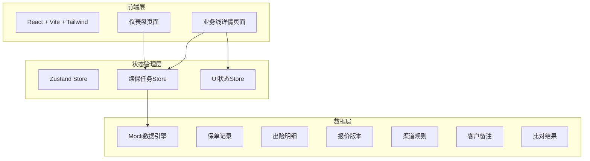
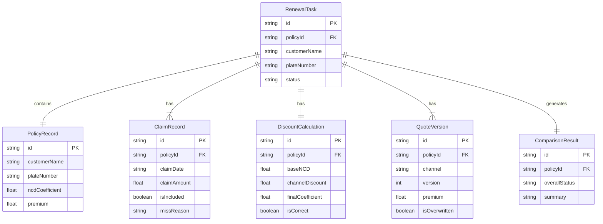

## 1. 架构设计



纯前端架构，所有数据通过Mock引擎提供，无需后端服务。Zustand统一管理业务状态与UI状态，确保图表/明细/报告三端数据来源唯一。

## 2. 技术说明

- **前端**：React@18 + TypeScript + Tailwind CSS@3 + Vite
- **初始化工具**：vite-init（react-ts模板）
- **后端**：无（纯前端，Mock数据）
- **数据库**：无（内存数据 + Zustand持久化）
- **图表库**：recharts（环形图、柱状图、条形图）
- **图标**：lucide-react
- **导出**：html2canvas + jspdf（PDF报告导出）
- **状态管理**：zustand

## 3. 路由定义

| 路由 | 用途 |
|------|------|
| `/` | 仪表盘页面——续保任务总览，图表入口 |
| `/business-line/:id` | 业务线详情页面——指定客户的续保全链路查看与比对 |

## 4. API定义

无后端API。前端通过Zustand Store直接访问Mock数据引擎。

### 4.1 核心数据类型

```typescript
interface PolicyRecord {
  id: string
  customerName: string
  plateNumber: string
  insuranceTypes: string[]
  coverageAmounts: Record<string, number>
  premium: number
  startDate: string
  endDate: string
  ncdCoefficient: number
}

interface ClaimRecord {
  id: string
  policyId: string
  claimDate: string
  claimAmount: number
  claimType: string
  isIncluded: boolean
  missReason?: string
}

interface DiscountCalculation {
  id: string
  policyId: string
  baseNCD: number
  channelDiscount: number
  finalCoefficient: number
  steps: DiscountStep[]
  isCorrect: boolean
  errorReason?: string
}

interface DiscountStep {
  label: string
  coefficient: number
  source: string
}

interface QuoteVersion {
  id: string
  policyId: string
  channel: string
  version: number
  premium: number
  timestamp: string
  isOverwritten: boolean
  overwriteReason?: string
}

interface ChannelRule {
  id: string
  channelName: string
  discountRate: number
  conditions: string[]
}

interface CustomerNote {
  id: string
  policyId: string
  content: string
  timestamp: string
  author: string
}

interface ComparisonResult {
  id: string
  policyId: string
  differences: DifferenceItem[]
  overallStatus: 'normal' | 'warning' | 'error'
  summary: string
}

interface DifferenceItem {
  field: string
  expected: string
  actual: string
  reason: string
  severity: 'info' | 'warning' | 'error'
}

interface RenewalTask {
  id: string
  policyId: string
  customerName: string
  plateNumber: string
  status: 'pending' | 'processing' | 'completed' | 'exception'
  exceptionTypes: ExceptionType[]
  policy: PolicyRecord
  claims: ClaimRecord[]
  discount: DiscountCalculation
  quotes: QuoteVersion[]
  channelRules: ChannelRule[]
  notes: CustomerNote[]
  comparison: ComparisonResult
}

type ExceptionType = 'claim_missing' | 'discount_error' | 'quote_overwrite' | 'channel_conflict'
```

## 5. 数据模型

### 5.1 数据模型定义



### 5.2 演示数据

三条预置业务线：
1. **张伟/京A·88888**：正常流程，1次出险已入，折扣正确，2渠道报价一致
2. **李娜/沪B·66666**：0出险但折扣误套，系统检测不匹配
3. **王强/粤C·12345**：3次出险1次漏入 + 报价版本覆盖2次 + 渠道规则冲突

## 6. 关键技术决策

| 决策点 | 选择 | 理由 |
|--------|------|------|
| 数据来源 | Mock引擎 | 用户明确"不指望自动理解所有文件"，MVP阶段用内存数据即可 |
| 异常处理策略 | 容错不中断 | 用户明确要求"正常的先走完，有问题的留清楚原因" |
| 图表交互 | 点击跳转业务线 | 用户要求"把图表当入口" |
| 报价版本管理 | 时间线展示 | 用户要求"报价版本"可追溯 |
| 报告导出 | PDF | 闭环需求，利用html2canvas+jspdf纯前端实现 |
| 状态管理 | Zustand | 轻量、单一数据源，确保图表/明细/报告三端一致 |
