## 1. 架构设计

```mermaid
graph TB
    subgraph "前端层"
        "React + TypeScript"
        "Zustand 状态管理"
        "Tailwind CSS"
        "ECharts 图表"
    end
    subgraph "后端层"
        "Express + TypeScript"
        "业务计算引擎"
        "溯源追踪器"
        "异常检测器"
    end
    subgraph "数据层"
        "SQLite 数据库"
        "增量归集引擎"
        "冲突检测器"
    end
    "React + TypeScript" --> "Express + TypeScript"
    "Express + TypeScript" --> "SQLite 数据库"
    "业务计算引擎" --> "溯源追踪器"
    "异常检测器" --> "溯源追踪器"
    "增量归集引擎" --> "冲突检测器"
```

## 2. 技术说明

- 前端：React@18 + TailwindCSS@3 + Vite + Zustand + ECharts
- 初始化工具：vite-init（react-express-ts 模板）
- 后端：Express@4 + TypeScript（ESM）
- 数据库：SQLite（better-sqlite3），本地文件数据库
- 图表：ECharts（用于桑基图、环形图、柱状图等）

## 3. 路由定义

| 路由 | 用途 |
|------|------|
| / | 数据总览页，缺口概览、资金卡片、预警状态、异常提示 |
| /quota | 配额归集页，排放数据表、配额账户表、缺口计算 |
| /hedging | 锁价匹配页，锁价合约表、匹配结果、市场价格 |
| /budget | 预算预警页，预算对比、预警规则、资金来源 |
| /report | 报告导出页，报告预览、导出配置、溯源链接 |

## 4. API 定义

### 4.1 数据导入

```typescript
interface ImportRequest {
  source: "emission" | "allowance" | "transaction" | "hedging" | "budget" | "fund";
  data: Record<string, unknown>[];
  period: string;
}

interface ImportResponse {
  imported: number;
  conflicts: ConflictItem[];
  warnings: WarningItem[];
}
```

### 4.2 配额缺口

```typescript
interface QuotaGapResult {
  totalEmission: number;
  totalAllowance: number;
  gap: number;
  gapUnit: string;
  trace: TraceNode[];
  anomalies: AnomalyItem[];
}

interface TraceNode {
  id: string;
  type: "source" | "calculation" | "aggregation";
  label: string;
  value: number;
  source?: string;
  timestamp?: string;
  children?: TraceNode[];
}
```

### 4.3 锁价匹配

```typescript
interface HedgingMatchResult {
  totalGap: number;
  matchedAmount: number;
  unmatchedAmount: number;
  duplicateContracts: DuplicateItem[];
  matches: HedgingMatch[];
  trace: TraceNode[];
}
```

### 4.4 预算预警

```typescript
interface BudgetAlertResult {
  budgetAmount: number;
  requiredAmount: number;
  status: "green" | "yellow" | "red";
  alerts: BudgetAlert[];
  trace: TraceNode[];
}
```

### 4.5 报告导出

```typescript
interface ReportExportRequest {
  period: string;
  format: "excel" | "pdf";
  includeTrace: boolean;
  sections: ("overview" | "quota" | "hedging" | "budget")[];
}
```

### 4.6 异常检测

```typescript
interface AnomalyItem {
  id: string;
  type: "unit_error" | "duplicate_hedging" | "gap_underestimate" | "data_conflict";
  severity: "error" | "warning" | "info";
  message: string;
  explanation: string;
  suggestion: string;
  relatedSource?: string;
}
```

## 5. 服务器架构图

```mermaid
graph LR
    "Controller" --> "Service"
    "Service" --> "Repository"
    "Repository" --> "SQLite"
    "Service" --> "溯源追踪器"
    "Service" --> "异常检测器"
    "Service" --> "增量归集引擎"
```

## 6. 数据模型

### 6.1 数据模型定义

```mermaid
erDiagram
    "排放记录" {
        string id PK
        string period
        string facility
        float emission_amount
        string unit
        string source_file
        datetime imported_at
    }
    "配额账户" {
        string id PK
        string period
        string account_no
        float allowance_amount
        string source_file
        datetime imported_at
    }
    "成交记录" {
        string id PK
        string period
        float price
        float quantity
        datetime trade_date
        string source_file
        datetime imported_at
    }
    "锁价合约" {
        string id PK
        string contract_no
        string period
        float locked_price
        float quantity
        datetime valid_from
        datetime valid_to
        string source_file
        datetime imported_at
    }
    "预算表" {
        string id PK
        string period
        float budget_amount
        string category
        string source_file
        datetime imported_at
    }
    "资金报告" {
        string id PK
        string period
        float amount
        string fund_type
        string source_file
        datetime imported_at
    }
    "缺口计算" {
        string id PK
        string period
        float total_emission
        float total_allowance
        float gap
        string unit
        datetime calculated_at
    }
    "锁价匹配" {
        string id PK
        string gap_id FK
        string hedging_id FK
        float matched_amount
        float matched_price
        datetime matched_at
    }
    "溯源记录" {
        string id PK
        string target_type
        string target_id
        string trace_type
        string trace_label
        float trace_value
        string source_type
        string source_id
        string source_file
        datetime created_at
    }
    "异常记录" {
        string id PK
        string anomaly_type
        string severity
        string message
        string explanation
        string suggestion
        string related_source
        boolean resolved
        datetime detected_at
    }
    "数据冲突" {
        string id PK
        string source_type
        string source_id
        string conflict_type
        string existing_value
        string new_value
        string resolution
        datetime detected_at
    }
    "缺口计算" ||--o{ "锁价匹配" : "has"
    "锁价合约" ||--o{ "锁价匹配" : "matched_in"
```



### 6.2 数据定义语言

```sql
CREATE TABLE emission_records (
  id TEXT PRIMARY KEY,
  period TEXT NOT NULL,
  facility TEXT NOT NULL,
  emission_amount REAL NOT NULL,
  unit TEXT NOT NULL,
  source_file TEXT,
  imported_at TEXT NOT NULL DEFAULT (datetime('now'))
);

CREATE TABLE allowance_accounts (
  id TEXT PRIMARY KEY,
  period TEXT NOT NULL,
  account_no TEXT NOT NULL,
  allowance_amount REAL NOT NULL,
  source_file TEXT,
  imported_at TEXT NOT NULL DEFAULT (datetime('now'))
);

CREATE TABLE trade_records (
  id TEXT PRIMARY KEY,
  period TEXT NOT NULL,
  price REAL NOT NULL,
  quantity REAL NOT NULL,
  trade_date TEXT NOT NULL,
  source_file TEXT,
  imported_at TEXT NOT NULL DEFAULT (datetime('now'))
);

CREATE TABLE hedging_contracts (
  id TEXT PRIMARY KEY,
  contract_no TEXT NOT NULL UNIQUE,
  period TEXT NOT NULL,
  locked_price REAL NOT NULL,
  quantity REAL NOT NULL,
  valid_from TEXT NOT NULL,
  valid_to TEXT NOT NULL,
  source_file TEXT,
  imported_at TEXT NOT NULL DEFAULT (datetime('now'))
);

CREATE TABLE budget_entries (
  id TEXT PRIMARY KEY,
  period TEXT NOT NULL,
  budget_amount REAL NOT NULL,
  category TEXT,
  source_file TEXT,
  imported_at TEXT NOT NULL DEFAULT (datetime('now'))
);

CREATE TABLE fund_reports (
  id TEXT PRIMARY KEY,
  period TEXT NOT NULL,
  amount REAL NOT NULL,
  fund_type TEXT,
  source_file TEXT,
  imported_at TEXT NOT NULL DEFAULT (datetime('now'))
);

CREATE TABLE gap_calculations (
  id TEXT PRIMARY KEY,
  period TEXT NOT NULL,
  total_emission REAL NOT NULL,
  total_allowance REAL NOT NULL,
  gap REAL NOT NULL,
  unit TEXT NOT NULL DEFAULT 'tCO2',
  calculated_at TEXT NOT NULL DEFAULT (datetime('now'))
);

CREATE TABLE hedging_matches (
  id TEXT PRIMARY KEY,
  gap_id TEXT NOT NULL REFERENCES gap_calculations(id),
  hedging_id TEXT NOT NULL REFERENCES hedging_contracts(id),
  matched_amount REAL NOT NULL,
  matched_price REAL NOT NULL,
  matched_at TEXT NOT NULL DEFAULT (datetime('now'))
);

CREATE TABLE trace_records (
  id TEXT PRIMARY KEY,
  target_type TEXT NOT NULL,
  target_id TEXT NOT NULL,
  trace_type TEXT NOT NULL,
  trace_label TEXT NOT NULL,
  trace_value REAL,
  source_type TEXT,
  source_id TEXT,
  source_file TEXT,
  created_at TEXT NOT NULL DEFAULT (datetime('now'))
);

CREATE TABLE anomalies (
  id TEXT PRIMARY KEY,
  anomaly_type TEXT NOT NULL,
  severity TEXT NOT NULL DEFAULT 'warning',
  message TEXT NOT NULL,
  explanation TEXT NOT NULL,
  suggestion TEXT NOT NULL,
  related_source TEXT,
  resolved INTEGER NOT NULL DEFAULT 0,
  detected_at TEXT NOT NULL DEFAULT (datetime('now'))
);

CREATE TABLE data_conflicts (
  id TEXT PRIMARY KEY,
  source_type TEXT NOT NULL,
  source_id TEXT NOT NULL,
  conflict_type TEXT NOT NULL,
  existing_value TEXT NOT NULL,
  new_value TEXT NOT NULL,
  resolution TEXT DEFAULT 'pending',
  detected_at TEXT NOT NULL DEFAULT (datetime('now'))
);

CREATE INDEX idx_emission_period ON emission_records(period);
CREATE INDEX idx_allowance_period ON allowance_accounts(period);
CREATE INDEX idx_trade_period ON trade_records(period);
CREATE INDEX idx_hedging_period ON hedging_contracts(period);
CREATE INDEX idx_budget_period ON budget_entries(period);
CREATE INDEX idx_fund_period ON fund_reports(period);
CREATE INDEX idx_gap_period ON gap_calculations(period);
CREATE INDEX idx_trace_target ON trace_records(target_type, target_id);
CREATE INDEX idx_anomalies_type ON anomalies(anomaly_type, resolved);
CREATE INDEX idx_conflicts_resolution ON data_conflicts(resolution);
```
