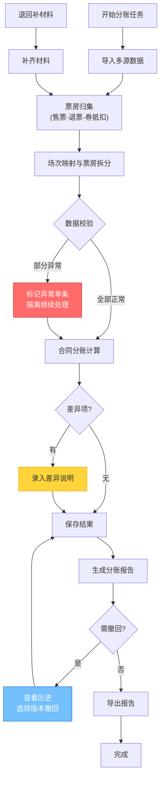

## 1. 产品概述
影城财务给片方分账时，退票、会员券和特殊场次会改变最终票房。系统解决售票流水、退票记录、会员券、影片合同、场次表、分账报告等材料互相不一致时的核对难题，让业务同事敢拍板。

### 1.1 核心痛点
- 多源数据不一致时无法定责
- 异常数据导致整批处理失败
- 退回补材料后需重新建单，无法续办
- 历史操作记录不可靠，撤回无依据

### 1.2 核心设计原则
- **按钮极简**：只保留保存、撤回、历史三个核心操作按钮
- **主线清晰**：票房归集 → 合同分账 → 退票回滚 → 差异说明 → 报告导出
- **异常隔离**：单条记录异常不影响整批，明确区分正常/异常流程
- **续办机制**：退回补材料后可继续处理，无需重建

## 2. 核心功能

### 2.1 用户角色
| 角色 | 注册方式 | 核心权限 |
|------|----------|----------|
| 业务操作员 | 系统账号 | 数据导入、分账核对、差异说明、报告导出 |
| 财务审核员 | 系统账号 | 审核分账结果、撤回操作、查看历史 |
| 系统管理员 | 系统账号 | 用户管理、参数配置 |

### 2.2 功能模块
1. **分账任务列表**：任务卡片、状态筛选、搜索
2. **票房归集**：售票流水导入、退票记录关联、会员券抵扣核算
3. **场次映射**：影片场次匹配、特殊场次标识、票房拆分
4. **合同分账**：分账比例应用、保底/阶梯计算、片方分账金额
5. **退票回滚**：退票金额从票房中扣除、回滚追溯
6. **差异说明**：数据不一致标注、说明录入、附件上传
7. **异常处理**：单条隔离、错误标记、跳过继续
8. **历史记录**：操作日志、版本对比、撤回恢复
9. **报告导出**：分账报告生成、Excel/PDF导出

### 2.3 页面详情
| 页面名称 | 模块名称 | 功能描述 |
|---------|---------|----------|
| 任务列表页 | 任务卡片 | 展示分账任务状态、进度、异常数量 |
| 任务列表页 | 操作栏 | 新建任务、搜索、筛选 |
| 分账详情页 | 票房归集 | 售票流水列表、退票扣减、会员券抵扣 |
| 分账详情页 | 场次映射 | 场次匹配、票房拆分、异常标记 |
| 分账详情页 | 合同分账 | 分账计算、明细展示、金额汇总 |
| 分账详情页 | 差异说明 | 差异项列表、说明录入、附件 |
| 分账详情页 | 操作区 | 保存、撤回、历史、导出 |
| 历史记录页 | 版本对比 | 操作日志、版本差异、撤回恢复 |

## 3. 核心流程

### 3.1 主流程描述
1. 操作员导入售票流水、退票记录、会员券、影片合同、场次表
2. 系统自动进行票房归集：售票金额 - 退票金额 - 会员券抵扣 = 净票房
3. 系统自动进行场次映射，将票房拆分到对应影片场次
4. 系统根据合同自动计算分账金额
5. 操作员核对结果，对差异项录入说明
6. 系统标记异常项但继续处理正常项
7. 保存分账结果，生成报告
8. 如需修改，可撤回至上一版本，查看历史记录
9. 若材料缺失被退回，补齐后可继续原任务

### 3.2 核心流程图

## 4. 用户界面设计

### 4.1 设计风格
- **主色调**：深邃蓝 #1e3a5f（专业、稳重）
- **强调色**：琥珀橙 #f59e0b（异常警示）、翡翠绿 #10b981（正常通过）、珊瑚红 #ef4444（错误）
- **中性色**：锌灰系列（zinc-50 到 zinc-900）
- **按钮风格**：微圆角 6px，细腻阴影，悬停有轻微浮起效果
- **字体**：正文使用 Inter，数字使用 JetBrains Mono 等宽字体便于金额对齐
- **布局**：左侧导航 + 右侧主内容区，卡片式布局，清晰的视觉层次
- **图标**：使用 lucide-react 线性图标，统一 20px 尺寸

### 4.2 页面设计概要
| 页面名称 | 模块名称 | UI 元素 |
|---------|---------|----------|
| 任务列表页 | 任务卡片 | 状态标签（绿/橙/红）、进度条、异常计数徽标、创建时间、操作按钮 |
| 分账详情页 | 步骤导航 | 顶部步骤条，标识当前阶段（归集→映射→分账→说明→导出） |
| 分账详情页 | 数据表格 | 斑马纹、异常行高亮、可展开明细、金额右对齐等宽字体 |
| 分账详情页 | 操作区 | 底部固定操作栏，仅三个按钮：保存（主按钮）、撤回（次按钮）、历史（图标按钮） |
| 历史记录页 | 时间线 | 垂直时间线展示操作记录，可对比版本差异 |
| 异常处理 | 异常标记 | 橙色边框 + 警告图标，悬停显示错误详情 |

### 4.3 响应式
- 桌面端优先设计（1280px 起步）
- 表格支持横向滚动，适配小屏幕
- 操作按钮在移动端转为底部悬浮栏

### 4.4 特殊交互设计
- **异常隔离视觉**：异常行背景浅橙，左侧 4px 橙色竖条标记
- **金额变化动画**：分账金额计算完成时有数字滚动动画
- **撤回确认**：二次确认弹窗，展示撤回前后对比预览
- **续办标识**：退回补材料的任务显示"续办中"标签，保留历史上下文
