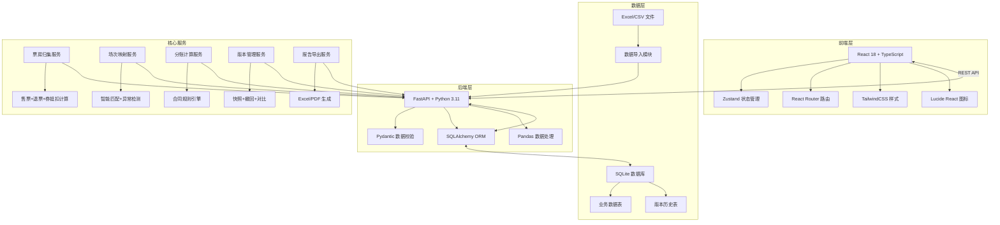
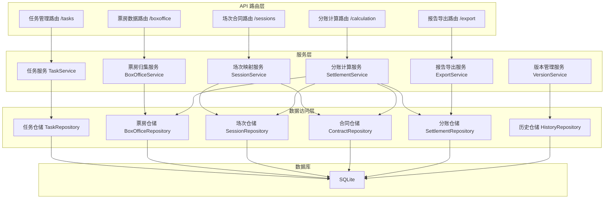
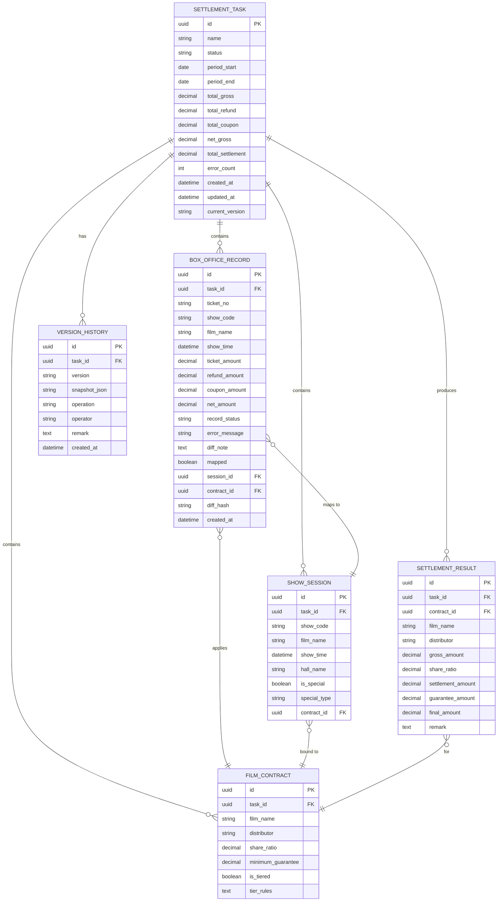

## 1. 架构设计



## 2. 技术描述

### 2.1 技术栈选择
- **前端**：React 18 + TypeScript + Vite + TailwindCSS 3 + Zustand + React Router
- **后端**：FastAPI + Python 3.11 + SQLAlchemy 2.0 + Pydantic + Pandas + OpenPyXL
- **数据库**：SQLite（轻量部署，适合单影城场景）
- **初始化工具**：Vite

### 2.2 关键技术决策
1. **单条异常隔离机制**：每条记录独立事务，失败时标记 `record_status = 'error'` 并记录错误信息，不影响其他记录
2. **版本快照机制**：每次保存时对当前分账结果生成 JSON 快照存入历史表，撤回时直接恢复快照
3. **续办机制**：任务状态机 `draft → processing → pending_material → processing → completed`，材料补齐后从 `pending_material` 回到 `processing`
4. **差异追踪**：每张数据表增加 `diff_hash` 字段，用于对比来源数据与计算结果的差异

## 3. 路由定义

| 路由 | 页面 | 用途 |
|------|------|------|
| `/` | 任务列表页 | 展示所有分账任务，新建/搜索/筛选 |
| `/task/:id` | 分账详情页 | 分账核对主流程，归集→映射→分账→说明 |
| `/task/:id/history` | 历史记录页 | 查看操作历史、版本对比、撤回 |
| `/task/:id/export` | 报告预览页 | 预览分账报告并导出 |

## 4. API 定义

### 4.1 任务管理
```typescript
interface SettlementTask {
  id: string;
  name: string;
  status: 'draft' | 'processing' | 'pending_material' | 'completed' | 'cancelled';
  period_start: string;
  period_end: string;
  total_gross: number;
  total_refund: number;
  total_coupon: number;
  net_gross: number;
  total_settlement: number;
  error_count: number;
  created_at: string;
  updated_at: string;
}

// GET /api/tasks - 获取任务列表
// POST /api/tasks - 创建新任务
// GET /api/tasks/:id - 获取任务详情
// PUT /api/tasks/:id - 保存任务（生成版本快照）
// POST /api/tasks/:id/withdraw - 撤回至上一版本
// GET /api/tasks/:id/history - 获取历史版本
// POST /api/tasks/:id/export - 导出分账报告
```

### 4.2 票房记录
```typescript
interface BoxOfficeRecord {
  id: string;
  task_id: string;
  ticket_no: string;
  show_code: string;
  film_name: string;
  show_time: string;
  ticket_amount: number;
  refund_amount: number;
  coupon_amount: number;
  net_amount: number;
  record_status: 'normal' | 'warning' | 'error';
  error_message?: string;
  diff_note?: string;
  mapped: boolean;
  created_at: string;
}

// POST /api/tasks/:id/import/tickets - 导入售票流水
// POST /api/tasks/:id/import/refunds - 导入退票记录
// POST /api/tasks/:id/import/coupons - 导入会员券记录
// GET /api/tasks/:id/boxoffice - 获取票房记录列表
// PUT /api/boxoffice/:id/note - 更新差异说明
```

### 4.3 场次映射
```typescript
interface ShowSession {
  id: string;
  task_id: string;
  show_code: string;
  film_name: string;
  show_time: string;
  hall_name: string;
  is_special: boolean;
  special_type?: string;
  contract_id?: string;
}

interface FilmContract {
  id: string;
  task_id: string;
  film_name: string;
  distributor: string;
  share_ratio: number;
  minimum_guarantee?: number;
  is_tiered: boolean;
  tier_rules?: string;
}

// POST /api/tasks/:id/import/shows - 导入场次表
// POST /api/tasks/:id/import/contracts - 导入影片合同
// POST /api/tasks/:id/map-sessions - 执行场次映射
// POST /api/tasks/:id/calculate - 执行分账计算
```

## 5. 服务器架构图



## 6. 数据模型

### 6.1 ER 图



### 6.2 DDL 语句

```sql
-- 分账任务表
CREATE TABLE settlement_task (
    id TEXT PRIMARY KEY,
    name TEXT NOT NULL,
    status TEXT NOT NULL DEFAULT 'draft',
    period_start DATE NOT NULL,
    period_end DATE NOT NULL,
    total_gross REAL DEFAULT 0,
    total_refund REAL DEFAULT 0,
    total_coupon REAL DEFAULT 0,
    net_gross REAL DEFAULT 0,
    total_settlement REAL DEFAULT 0,
    error_count INTEGER DEFAULT 0,
    created_at TIMESTAMP DEFAULT CURRENT_TIMESTAMP,
    updated_at TIMESTAMP DEFAULT CURRENT_TIMESTAMP,
    current_version TEXT
);

-- 票房记录表（含异常隔离字段）
CREATE TABLE box_office_record (
    id TEXT PRIMARY KEY,
    task_id TEXT NOT NULL,
    ticket_no TEXT NOT NULL,
    show_code TEXT,
    film_name TEXT,
    show_time TIMESTAMP,
    ticket_amount REAL DEFAULT 0,
    refund_amount REAL DEFAULT 0,
    coupon_amount REAL DEFAULT 0,
    net_amount REAL DEFAULT 0,
    record_status TEXT NOT NULL DEFAULT 'normal',
    error_message TEXT,
    diff_note TEXT,
    mapped BOOLEAN DEFAULT FALSE,
    session_id TEXT,
    contract_id TEXT,
    diff_hash TEXT,
    created_at TIMESTAMP DEFAULT CURRENT_TIMESTAMP,
    FOREIGN KEY (task_id) REFERENCES settlement_task(id)
);

CREATE INDEX idx_boxoffice_task ON box_office_record(task_id);
CREATE INDEX idx_boxoffice_status ON box_office_record(record_status);
CREATE INDEX idx_boxoffice_ticket ON box_office_record(ticket_no);

-- 场次表
CREATE TABLE show_session (
    id TEXT PRIMARY KEY,
    task_id TEXT NOT NULL,
    show_code TEXT NOT NULL,
    film_name TEXT NOT NULL,
    show_time TIMESTAMP NOT NULL,
    hall_name TEXT,
    is_special BOOLEAN DEFAULT FALSE,
    special_type TEXT,
    contract_id TEXT,
    FOREIGN KEY (task_id) REFERENCES settlement_task(id)
);

CREATE INDEX idx_session_task ON show_session(task_id);
CREATE INDEX idx_session_code ON show_session(show_code);

-- 影片合同表
CREATE TABLE film_contract (
    id TEXT PRIMARY KEY,
    task_id TEXT NOT NULL,
    film_name TEXT NOT NULL,
    distributor TEXT NOT NULL,
    share_ratio REAL NOT NULL,
    minimum_guarantee REAL,
    is_tiered BOOLEAN DEFAULT FALSE,
    tier_rules TEXT,
    FOREIGN KEY (task_id) REFERENCES settlement_task(id)
);

-- 分账结果表
CREATE TABLE settlement_result (
    id TEXT PRIMARY KEY,
    task_id TEXT NOT NULL,
    contract_id TEXT,
    film_name TEXT NOT NULL,
    distributor TEXT NOT NULL,
    gross_amount REAL DEFAULT 0,
    share_ratio REAL DEFAULT 0,
    settlement_amount REAL DEFAULT 0,
    guarantee_amount REAL DEFAULT 0,
    final_amount REAL DEFAULT 0,
    remark TEXT,
    FOREIGN KEY (task_id) REFERENCES settlement_task(id)
);

-- 版本历史表（用于撤回和历史追溯）
CREATE TABLE version_history (
    id TEXT PRIMARY KEY,
    task_id TEXT NOT NULL,
    version TEXT NOT NULL,
    snapshot_json TEXT NOT NULL,
    operation TEXT NOT NULL,
    operator TEXT,
    remark TEXT,
    created_at TIMESTAMP DEFAULT CURRENT_TIMESTAMP,
    FOREIGN KEY (task_id) REFERENCES settlement_task(id)
);

CREATE INDEX idx_version_task ON version_history(task_id);
CREATE INDEX idx_version_time ON version_history(created_at DESC);
```
