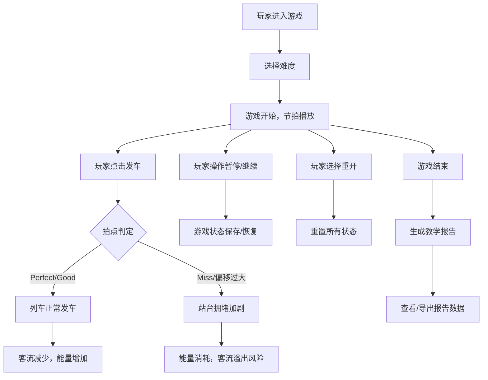

# 节奏地铁调度战 - 产品需求文档

## 1. 产品概述
一款结合音乐节奏与地铁调度的互动游戏，玩家需按照音乐节拍准时发车，错误拍点会导致站台拥堵。支持暂停、继续、重开功能，并提供教学报告用于复盘分析。
- **目标用户**: 学生群体（音乐社、交通社活动参与者）、教师（用于教学复盘）
- **核心价值**: 寓教于乐，通过游戏化方式训练节奏感和调度决策能力

## 2. 核心功能

### 2.1 用户角色
| 角色 | 注册方式 | 核心权限 |
|------|----------|----------|
| 玩家 | 无需注册，直接游玩 | 游戏操作、查看成绩、回放游戏 |
| 教师 | 无需注册，使用报告功能 | 查看教学报告、导出数据、分析错误类型 |

### 2.2 功能模块
1. **主界面**: 游戏入口、难度选择、规则说明
2. **游戏界面**: 节拍轨、列车调度区、站台客流显示、能量条、换乘口
3. **控制面板**: 开始/暂停/继续/重开按钮
4. **教学报告**: 节奏判定统计、调度队列分析、拥堵反馈、回放评分、报告导出

### 2.3 页面详情
| 页面名称 | 模块名称 | 功能描述 |
|----------|----------|----------|
| 主界面 | 英雄区 | 游戏标题、动态背景、开始按钮 |
| 主界面 | 难度选择 | 简单/普通/困难三档，影响节拍速度和客流密度 |
| 游戏界面 | 节拍轨 | 显示节拍点、玩家点击判定反馈 |
| 游戏界面 | 列车调度区 | 显示列车位置、运行状态、避免追尾 |
| 游戏界面 | 站台客流 | 显示各站台乘客数量、拥堵程度 |
| 游戏界面 | 能量条 | 连续正确点击增加能量，失误消耗能量 |
| 游戏界面 | 控制面板 | 暂停、继续、重开功能 |
| 教学报告 | 节奏判定 | Perfect/Good/Miss统计、拍点偏移分析 |
| 教学报告 | 调度队列 | 发车时间记录、列车间隔分析 |
| 教学报告 | 拥堵反馈 | 各站台拥堵历史、溢出事件记录 |
| 教学报告 | 回放评分 | 综合得分、评级、错误类型分类 |
| 教学报告 | 报告导出 | CSV/JSON格式导出详细数据 |

## 3. 核心流程

## 4. 用户界面设计

### 4.1 设计风格
- **主色调**: 科技蓝 (#00D4FF) 搭配警示红 (#FF4757)、成功绿 (#2ED573)
- **辅助色**: 站台橙 (#FFA502)、换乘紫 (#9B59B6)
- **背景**: 深色赛博朋克风格，带网格线和发光效果
- **按钮风格**: 圆角矩形，带发光边框和悬停动画
- **字体**: 标题使用极客风格字体，正文使用清晰易读的无衬线字体
- **布局**: 模块化布局，节拍轨居中，站台分布两侧，控制面板底部

### 4.2 页面设计概述
| 页面名称 | 模块名称 | UI元素 |
|----------|----------|---------|
| 主界面 | 英雄区 | 发光标题、动态地铁线动画、玻璃拟态卡片 |
| 游戏界面 | 节拍轨 | 垂直时间轴、发光节拍点、点击判定特效 |
| 游戏界面 | 站台区 | 左右两侧各3个站台、乘客小人图标、拥堵进度条 |
| 游戏界面 | 列车 | 动态行驶动画、尾灯效果、碰撞警告 |
| 游戏界面 | 能量条 | 渐变发光效果、分段显示 |
| 教学报告 | 数据面板 | 图表可视化、错误高亮、分类统计 |

### 4.3 响应式
- 桌面端优先设计，支持宽屏显示
- 平板端自适应缩放布局
- 关键操作区域确保触控友好

### 4.4 异常处理设计
- **拍点偏移**: 视觉反馈显示偏移方向和程度，音效提示
- **列车追尾**: 红色警告闪烁，列车减速动画，扣分提示
- **客流溢出**: 站台变红闪烁，乘客溢出动画，游戏失败警告
- **空值/重复项**: 数据校验机制，默认值填充，重复点击过滤
- **边界值**: 最大客流限制，最小发车间隔保护
