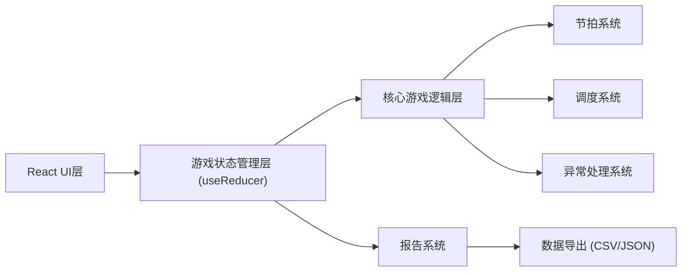

# 节奏地铁调度战 - 技术架构文档

## 1. 架构设计



## 2. 技术描述
- **前端框架**: React@18 + TypeScript + Vite
- **样式方案**: TailwindCSS@3 + CSS Modules
- **状态管理**: React useReducer (游戏状态) + Context API
- **动画方案**: Framer Motion + CSS Animations
- **音频处理**: Web Audio API
- **图表可视化**: Recharts
- **构建工具**: Vite

## 3. 路由定义
| 路由 | 页面名称 | 功能说明 |
|------|----------|----------|
| / | 主界面 | 游戏入口、难度选择、规则说明 |
| /game | 游戏界面 | 核心游戏玩法界面 |
| /report | 教学报告 | 成绩展示、数据分析、报告导出 |

## 4. 核心数据模型

### 4.1 游戏状态类型定义

```typescript
// 节拍判定类型
type JudgeType = 'perfect' | 'good' | 'miss' | 'early' | 'late';

// 列车状态
interface Train {
  id: string;
  departureTime: number;
  position: number;
  speed: number;
  status: 'waiting' | 'running' | 'arrived';
  platformId: string;
}

// 站台状态
interface Platform {
  id: string;
  name: string;
  passengerCount: number;
  maxCapacity: number;
  congestionLevel: number; // 0-100
  overflowCount: number;
  history: { time: number; count: number }[];
}

// 节拍点
interface BeatPoint {
  id: string;
  time: number;
  isHit: boolean;
  judgeType?: JudgeType;
  offset?: number;
}

// 调度记录
interface DispatchRecord {
  id: string;
  time: number;
  trainId: string;
  platformId: string;
  judgeType: JudgeType;
  offset: number;
}

// 异常事件
interface AnomalyEvent {
  id: string;
  type: 'beat_offset' | 'train_collision' | 'passenger_overflow';
  time: number;
  severity: 'warning' | 'danger';
  description: string;
  data: Record<string, any>;
}

// 游戏状态
interface GameState {
  status: 'idle' | 'playing' | 'paused' | 'ended';
  difficulty: 'easy' | 'normal' | 'hard';
  score: number;
  energy: number;
  combo: number;
  maxCombo: number;
  currentTime: number;
  totalTime: number;
  beatPoints: BeatPoint[];
  trains: Train[];
  platforms: Platform[];
  dispatchRecords: DispatchRecord[];
  anomalies: AnomalyEvent[];
  statistics: {
    perfect: number;
    good: number;
    miss: number;
    early: number;
    late: number;
  };
}
```

### 4.2 教学报告数据结构

```typescript
interface TeachingReport {
  basicInfo: {
    date: string;
    duration: number;
    difficulty: string;
    finalScore: number;
    grade: string;
  };
  rhythmAnalysis: {
    totalBeats: number;
    hitRate: number;
    judgeDistribution: { perfect: number; good: number; miss: number };
    offsetDistribution: { early: number; late: number };
    averageOffset: number;
  };
  dispatchAnalysis: {
    totalDispatches: number;
    avgInterval: number;
    minInterval: number;
    collisionCount: number;
    queueEfficiency: number;
  };
  congestionAnalysis: {
    platformStats: {
      platformId: string;
      avgCongestion: number;
      maxCongestion: number;
      overflowCount: number;
    }[];
    totalOverflow: number;
  };
  anomalyDetails: AnomalyEvent[];
}
```

## 5. 核心模块设计

### 5.1 节拍系统
- 使用 `requestAnimationFrame` 实现高精度计时
- 判定窗口: Perfect ±50ms, Good ±100ms, Miss > ±150ms
- 支持提前/延迟判定，记录偏移量用于分析

### 5.2 调度系统
- 列车间隔检测: 最小安全间隔 2秒
- 追尾检测: 实时计算列车距离，触发警告
- 站台分配算法: 优先选择客流最高的站台

### 5.3 异常处理系统
- **拍点偏移**: 记录偏移方向和毫秒数，累积偏移统计
- **列车追尾**: 触发碰撞事件，列车减速，扣除分数和能量
- **客流溢出**: 站台容量上限为100，溢出时触发警告并扣分
- **空值处理**: 所有数据字段设置默认值，防止undefined报错
- **重复点击**: 防抖处理，同一节拍窗口只判定一次
- **边界值**: 能量值限制在0-100区间，分数不低于0

### 5.4 游戏控制
- **暂停**: 保存当前游戏状态快照，停止所有计时器
- **继续**: 从快照恢复状态，重新启动计时器
- **重开**: 重置所有状态为初始值，保留难度设置

### 5.5 数据导出
- CSV格式: 适合Excel导入分析
- JSON格式: 适合程序处理和存档
- 导出内容包含: 节拍记录、调度记录、异常事件、统计数据

## 6. 性能优化
- 使用 React.memo 优化组件重渲染
- 游戏循环使用 requestAnimationFrame
- 大数据量报表使用虚拟滚动
- 节流处理频繁更新的UI元素
