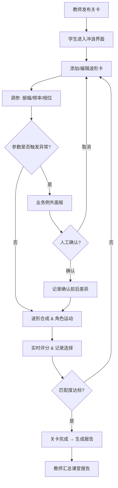

## 1. 产品概述

傅里叶海浪冲浪是一款面向数学课堂的正弦波叠加交互式教学小游戏。学生通过调整振幅、频率、相位等参数组合多路正弦波，合成海浪波形，冲浪角色沿波形路径运动。系统不仅给出分数，还记录每次关键选择、扣分原因和最终改进建议，并支持课堂报告导出。

- **目标用户**：中学/大学数学课堂学生及教师
- **核心价值**：将抽象的傅里叶叠加概念可视化为可玩的海浪冲浪体验，让「调参数」变成「造浪」；异常不做简单校验拦截，而是像真实业务例外一样保留上下文和处置建议

## 2. 核心功能

### 2.1 用户角色

| 角色 | 进入方式 | 核心权限 |
|------|----------|----------|
| 学生 | 输入课堂码加入 | 调参、冲浪、查看评分与报告 |
| 教师 | 创建课堂 | 出题、查看全班报告、确认/驳回学生操作 |

### 2.2 功能模块

1. **冲浪主界面**：实时波形画布、冲浪板角色、波形参数调节面板、关卡目标展示
2. **波形卡编辑器**：添加/删除/编辑波形分量卡（每卡含振幅、频率、相位）
3. **评分与反馈面板**：实时分数、扣分明细、关键选择记录、改进建议
4. **参数回放**：时间轴回放历史操作，含人工确认前后的差异高亮
5. **课堂报告**：汇总学生表现，导出为 JSON/PDF

### 2.3 页面详情

| 页面名称 | 模块名称 | 功能描述 |
|----------|----------|----------|
| 冲浪主界面 | 波形画布 | Canvas 渲染合成波形与冲浪板角色运动，实时响应参数变化 |
| 冲浪主界面 | 参数调节面板 | 波形卡列表，每卡含振幅/频率/相位滑块与输入框，支持拖拽排序 |
| 冲浪主界面 | 关卡目标 | 显示目标波形轮廓与匹配度百分比 |
| 冲浪主界面 | 评分反馈栏 | 分数动画、扣分项列表、关键选择标签、改进建议气泡 |
| 波形卡编辑器 | 卡片管理 | 新增/删除/复制波形卡，卡内参数编辑 |
| 波形卡编辑器 | 异常提示 | 相位单位错/振幅爆掉/边界穿越的业务级例外面板，含上下文与处置按钮 |
| 参数回放 | 时间轴 | 操作历史条目，支持逐步回放；确认操作前后差异高亮 |
| 课堂报告 | 报告视图 | 按学生/关卡维度展示评分、扣分明细、最终建议 |
| 课堂报告 | 导出 | 一键导出 JSON 或打印为 PDF |

## 3. 核心流程

**学生闯关流程**：教师发布关卡 → 学生进入冲浪界面 → 通过波形卡调参合成海浪 → 冲浪板沿合成波运动 → 系统实时评分并记录选择 → 遇异常时弹出业务例外面板（非简单校验提示）→ 人工确认操作在历史中标记前后差异 → 关卡结束生成评分报告 → 教师汇总课堂报告

## 4. 用户界面设计

### 4.1 设计风格

- **主色调**：深海蓝 (#0A2540) 搭配浪花青 (#00D4AA) ，日落橙 (#FF6B35) 作为强调色
- **按钮风格**：圆角胶囊按钮，冲浪主题渐变，hover 时微微上浮 + 阴影扩散
- **字体**：标题使用 Righteous（冲浪海报风），正文使用 Nunito（圆润友好）
- **布局**：左侧参数面板 + 中央大画布 + 底部评分反馈栏
- **图标/表情**：使用 lucide-react 图标，辅以海浪/冲浪主题装饰元素
- **动效**：波形实时流动动画、冲浪板随波摇摆、参数卡拖拽弹性动画、评分弹出动画

### 4.2 页面设计概览

| 页面名称 | 模块名称 | UI 元素 |
|----------|----------|---------|
| 冲浪主界面 | 波形画布 | 深海渐变背景、Canvas 波形线、冲浪板角色、目标波形虚线轮廓 |
| 冲浪主界面 | 参数调节面板 | 波形卡堆叠列表，每卡有颜色标识条、振幅/频率/相位滑块 |
| 冲浪主界面 | 评分反馈栏 | 圆形分数仪表、扣分标签列表、建议气泡卡片 |
| 波形卡编辑器 | 异常面板 | 半透明遮罩 + 居中卡片，含异常类型图标、上下文摘要、处置按钮 |
| 参数回放 | 时间轴 | 水平时间轴，节点含缩略波形，确认节点双圈标记 |
| 课堂报告 | 报告视图 | 表格/卡片混排，柱状图对比，导出按钮 |

### 4.3 响应式

- 桌面优先设计（1280px+ 最佳体验）
- 平板（768-1280px）参数面板折叠为底部抽屉
- 手机暂不支持（课堂场景以大屏为主）

### 4.4 异常处理设计

异常不使用简单表单校验提示，而是作为业务级例外弹窗：

| 异常类型 | 触发条件 | 面板内容 | 处置方式 |
|----------|----------|----------|----------|
| 相位单位错 | 相位值 > 2π 且未显式选择度数模式 | 显示当前值、单位建议、最近正确值对比 | 切换单位/自动修正/手动修正 |
| 振幅叠加爆掉 | 所有分量振幅绝对值之和 > 安全阈值 | 显示叠加值、超出量、各分量贡献占比 | 等比缩放/手动削减/取消 |
| 边界穿越 | 角色位置超出画布安全区域 | 显示穿越坐标、超出距离、方向 | 回弹至边界/参数回退/确认穿越 |
