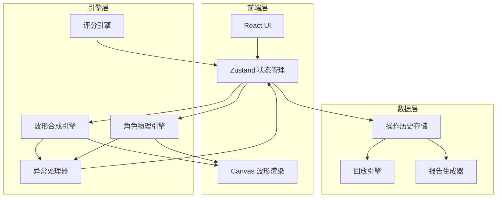

## 1. 架构设计



## 2. 技术说明

- **前端**：React@18 + TypeScript + Tailwind CSS@3 + Vite
- **初始化工具**：vite-init（react-ts 模板）
- **状态管理**：Zustand（轻量、适合游戏状态）
- **波形渲染**：Canvas 2D API（高性能实时波形绘制）
- **动画**：requestAnimationFrame 驱动游戏循环
- **后端**：无（纯前端，数据存 localStorage，报告前端生成）
- **数据持久化**：localStorage + JSON 导出

## 3. 路由定义

| 路由 | 用途 |
|------|------|
| `/` | 首页：课堂码输入 / 创建课堂 |
| `/game/:levelId` | 冲浪主界面：波形画布 + 参数面板 + 评分 |
| `/replay/:levelId` | 参数回放：时间轴 + 波形回放 |
| `/report` | 课堂报告：汇总视图 + 导出 |

## 4. 核心数据模型

### 4.1 波形卡 (WaveCard)

```typescript
interface WaveCard {
  id: string
  amplitude: number
  frequency: number
  phase: number
  phaseUnit: "radian" | "degree"
  color: string
  locked: boolean
}
```

### 4.2 游戏状态 (GameState)

```typescript
interface GameState {
  levelId: string
  targetWave: WaveCard[]
  playerWave: WaveCard[]
  surfboard: {
    x: number
    y: number
    velocityX: number
    velocityY: number
    angle: number
  }
  score: {
    total: number
    maxScore: number
    deductions: Deduction[]
  }
  exceptions: BusinessException[]
  history: HistoryEntry[]
}
```

### 4.3 异常记录 (BusinessException)

```typescript
interface BusinessException {
  id: string
  type: "PHASE_UNIT_ERROR" | "AMPLITUDE_OVERFLOW" | "BOUNDARY_CROSSING"
  triggeredAt: number
  context: {
    parameterName: string
    currentValue: number
    expectedRange: [number, number]
    allWaveCards: WaveCard[]
  }
  resolution: "AUTO_FIXED" | "MANUAL_FIXED" | "CONFIRMED" | "CANCELLED" | null
  beforeSnapshot: WaveCard[]
  afterSnapshot: WaveCard[]
  confirmedBy: "student" | "teacher" | null
  confirmedAt: number | null
}
```

### 4.4 扣分明细 (Deduction)

```typescript
interface Deduction {
  id: string
  reason: string
  points: number
  relatedExceptionId: string | null
  timestamp: number
  parameterSnapshot: WaveCard[]
}
```

### 4.5 历史条目 (HistoryEntry)

```typescript
interface HistoryEntry {
  id: string
  timestamp: number
  action: "PARAM_CHANGE" | "ADD_CARD" | "REMOVE_CARD" | "EXCEPTION_TRIGGERED" | "EXCEPTION_CONFIRMED" | "EXCEPTION_CANCELLED" | "MANUAL_CONFIRM"
  description: string
  beforeSnapshot: WaveCard[]
  afterSnapshot: WaveCard[]
  exceptionId: string | null
  requiresConfirmation: boolean
  confirmedAt: number | null
}
```

### 4.6 课堂报告 (ClassReport)

```typescript
interface ClassReport {
  classCode: string
  generatedAt: number
  students: {
    name: string
    levels: {
      levelId: string
      score: number
      maxScore: number
      deductions: Deduction[]
      exceptions: BusinessException[]
      suggestions: string[]
      keyChoices: { description: string; timestamp: number }[]
    }[]
  }[]
}
```

## 5. 引擎详细设计

### 5.1 波形合成引擎

- 输入：`WaveCard[]`，合成函数 `y(x, t) = Σ Aᵢ·sin(2π·fᵢ·x + φᵢ + ωt)`
- 输出：采样点数组 `[{x, y}]`，供 Canvas 绘制和物理引擎使用
- 安全检查：合成后振幅是否超过阈值，触发 `AMPLITUDE_OVERFLOW` 异常

### 5.2 角色物理引擎

- 冲浪板位置沿合成波形表面运动
- 速度由波形斜率（导数）驱动：`vx = baseSpeed`, `vy = dy/dx · vx`
- 角色角度跟随波形切线：`angle = atan(dy/dx)`
- 边界检测：角色超出画布安全区域时触发 `BOUNDARY_CROSSING` 异常

### 5.3 评分引擎

- 匹配度 = 1 - (目标波形与玩家波形在采样点上的归一化均方误差)
- 分数 = 匹配度 × 最高分 - 扣分总和
- 扣分项包含原因描述和关联异常 ID
- 最终建议基于扣分模式自动生成

### 5.4 异常处理器

三种异常统一走 `BusinessException` 流程，不是简单校验：

| 异常 | 检测 | 处置选项 | 历史记录 |
|------|------|----------|----------|
| `PHASE_UNIT_ERROR` | 相位值 > 2π 且 phaseUnit 为 radian | 切换为度数 / 自动映射到 [0, 2π) / 手动修改 | 记录修正前后快照 |
| `AMPLITUDE_OVERFLOW` | Σ|Aᵢ| > MAX_AMPLITUDE (默认 10) | 等比缩放至阈值内 / 手动削减各分量 / 取消操作 | 记录缩放比例与各分量变化 |
| `BOUNDARY_CROSSING` | 角色 y 坐标超出画布边界 | 弹回最近边界点 / 回退到上一个安全参数 / 确认穿越（扣分） | 记录穿越方向与距离 |

### 5.5 人工确认与变更历史

- 需人工确认的操作（如确认穿越边界、教师驳回）在历史中标记 `requiresConfirmation: true`
- 确认前：`beforeSnapshot` 记录操作前的波形卡状态
- 确认后：`afterSnapshot` 记录确认后的波形卡状态
- 回放界面中，确认节点用双圈标记，点击可展开 before/after 差异对比

### 5.6 报告生成器

- 从历史和评分数据生成 `ClassReport`
- 每个学生的每关包含：分数、扣分明细、异常记录、关键选择、改进建议
- 改进建议算法：统计扣分模式 → 匹配建议模板 → 个性化措辞
- 导出格式：JSON（完整数据）/ 打印 PDF（排版报告）
