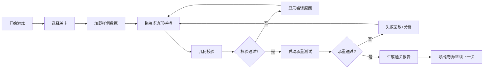

## 1. 产品概述

多边形修桥挑战是一款几何学习类浏览器小游戏，通过拖拽多边形拼接桥梁的方式，让学生直观理解几何形状、面积计算和结构力学的关系。游戏重点在于规则透明、胜负原因可追溯、失败可复盘，帮助学生从错误中学习。

- **核心目标**：通过游戏化方式教授几何与物理知识
- **目标用户**：几何课学生和教师
- **产品价值**：将抽象的几何概念转化为可交互的实践体验

## 2. 核心功能

### 2.1 用户角色
| 角色 | 注册方式 | 核心权限 |
|------|----------|----------|
| 学生玩家 | 无需注册，直接使用 | 游戏游玩、成绩导出、查看报告 |

### 2.2 功能模块
1. **游戏主界面**：画布区域、多边形工具箱、信息面板
2. **关卡选择**：预制关卡加载、样例数据展示
3. **几何校验系统**：面积计算、闭合检测、重叠检测
4. **承重模拟**：物理引擎模拟、载重评分、失败回放
5. **通关报告**：详细分析、数据导出、错误原因解释

### 2.3 页面详情
| 页面名称 | 模块名称 | 功能描述 |
|---------|----------|----------|
| 游戏主界面 | 画布区域 | SVG画布，支持拖拽、旋转多边形，显示桥墩和桥面 |
| 游戏主界面 | 工具箱 | 显示可用多边形块，显示面积和属性 |
| 游戏主界面 | 信息面板 | 显示面积预算、当前承重、剩余材料 |
| 关卡选择 | 关卡列表 | 显示关卡名称、难度、最佳成绩 |
| 通关报告 | 分析面板 | 显示面积使用、承重测试、失败点分析 |
| 通关报告 | 导出功能 | 支持JSON格式导出成绩和回放数据 |

## 3. 核心流程

## 4. 用户界面设计

### 4.1 设计风格
- **主色调**：深蓝色(#1e3a5f)代表工程与稳重，搭配橙色(#f97316)作为交互强调色
- **辅助色**：绿色(#22c55e)表示成功，红色(#ef4444)表示失败，灰色系用于信息展示
- **按钮风格**：圆润边角(8px)，微阴影，悬停时有轻微上浮动画
- **字体**：标题使用JetBrains Mono增强科技感，正文使用系统字体保证可读性
- **布局风格**：三栏布局，左侧工具箱、中间画布、右侧信息面板
- **图标风格**：使用简洁的线性图标，配合emoji增强趣味性

### 4.2 页面设计概述
| 页面名称 | 模块名称 | UI元素 |
|---------|----------|--------|
| 游戏主界面 | 画布区域 | SVG画布、网格背景、桥墩锚点、拖拽高亮 |
| 游戏主界面 | 工具箱 | 卡片式多边形预览、面积标签、可拖拽手柄 |
| 游戏主界面 | 信息面板 | 进度条、数据数值、状态指示灯、操作按钮 |
| 通关报告 | 分析面板 | 分章节卡片、数据图表、错误标记、回放控制条 |

### 4.3 响应式
- 桌面端优先，三栏布局
- 平板端自适应，工具箱可折叠
- 移动端简化为上下布局，画布居中

### 4.4 动效设计
- 多边形拖拽时跟随光标，有半透明预览
- 吸附锚点时有磁吸动画和提示音
- 承重测试时有车辆行驶动画
- 失败时桥梁断裂有物理模拟效果
