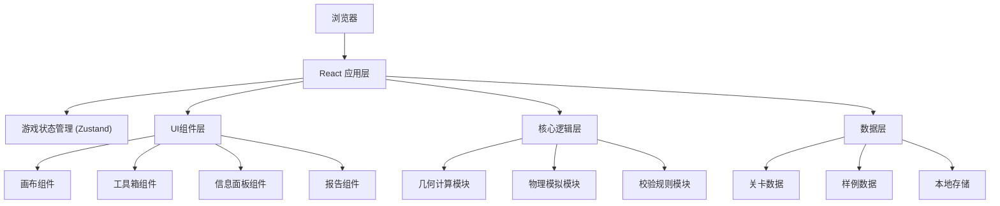

## 1. 架构设计



## 2. 技术描述

- **前端框架**：React@18 + TypeScript
- **构建工具**：Vite
- **样式方案**：TailwindCSS@3
- **状态管理**：Zustand (轻量级状态管理)
- **图形渲染**：原生SVG + Canvas混合
- **几何计算**：自定义几何算法库
- **物理模拟**：简化的2D物理引擎
- **数据存储**：LocalStorage + 支持JSON导出

## 3. 目录结构

```
src/
├── components/          # UI组件
│   ├── Canvas/         # 画布相关组件
│   ├── Toolbox/        # 工具箱组件
│   ├── InfoPanel/      # 信息面板
│   ├── Report/         # 报告组件
│   └── common/         # 通用组件
├── store/              # 状态管理
│   └── useGameStore.ts
├── engine/             # 核心引擎
│   ├── geometry.ts     # 几何计算
│   ├── physics.ts      # 物理模拟
│   └── validator.ts    # 校验规则
├── data/               # 数据
│   ├── levels.ts       # 关卡数据
│   └── samples.ts      # 样例数据
├── types/              # 类型定义
│   └── index.ts
├── utils/              # 工具函数
├── App.tsx
└── main.tsx
```

## 4. 核心数据模型

### 4.1 类型定义

```typescript
// 点坐标
interface Point {
  x: number;
  y: number;
}

// 多边形块
interface PolygonBlock {
  id: string;
  name: string;
  vertices: Point[];      // 顶点坐标
  area: number;           // 面积
  weight: number;         // 重量
  strength: number;       // 强度系数
  color: string;
}

// 桥墩
interface BridgePier {
  id: string;
  position: Point;
  height: number;
  width: number;
}

// 载重车
interface Truck {
  id: string;
  weight: number;
  position: Point;
  speed: number;
}

// 已放置的多边形
interface PlacedPolygon {
  blockId: string;
  position: Point;
  rotation: number;
  vertices: Point[];      // 变换后的顶点
}

// 关卡
interface Level {
  id: string;
  name: string;
  description: string;
  areaBudget: number;     // 面积预算
  requiredStrength: number;
  piers: BridgePier[];
  availableBlocks: PolygonBlock[];
  truck: Truck;
  startPoint: Point;
  endPoint: Point;
}

// 游戏状态
interface GameState {
  currentLevel: Level | null;
  placedPolygons: PlacedPolygon[];
  usedArea: number;
  isSimulating: boolean;
  simulationResult: SimulationResult | null;
}

// 校验结果
interface ValidationResult {
  valid: boolean;
  errors: ValidationError[];
  warnings: ValidationWarning[];
}

interface ValidationError {
  type: 'area_exceeded' | 'not_connected' | 'overlap' | 'not_closed';
  message: string;
  polygonId?: string;
  details: Record<string, any>;
}

// 模拟结果
interface SimulationResult {
  success: boolean;
  maxLoad: number;
  failurePoint?: Point;
  failureReason?: string;
  stressMap: Record<string, number>;  // 每个多边形的应力
  replayData: ReplayFrame[];
}

interface ReplayFrame {
  time: number;
  truckPosition: Point;
  polygonStates: PolygonState[];
}
```

## 5. 核心算法

### 5.1 几何计算模块
- **多边形面积计算**：鞋带公式
- **点在多边形内**：射线法
- **多边形相交检测**：分离轴定理(SAT)
- **多边形变换**：矩阵旋转和平移
- **闭合检测**：首尾点距离阈值判断

### 5.2 物理模拟模块
- **简化桁架模型**：将多边形视为刚体
- **应力计算**：基于支撑点和载荷分布
- **断裂判定**：应力超过强度系数即断裂
- **动画帧生成**：60fps回放数据

### 5.3 校验规则模块
1. 面积预算检查
2. 桥梁连通性检查
3. 多边形重叠检测
4. 边界闭合检查
