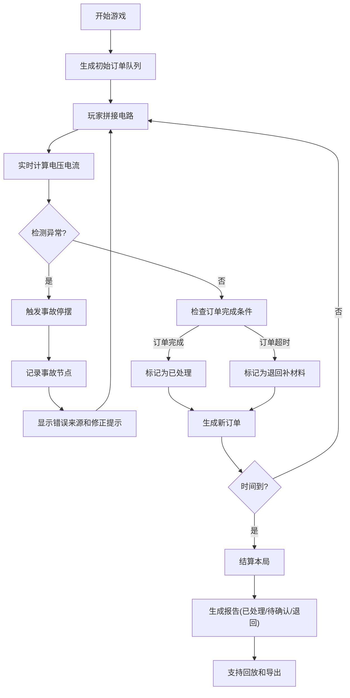

## 1. 产品概述

"电路酒吧点单夜"是电子社迎新教学游戏，玩家通过串并联电路拼接为不同吧台供电，在1-2分钟内完成多轮订单挑战。游戏将电路基础知识（串联分压、并联分流、短路保护）融入趣味场景，每次选择都有即时后果，同时支持完整的事故回溯和教学复盘。

- 核心目标：让新生在游戏中理解串并联电路的基本原理
- 目标用户：电子社新生、物理教学课堂
- 产品价值：将抽象的电路知识具象化，通过游戏化机制提升学习兴趣和记忆点

## 2. 核心特性

### 2.1 用户角色

| 角色 | 登录方式 | 核心权限 |
|------|----------|----------|
| 玩家 | 无需登录，直接开始 | 游戏游玩、查看本局报告 |
| 教师 | 无需登录 | 查看所有历史对局、导出教学报告、使用回放功能 |

### 2.2 功能模块

1. **游戏主界面**：线路板拼接区、吧台状态区、订单队列区、计时器
2. **电路拼接系统**：拖拽电源/开关/灯泡，支持串联/并联连接，实时电压计算
3. **订单处理系统**：顾客订单生成、倒计时、完成判定、超时惩罚
4. **事故检测系统**：短路检测、并联电流异常、电压不匹配、可追溯错误源
5. **回放系统**：电路拼接历史、电压反馈记录、订单队列变化、事故时间线
6. **报告系统**：已处理/待确认/退回补材料分类统计、详细操作审计

### 2.3 页面详情

| 页面名称 | 模块名称 | 功能描述 |
|----------|----------|----------|
| 游戏主页 | 开始区域 | 游戏说明、难度选择、开始按钮、历史记录入口 |
| 游戏主界面 | 线路板拼接区 | 拖拽元件、连线、实时电路状态显示 |
| 游戏主界面 | 吧台状态区 | 5个吧台灯泡，显示当前电压和供电状态 |
| 游戏主界面 | 订单队列区 | 显示当前待处理订单、倒计时、优先级 |
| 游戏主界面 | 操作反馈区 | 电压提示、错误警告、得分显示、事故告警 |
| 结算页面 | 成绩展示 | 本局得分、准确率、事故统计、耗时 |
| 结算页面 | 事故回放 | 时间轴回放、关键节点跳转、错误原因追溯 |
| 报告页面 | 分类统计 | 已处理/待确认/退回补材料订单分类 |
| 报告页面 | 详情导出 | 导出完整操作记录，支持教学演示 |

## 3. 核心流程

### 3.1 游戏主流程

### 3.2 事故回溯流程

1. 发生短路/电压错误/订单超时
2. 系统自动记录：时间戳、电路状态、操作人、错误类型
3. 点击错误提示可直接跳转至对应电路节点
4. 高亮显示问题元件和连接方式
5. 提供正确接法对比和知识点说明

## 4. 用户界面设计

### 4.1 设计风格

**霓虹赛博酒吧风格**：结合电子电路的科技感与酒吧的霓虹氛围

- 主色调：深邃藏蓝 (#0A0E27) 背景，霓虹紫 (#8B5CF6)、电光青 (#06B6D4)、警示红 (#EF4444)
- 次要色：金属银 (#94A3B8)、琥珀橙 (#F59E0B)、成功绿 (#10B981)
- 按钮风格：霓虹发光边框，悬停时电流流动动画，按压时轻微凹陷
- 字体：展示字体用 Orbitron（科技感），正文字体用 JetBrains Mono（等宽代码风）
- 布局：左侧线路板拼接区（主操作区），右侧订单和状态面板，底部时间轴和控制栏
- 图标：电路符号风格，发光效果，状态变化时有脉冲动画

### 4.2 页面设计概览

| 页面名称 | 模块名称 | UI元素 |
|----------|----------|--------|
| 游戏主页 | 开始区域 | 霓虹标题动画、电路粒子背景、玻璃拟态卡片、渐显按钮 |
| 游戏主界面 | 线路板拼接区 | 网格背景、元件拖拽吸附、连线电流动画、节点发光效果 |
| 游戏主界面 | 吧台状态区 | 5个灯泡卡片，发光强度对应电压，颜色表示状态(绿/黄/红) |
| 游戏主界面 | 订单队列区 | 堆叠卡片，倒计时进度条，优先级标签，滑动动画 |
| 结算页面 | 事故回放 | 垂直时间轴，可点击节点，电路快照对比 |
| 报告页面 | 分类统计 | 三栏式布局(已处理/待确认/退回)，每栏带数字统计和列表 |

### 4.3 响应式设计

- Desktop-first 设计，主操作区在桌面端保证充足空间
- 平板端：左右面板改为上下堆叠，线路板区域保持可缩放
- 移动端：简化操作，改为点击选择而非拖拽，适配触控操作
- 关键交互区域保证最小48x48px触控尺寸

### 4.4 动效设计

- 页面加载：霓虹文字逐字点亮，电路粒子从中心扩散
- 元件拖拽：拿起时上浮+发光，放下时吸附+电流脉冲
- 电路导通：连线有流动光点动画，灯泡渐亮
- 短路事故：红色闪光，警示音，错误源波浪高亮
- 订单完成：吧台酒杯图标举杯庆祝动画，得分数字弹出
- 时间流逝：进度条发光渐变，最后10秒红色脉冲警告
