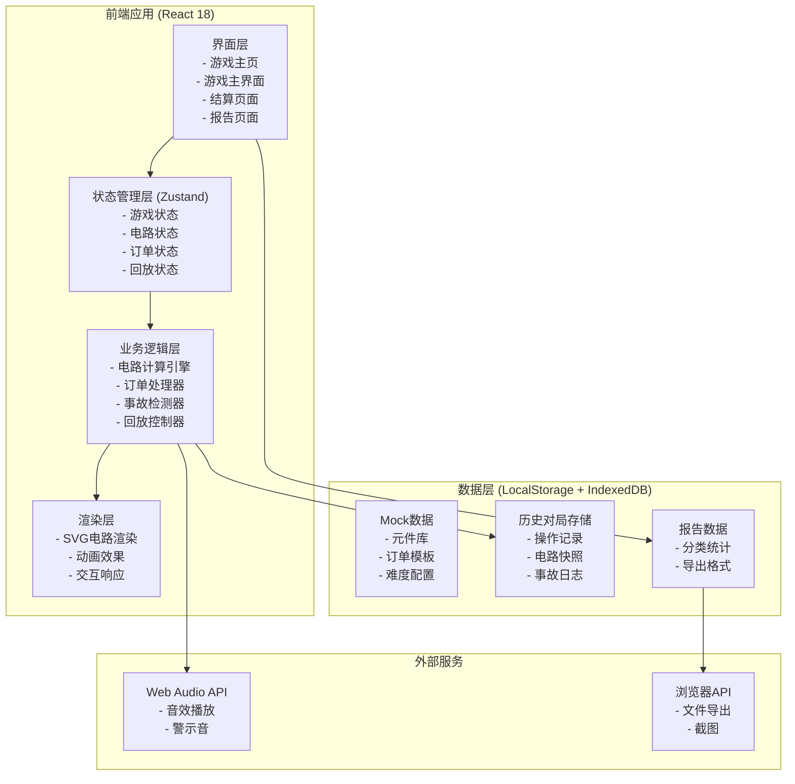
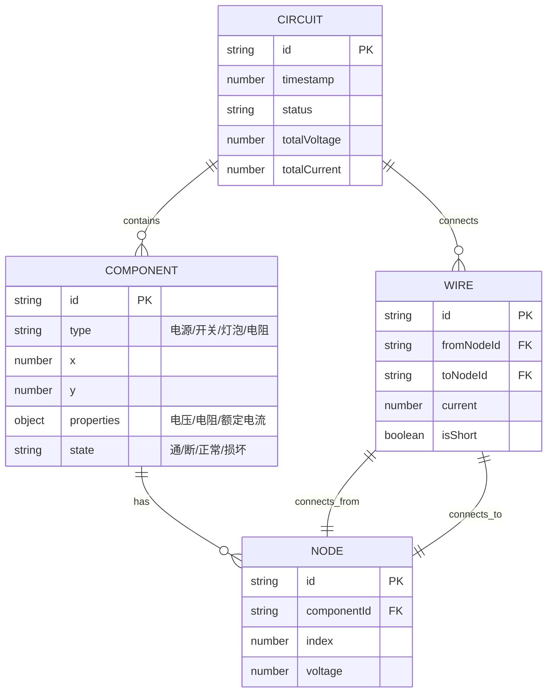
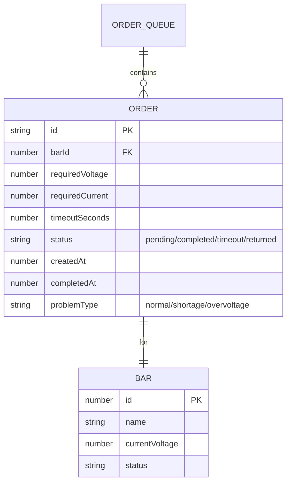
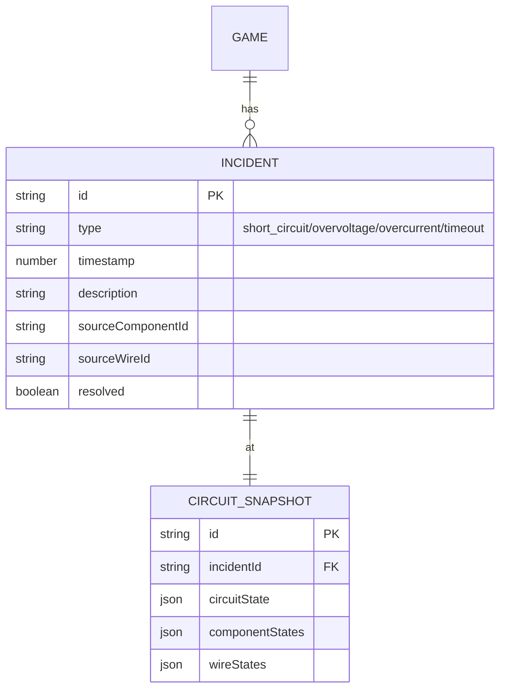
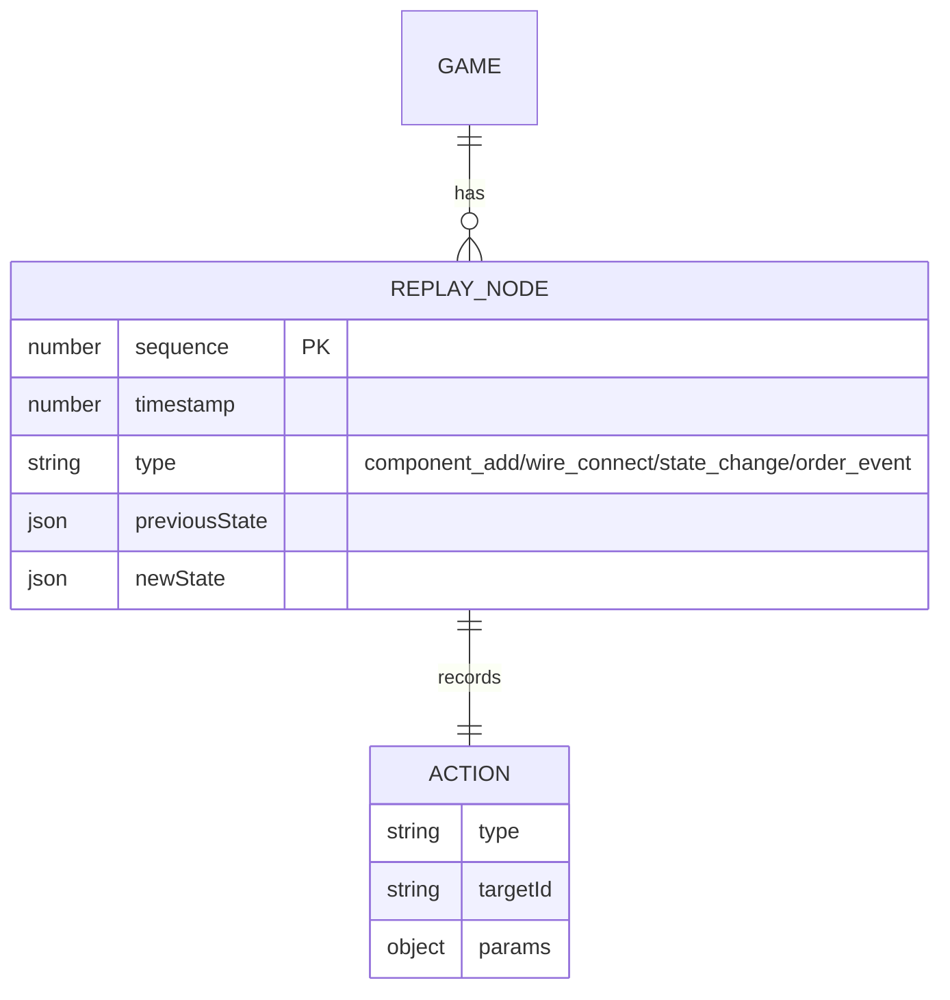

## 1. 架构设计



## 2. 技术栈说明

- **前端框架**: React 18 + TypeScript + Vite 5
- **状态管理**: Zustand 4（轻量级，适合游戏状态快速更新）
- **样式方案**: TailwindCSS 3.4 + CSS Variables（霓虹主题变量）
- **动画库**: Framer Motion 11（复杂交互动画、页面过渡）
- **电路渲染**: SVG + 自定义连线逻辑（无需额外图形库，保持轻量）
- **拖拽交互**: @dnd-kit/core + @dnd-kit/sortable（元件拖拽、吸附）
- **数据存储**: LocalStorage（配置）+ IndexedDB（历史对局）
- **图表可视化**: Recharts 2（报告统计图表）
- **图标**: Lucide React（电路图标自定义扩展）
- **后端**: 无（纯前端应用，所有数据本地存储）

## 3. 路由定义

| 路由 | 页面 | 主要功能 |
|------|------|----------|
| `/` | 游戏主页 | 游戏介绍、难度选择、开始游戏、历史记录入口 |
| `/game` | 游戏主界面 | 电路拼接、订单处理、实时状态、计时 |
| `/result/:gameId` | 结算页面 | 本局成绩、事故回放、操作时间线 |
| `/report/:gameId` | 报告页面 | 订单分类统计、详情列表、导出功能 |
| `/history` | 历史记录 | 所有对局列表、查看报告、删除记录 |

## 4. 核心数据模型

### 4.1 电路元件模型



### 4.2 订单模型



### 4.3 事故日志模型



### 4.4 回放记录模型



## 5. 核心算法

### 5.1 串并联电路计算

1. **电路拓扑分析**：使用并查集(Union-Find)识别连通分量，判断串联/并联关系
2. **基尔霍夫电压定律(KVL)**：沿闭合回路电压和为零
3. **基尔霍夫电流定律(KCL)**：节点电流和为零
4. **短路检测**：导线直接连接电源正负极，或电阻趋近于零的路径
5. **分压计算**：串联电路 U总 = U1 + U2 + ..., 各电阻电压按阻值比例分配
6. **分流计算**：并联电路 I总 = I1 + I2 + ..., 各支路电流按电阻反比例分配

### 5.2 事故检测优先级

1. 短路 → 立即停摆，最高优先级
2. 过压/过流 → 延迟0.5秒警告，持续1秒后停摆
3. 电压不足 → 标记为待确认，可继续运行
4. 订单超时 → 标记为退回补材料，不影响电路

## 6. 性能优化策略

1. **电路计算防抖**：频繁拖拽时200ms防抖，避免重复计算
2. **SVG增量更新**：仅重绘变化的元件和连线，而非整个画布
3. **时间轴虚拟滚动**：回放时只渲染可见范围的节点
4. **LocalStorage分片存储**：大体积对局数据使用IndexedDB
5. **动画硬件加速**：使用transform和opacity属性，触发GPU加速

## 7. 报告导出格式

```typescript
interface GameReport {
  gameId: string;
  startTime: number;
  endTime: number;
  totalScore: number;
  accuracy: number;
  statistics: {
    processed: { count: number; orders: Order[] };
    pending: { count: number; orders: Order[] };
    returned: { count: number; orders: Order[] };
  };
  incidents: Incident[];
  replayData: ReplayNode[];
  exportTime: number;
}
```

支持导出格式：
- JSON：完整数据，可导入回放
- CSV：统计摘要，适合教师整理
- PNG：电路快照+关键数据
