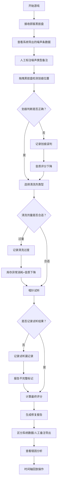

## 1. 产品概述

"黑胶修复工坊赛"是一款面向唱片店店员的培训类交互式游戏，通过模拟黑胶唱片修复流程，帮助店员掌握正确的修复技术，识别常见操作错误。

- 核心目的：培训店员掌握噪声分析、划痕判断、清洗剂选择的完整修复流程
- 解决问题：划痕误判、清洗过度、试听漏记录三类常见错误互相掩盖的问题
- 目标用户：唱片店新入职店员、需要提升修复技能的老员工
- 产品价值：将抽象的修复规则转化为可感知的交互反馈，通过试错式学习提升培训效果

## 2. 核心功能

### 2.1 用户角色

| 角色 | 登录方式 | 核心权限 |
|------|----------|----------|
| 店员玩家 | 直接进入 | 进行游戏、查看个人历史记录、导出修复报告 |
| 培训管理员 | 密码登录 | 查看全员统计、调整难度参数、管理题库 |

### 2.2 功能模块

1. **游戏主界面**：黑胶盘工作台、噪声分析区、工具选择区、顾客耐心指示器
2. **修复流程系统**：噪声检测、划痕判断、清洗剂选择、唱针试听四大步骤
3. **多维度反馈系统**：音质评分实时变化、库存消耗追踪、顾客耐心波动
4. **错因分析系统**：划痕误判/清洗过度/试听漏记录三类错误独立统计
5. **回放与报告系统**：时间轴回放、筛选导出、修复报告生成

### 2.3 页面详情

| 页面名称 | 模块名称 | 功能描述 |
|---------|----------|----------|
| 游戏主界面 | 黑胶盘工作台 | 可旋转的黑胶盘，支持拖拽操作，显示划痕位置和噪声区域 |
| 游戏主界面 | 噪声分析器 | 可视化噪声频谱条，点击选择噪声类型，区分系统检测数据与人工备注 |
| 游戏主界面 | 修复工具架 | 清洗剂（3种类型）、唱针（2种型号）、划痕修复工具，支持拖拽使用 |
| 游戏主界面 | 状态仪表盘 | 顾客耐心值、音质评分、库存数量实时显示，动态变化 |
| 错因分析面板 | 错误分类统计 | 划痕误判、清洗过度、试听漏记录三类错误分别计数，不合并显示 |
| 错因分析面板 | 错因回放 | 点击错误条目可回放当时操作画面，显示错误发生时的参数 |
| 时间轴页面 | 操作时间轴 | 按时间顺序展示所有操作节点，支持缩放、筛选、定位 |
| 报告导出页面 | 报告生成器 | 筛选条件与当前屏幕视图联动，导出PDF/CSV格式报告，区分系统数据和人工备注 |

## 3. 核心流程

玩家从接收黑胶盘开始，依次进行噪声分析、划痕检测、清洗操作、试听验证，每一步操作错误都会独立记录并影响相应维度的数值，最终生成包含系统数据和人工备注的完整报告。

## 4. 用户界面设计

### 4.1 设计风格
- **主色调**：深棕色(#2C1810) + 暖金色(#D4A574) + 墨黑色(#121212)，营造复古黑胶店氛围
- **辅助色**：猩红色(#C0392B)用于错误提示，森林绿(#27AE60)用于正确反馈，暖橙色(#E67E22)用于警告状态
- **按钮风格**：圆角矩形，轻微浮雕效果，悬停时有暗金色边框发光
- **字体**：标题使用 "Playfair Display" 复古衬线字体，正文使用 "Lora" 优雅衬线体
- **布局风格**：工作台式布局，中心为黑胶盘，周围环绕功能区，模拟真实工坊场景
- **视觉细节**：黑胶纹理背景、轻微颗粒噪点、暗角效果、复古牛皮纸质感的面板

### 4.2 页面设计概述

| 页面名称 | 模块名称 | UI元素 |
|---------|----------|---------|
| 游戏主界面 | 黑胶盘工作台 | 可旋转黑胶唱片SVG动画、划痕高亮闪烁、噪声区域波纹效果、拖拽指示箭头 |
| 游戏主界面 | 噪声分析器 | 垂直频谱条形图、系统数据蓝色标签、人工备注橙色标签、点击选中高亮 |
| 游戏主界面 | 修复工具架 | 磨砂玻璃瓶质感的清洗剂、金属质感唱针、拖拽时的半透明跟随效果 |
| 游戏主界面 | 状态仪表盘 | 半圆形顾客耐心表盘、垂直音质评分柱、库存数量胶囊标签 |
| 错因分析面板 | 错误分类统计 | 三栏独立卡片、各自计数图表、错误类型图标、点击展开详情 |
| 时间轴页面 | 操作时间轴 | 水平时间线、节点图标、缩放滑块、筛选下拉框、当前视图高亮 |
| 报告导出页面 | 报告生成器 | 筛选条件同步当前视图、预览区域、导出格式选择按钮、数据来源标记 |

### 4.3 响应性
- 采用桌面端优先设计，主工作台区域最小支持1280px宽度
- 平板端自适应调整为上下布局，控制面板移至下方
- 移动端精简为步骤引导式界面，保留核心操作
- 所有拖拽操作在触屏设备上自动适配为点击选择模式

### 4.4 动画与交互
- 黑胶盘缓慢旋转动画，操作时加速，错误时抖动
- 清洗剂倒出时的液体流动动画，过量时溢出效果
- 顾客耐心值下降时的心跳闪烁动画
- 错误发生时的红色边框脉冲效果，正确操作时的金色光晕
- 页面切换时的淡入淡出，面板展开时的滑入效果
- 时间轴回放时的节点高亮动画，同步显示对应操作画面
