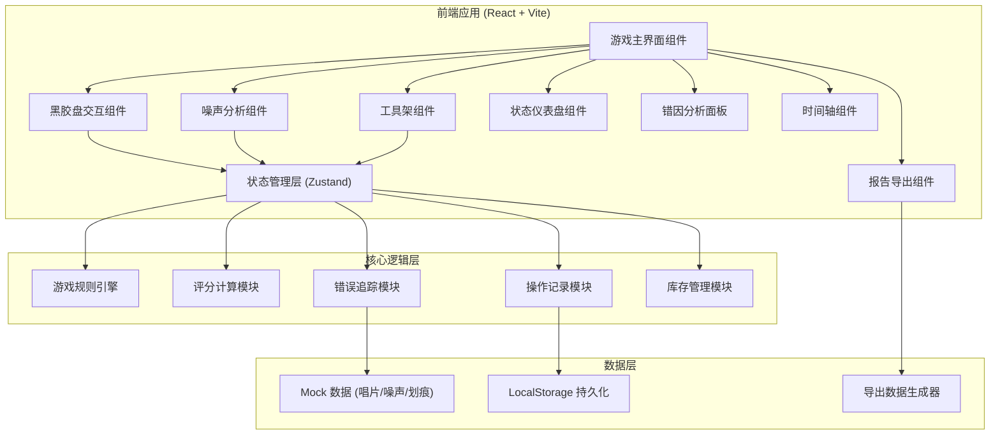
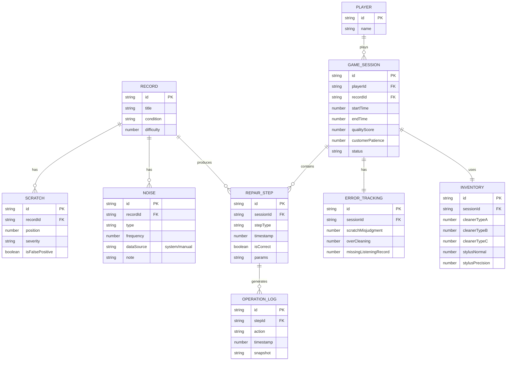

## 1. 架构设计



## 2. 技术描述

- **前端框架**：React@18 + TypeScript
- **构建工具**：Vite@5
- **状态管理**：Zustand（轻量级，适合游戏状态管理）
- **样式方案**：TailwindCSS@3 + CSS 变量 + 自定义动画
- **拖拽交互**：@dnd-kit/core + @dnd-kit/sortable
- **图表可视化**：recharts（用于音质评分、错误统计图表）
- **动画库**：framer-motion（用于复杂交互动画）
- **图标库**：lucide-react
- **导出功能**：jspdf（PDF导出）+ papaparse（CSV导出）
- **后端**：无，使用 Mock 数据 + LocalStorage 持久化
- **数据库**：LocalStorage 存储游戏进度和历史记录

## 3. 路由定义

| 路由 | 页面组件 | 功能说明 |
|------|----------|----------|
| / | HomePage | 游戏首页，开始游戏入口、历史记录入口 |
| /game | GamePage | 游戏主界面，包含黑胶盘工作台、噪声分析、工具架 |
| /analysis | AnalysisPage | 错因分析面板，三类错误独立统计 |
| /timeline | TimelinePage | 操作时间轴页面，支持回放和筛选 |
| /report | ReportPage | 报告导出页面，生成修复报告 |

## 4. 数据模型

### 4.1 数据模型定义



### 4.2 TypeScript 类型定义

```typescript
// 黑胶唱片
interface VinylRecord {
  id: string;
  title: string;
  artist: string;
  condition: 'poor' | 'fair' | 'good' | 'excellent';
  difficulty: 1 | 2 | 3;
  scratches: Scratch[];
  noises: Noise[];
}

// 划痕
interface Scratch {
  id: string;
  position: number; // 0-100 半径位置
  angle: number; // 0-360 角度
  severity: 'light' | 'medium' | 'deep';
  isFalsePositive: boolean; // 是否为误判目标
  length: number;
}

// 噪声
interface Noise {
  id: string;
  type: 'surface' | 'crackle' | 'pop' | 'warble' | 'distortion';
  frequency: number; // 频率值
  amplitude: number; // 振幅 0-100
  dataSource: 'system' | 'manual'; // 数据来源
  note?: string; // 人工备注
  detectedAt: number;
}

// 清洗剂类型
type CleanerType = 'typeA' | 'typeB' | 'typeC';

// 唱针类型
type StylusType = 'normal' | 'precision';

// 修复步骤
interface RepairStep {
  id: string;
  type: 'noise_analysis' | 'scratch_detection' | 'cleaning' | 'listening' | 'reporting';
  timestamp: number;
  isCorrect: boolean;
  params: Record<string, any>;
  snapshot: GameState; // 操作时的状态快照
}

// 错误类型
type ErrorType = 'scratch_misjudgment' | 'over_cleaning' | 'missing_listening_record';

// 错误追踪
interface ErrorTracking {
  scratchMisjudgment: number;
  overCleaning: number;
  missingListeningRecord: number;
  errors: Array<{
    type: ErrorType;
    timestamp: number;
    stepId: string;
    description: string;
  }>;
}

// 库存
interface Inventory {
  cleanerA: number;
  cleanerB: number;
  cleanerC: number;
  stylusNormal: number;
  stylusPrecision: number;
}

// 游戏状态
interface GameState {
  sessionId: string;
  currentRecord: VinylRecord | null;
  currentStep: number;
  qualityScore: number; // 0-100
  customerPatience: number; // 0-100
  inventory: Inventory;
  errorTracking: ErrorTracking;
  repairSteps: RepairStep[];
  isPlaying: boolean;
  isPaused: boolean;
  playbackSpeed: number;
  filterOptions: FilterOptions;
}

// 筛选选项
interface FilterOptions {
  timeRange: [number, number] | null;
  errorTypes: ErrorType[];
  dataSources: ('system' | 'manual')[];
  stepTypes: RepairStep['type'][];
}

// 导出报告
interface RepairReport {
  sessionId: string;
  exportTime: number;
  filterOptions: FilterOptions;
  recordInfo: VinylRecord;
  qualityScore: number;
  errorSummary: ErrorTracking;
  steps: RepairStep[];
  dataSourceMarks: Array<{
    stepId: string;
    dataSource: 'system' | 'manual';
    content: string;
  }>;
}
```

## 5. 核心模块设计

### 5.1 游戏状态管理 (Zustand Store)

```typescript
// src/store/gameStore.ts
import { create } from 'zustand';
import { GameState, RepairStep, ErrorType, FilterOptions } from '../types';

interface GameActions {
  startGame: (recordId: string) => void;
  endGame: () => void;
  addRepairStep: (step: Omit<RepairStep, 'id' | 'timestamp'>) => void;
  recordError: (type: ErrorType, description: string) => void;
  updateQualityScore: (delta: number) => void;
  updateCustomerPatience: (delta: number) => void;
  useInventory: (item: keyof Inventory, amount: number) => void;
  setFilterOptions: (options: Partial<FilterOptions>) => void;
  resetGame: () => void;
  exportReport: () => RepairReport;
}

export const useGameStore = create<GameState & GameActions>((set, get) => ({
  // 初始状态...
  // 操作方法...
}));
```

### 5.2 规则引擎模块

```typescript
// src/engine/rulesEngine.ts
export class RulesEngine {
  // 划痕判断规则
  static validateScratchJudgment(
    scratch: Scratch,
    userJudgment: boolean
  ): { isCorrect: boolean; scoreDelta: number; errorType?: ErrorType };
  
  // 清洗剂量规则
  static validateCleaningAmount(
    cleanerType: CleanerType,
    amount: number,
    scratchSeverity: string
  ): { isCorrect: boolean; scoreDelta: number; inventoryDelta: number; errorType?: ErrorType };
  
  // 试听记录规则
  static validateListeningRecord(
    hasRecord: boolean,
    noiseTypes: string[]
  ): { isCorrect: boolean; scoreDelta: number; errorType?: ErrorType };
}
```

### 5.3 导出模块

```typescript
// src/utils/exportUtils.ts
export const exportToPDF = (report: RepairReport) => {
  // 使用 jspdf 生成 PDF，区分系统数据和人工备注
};

export const exportToCSV = (report: RepairReport) => {
  // 使用 papaparse 生成 CSV，筛选条件与当前视图一致
};

export const getFilteredSteps = (
  steps: RepairStep[],
  filters: FilterOptions
): RepairStep[] => {
  // 根据筛选条件过滤步骤
};
```

## 6. 目录结构

```
src/
├── components/          # React 组件
│   ├── game/           # 游戏主界面组件
│   │   ├── VinylDisc.tsx      # 黑胶盘组件
│   │   ├── NoiseAnalyzer.tsx  # 噪声分析器
│   │   ├── ToolShelf.tsx      # 工具架
│   │   └── Dashboard.tsx      # 状态仪表盘
│   ├── analysis/       # 错因分析组件
│   │   ├── ErrorCard.tsx
│   │   └── ErrorStats.tsx
│   ├── timeline/       # 时间轴组件
│   │   ├── Timeline.tsx
│   │   └── TimelineNode.tsx
│   └── report/         # 报告导出组件
│       ├── ReportPreview.tsx
│       └── ExportButtons.tsx
├── store/              # 状态管理
│   └── gameStore.ts
├── engine/             # 游戏规则引擎
│   ├── rulesEngine.ts
│   └── scoring.ts
├── types/              # TypeScript 类型
│   └── index.ts
├── data/               # Mock 数据
│   ├── records.ts
│   └── noises.ts
├── utils/              # 工具函数
│   ├── exportUtils.ts
│   └── animation.ts
├── hooks/              # 自定义 Hooks
│   ├── useDragDrop.ts
│   └── usePlayback.ts
├── App.tsx
├── main.tsx
└── index.css
```
