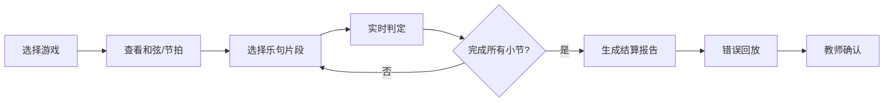
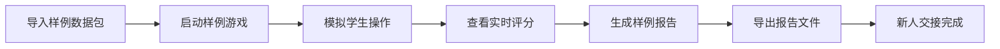
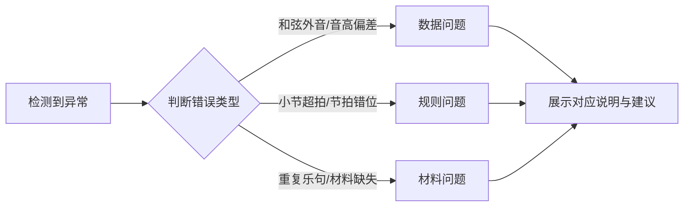

## 1. 产品概述

"爵士即兴接龙局"是一款面向音乐教学场景的互动小游戏，帮助学生在游戏化环境中练习爵士即兴乐句创作，同时兼顾和弦进行正确性与节拍稳定性。

- **核心问题**：传统教学依赖和弦牌、乐句片段、节拍器等零散工具，月底易遗漏学生进度，错误反馈仅停留在红色提示层面
- **目标用户**：音乐教师、爵士音乐学习者
- **产品价值**：将零散教学工具整合为统一游戏平台，提供精细化错误分类、完整学习轨迹追踪、可导出的课堂报告

## 2. 核心功能

### 2.1 用户角色

| 角色 | 登录方式 | 核心权限 |
|------|---------|---------|
| 学生 | 班级码+姓名 | 参与游戏、查看个人成绩、回放错误片段 |
| 教师 | 账号密码 | 创建游戏、管理班级、查看全班报告、导出成绩、配置规则和材料库 |

### 2.2 功能模块

1. **游戏大厅**：班级选择、游戏模式选择、历史记录入口
2. **即兴接龙游戏**：乐句拼接、和弦判定、节拍评分、实时反馈
3. **成绩分析**：关键选择展示、扣分原因拆解、改进建议
4. **错误回放**：按错误类型分类回放、时间轴定位
5. **教师控制台**：班级管理、材料库管理（和弦/乐句/节拍）、规则配置
6. **报告导出**：个人/班级报告生成、多格式导出

### 2.3 页面详情

| 页面名称 | 模块名称 | 功能描述 |
|---------|---------|----------|
| 登录/角色选择 | 身份验证 | 教师登录/学生快速加入、角色切换 |
| 游戏大厅 | 游戏列表 | 可用游戏、进行中游戏、历史游戏卡片展示 |
| 游戏大厅 | 班级概览 | 当前班级学生状态、完成进度 |
| 即兴游戏主界面 | 五线谱显示区 | 实时显示当前和弦进行、已有乐句、待拼接位置 |
| 即兴游戏主界面 | 乐句选择面板 | 可选乐句片段卡片、拖拽/点击拼接 |
| 即兴游戏主界面 | 节拍器模块 | 可视化节拍指示、速度调节、小节计数 |
| 即兴游戏主界面 | 实时反馈区 | 本次选择的和弦/节拍评分、即时提示 |
| 结算页面 | 总分展示 | 和弦得分、节拍得分、综合评级 |
| 结算页面 | 关键选择分析 | 展示玩家的关键决策点、正确/错误标注 |
| 结算页面 | 扣分原因拆解 | 按错误类型分类展示扣分点、扣分值 |
| 结算页面 | 改进建议 | 针对性练习建议、相关材料推荐 |
| 错误回放页面 | 时间轴回放 | 可拖动时间轴、按错误类型过滤跳转 |
| 错误回放页面 | 错误类型说明 | 区分数据问题/规则问题/材料问题及说明 |
| 教师控制台 | 班级管理 | 学生列表、进度追踪、批改状态 |
| 教师控制台 | 材料库管理 | 和弦牌、乐句片段、节拍配置的增删改 |
| 教师控制台 | 报告中心 | 个人报告、班级汇总报告、导出功能 |
| 样例引导页 | 新手流程 | 从导入样例到生成报告的完整引导流程 |

## 3. 核心流程

### 3.1 游戏主流程

学生选择游戏 → 查看当前和弦进行与节拍 → 从乐句库选择合适片段 → 系统实时判定和弦匹配度与节拍准确度 → 完成所有小节后生成结算报告 → 可回放错误片段 → 教师确认成绩

### 3.2 教师样例流程

导入预设样例 → 启动样例游戏 → 模拟学生操作 → 查看评分过程 → 生成样例报告 → 导出报告 → 完成新人交接演示

### 3.3 错误分类判定流程

## 4. 用户界面设计

### 4.1 设计风格

- **主色调**：深炭灰（#1A1A2E）作为背景，营造爵士酒吧氛围
- **辅助色**：黄铜金（#D4AF37）用于强调和高分，勃艮第红（#722F37）用于错误提示，森林绿（#2D5A27）用于正确反馈
- **按钮风格**：圆角矩形（8px），微立体阴影，悬停时有轻微上浮和光泽变化
- **字体**：标题使用 Playfair Display（优雅衬线，爵士复古感），正文使用 Source Code Pro（等宽字体，适合乐谱和数据展示）
- **布局风格**：卡片式模块化布局，关键区域使用深色玻璃拟态效果
- **视觉元素**：五线谱纹理背景、音符装饰元素、黑胶唱片质感的进度指示器
- **动效**：乐句拼接时有平滑过渡动画，节拍器有明显的律动反馈，错误提示有柔和的震动而非突兀闪烁

### 4.2 页面设计概述

| 页面名称 | 模块名称 | UI元素 |
|---------|---------|--------|
| 登录页 | 身份选择 | 深色渐变背景、居中卡片、角色切换标签、黄铜色主按钮 |
| 游戏大厅 | 游戏卡片 | 横向滚动卡片组、每张卡片显示游戏状态、参与人数、截止时间 |
| 游戏主界面 | 五线谱区 | 占据页面中央60%宽度，显示当前小节、和弦符号、已放置乐句 |
| 游戏主界面 | 乐句面板 | 底部横向排列乐句卡片，可拖拽，悬停时显示和弦信息 |
| 游戏主界面 | 节拍器 | 右侧垂直排列的节拍指示灯，随节拍律动点亮 |
| 结算页 | 分数展示 | 大号黄铜色数字显示总分，和弦/节拍分数环形对比图 |
| 结算页 | 错误分析 | 时间轴条形图，不同颜色代表不同错误类型，可点击查看详情 |
| 教师控制台 | 数据面板 | 网格布局的数据卡片，显示班级完成率、平均分、薄弱知识点 |

### 4.3 响应式设计

- **桌面端优先**：核心游戏区域需要较大屏幕展示五线谱和乐句面板
- **平板适配**：乐句面板改为可折叠抽屉，五线谱区域自适应缩放
- **手机端**：仅支持查看成绩、报告和简单操作，不支持完整游戏流程
- **触控优化**：乐句卡片最小高度60px，确保触控精准

### 4.4 错误类型可视化规范

| 错误类型 | 颜色标识 | 图标 | 说明文字风格 |
|---------|---------|------|-------------|
| 数据问题（和弦外音等） | 橙色（#E67E22） | ⚠️ | "音高识别可能存在偏差，建议结合听觉判断" |
| 规则问题（超拍等） | 勃艮第红（#722F37） | 🚫 | "违反节拍规则，请检查时值配置" |
| 材料问题（重复乐句等） | 紫色（#8E44AD） | 📦 | "乐句库材料不足或重复，建议扩充材料库" |
