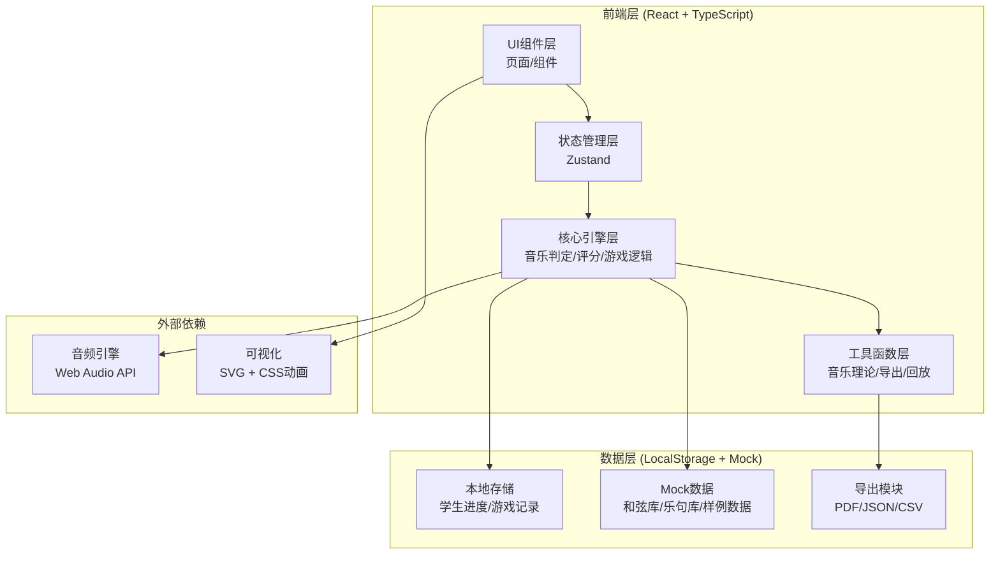

## 1. 架构设计



## 2. 技术描述

- **前端框架**: React@18 + TypeScript + Vite@5
- **样式方案**: TailwindCSS@3 + CSS变量主题系统
- **状态管理**: Zustand（轻量级，适合游戏状态）
- **路由管理**: React Router@6
- **图标方案**: Lucide React
- **音频处理**: Web Audio API（内置，无需额外库）
- **数据持久化**: LocalStorage + 自动备份
- **图表可视化**: Recharts（用于成绩分析图表）
- **导出功能**: jsPDF（PDF）+ 原生JSON/CSV导出

## 3. 核心目录结构

```
src/
├── assets/              # 静态资源
├── components/          # 通用组件
│   ├── ui/             # 基础UI组件
│   ├── game/           # 游戏相关组件
│   ├── music/          # 音乐相关组件
│   └── reports/        # 报告相关组件
├── engine/             # 核心引擎
│   ├── musicTheory.ts  # 音乐理论计算
│   ├── chordEngine.ts  # 和弦判定引擎
│   ├── rhythmEngine.ts # 节拍评分引擎
│   └── gameEngine.ts   # 游戏流程引擎
├── store/              # 状态管理
│   ├── useGameStore.ts
│   ├── useUserStore.ts
│   └── useMaterialStore.ts
├── types/              # TypeScript类型定义
│   ├── music.ts
│   ├── game.ts
│   └── reports.ts
├── data/               # Mock数据
│   ├── chords.ts       # 和弦库
│   ├── phrases.ts      # 乐句库
│   └── sample.ts       # 样例数据
├── utils/              # 工具函数
│   ├── audio.ts        # 音频播放
│   ├── export.ts       # 导出功能
│   └── playback.ts     # 回放功能
├── pages/              # 页面组件
│   ├── Login.tsx
│   ├── Lobby.tsx
│   ├── Game.tsx
│   ├── Results.tsx
│   ├── Playback.tsx
│   ├── TeacherConsole.tsx
│   └── SampleGuide.tsx
└── App.tsx
```

## 4. 路由定义

| 路由 | 页面 | 权限 | 说明 |
|------|------|------|------|
| / | 登录/角色选择 | 公开 | 角色选择和身份验证 |
| /lobby | 游戏大厅 | 学生/教师 | 游戏列表和班级概览 |
| /game/:id | 即兴游戏主界面 | 学生 | 核心游戏界面 |
| /results/:id | 结算页面 | 学生 | 成绩分析和建议 |
| /playback/:id | 错误回放 | 学生 | 按错误类型回放 |
| /console | 教师控制台 | 教师 | 班级/材料/报告管理 |
| /console/reports | 报告中心 | 教师 | 查看和导出报告 |
| /console/materials | 材料库管理 | 教师 | 和弦/乐句/节拍配置 |
| /guide | 样例引导页 | 教师 | 新人交接样例流程 |

## 5. 数据模型

### 5.1 核心数据模型

```mermaid
erDiagram
    TEACHER ||--o{ CLASS : manages
    CLASS ||--o{ STUDENT : contains
    CLASS ||--o{ GAME : has
    GAME ||--o{ GAME_SESSION : has
    STUDENT ||--o{ GAME_SESSION : participates
    GAME ||--|| CHORD_PROGRESSION : uses
    GAME ||--|| RHYTHM_PATTERN : uses
    PHRASE_LIBRARY ||--o{ PHRASE : contains
    GAME_SESSION ||--o{ MOVE : records
    MOVE ||--|| PHRASE : selects
    GAME_SESSION ||--|| SCORE : produces
    SCORE ||--o{ ERROR : contains
```

### 5.2 类型定义

```typescript
// 音乐相关类型
interface Note {
  pitch: string; // C, D, E, F, G, A, B
  octave: number;
  accidental: '#' | 'b' | 'natural';
  duration: number; // 1=whole, 0.5=half, 0.25=quarter, etc.
}

interface Chord {
  id: string;
  symbol: string; // Cmaj7, Dm7, G7, etc.
  root: string;
  quality: 'maj' | 'min' | 'dom' | 'dim' | 'aug';
  extensions: string[]; // ['7', '9', '11', '13']
  allowedNotes: string[]; // 和弦内音
  passingNotes: string[]; // 允许的经过音
}

interface Phrase {
  id: string;
  name: string;
  notes: Note[];
  totalDuration: number;
  difficulty: 'easy' | 'medium' | 'hard';
  compatibleChords: string[]; // 和弦ID列表
  tags: string[];
}

interface ChordProgression {
  id: string;
  name: string;
  chords: { chord: Chord; measure: number; beat: number }[];
  totalMeasures: number;
}

interface RhythmPattern {
  id: string;
  timeSignature: [number, number]; // [4, 4] = 4/4
  bpm: number;
  swingFactor?: number; // 0-1, 0=straight, 1=max swing
}

// 游戏相关类型
type ErrorType = 'data' | 'rule' | 'material';

interface ErrorDetail {
  id: string;
  type: ErrorType;
  measure: number;
  beat: number;
  description: string;
  deduction: number;
  suggestion: string;
}

interface Move {
  id: string;
  measureNumber: number;
  phrase: Phrase;
  timestamp: number;
  isCorrect: boolean;
  errors: ErrorDetail[];
}

interface Score {
  chordScore: number; // 0-100
  rhythmScore: number; // 0-100
  totalScore: number; // 0-100
  grade: 'S' | 'A' | 'B' | 'C' | 'D' | 'F';
  errors: ErrorDetail[];
  keyDecisions: {
    measure: number;
    choice: string;
    isCorrect: boolean;
    explanation: string;
  }[];
  suggestions: string[];
}

interface GameSession {
  id: string;
  gameId: string;
  studentId: string;
  startTime: number;
  endTime?: number;
  moves: Move[];
  score?: Score;
  confirmed: boolean;
  confirmedBy?: string;
}

// 用户相关类型
interface Student {
  id: string;
  name: string;
  classId: string;
}

interface Teacher {
  id: string;
  name: string;
  email: string;
}

interface Class {
  id: string;
  name: string;
  teacherId: string;
  joinCode: string;
  students: Student[];
}
```

### 5.3 Mock 数据初始化

```typescript
// 预设和弦库（常用爵士和弦）
const DEFAULT_CHORDS: Chord[] = [
  { id: 'c-maj7', symbol: 'Cmaj7', root: 'C', quality: 'maj', extensions: ['7'], allowedNotes: ['C', 'E', 'G', 'B'], passingNotes: ['D', 'F', 'A'] },
  { id: 'd-min7', symbol: 'Dm7', root: 'D', quality: 'min', extensions: ['7'], allowedNotes: ['D', 'F', 'A', 'C'], passingNotes: ['E', 'G', 'B'] },
  { id: 'g-dom7', symbol: 'G7', root: 'G', quality: 'dom', extensions: ['7'], allowedNotes: ['G', 'B', 'D', 'F'], passingNotes: ['A', 'C', 'E'] },
  // 更多和弦...
];

// 预设乐句库
const DEFAULT_PHRASES: Phrase[] = [
  {
    id: 'phrase-001',
    name: 'C大调上行乐句',
    notes: [
      { pitch: 'C', octave: 4, accidental: 'natural', duration: 0.25 },
      { pitch: 'D', octave: 4, accidental: 'natural', duration: 0.25 },
      { pitch: 'E', octave: 4, accidental: 'natural', duration: 0.25 },
      { pitch: 'G', octave: 4, accidental: 'natural', duration: 0.25 },
    ],
    totalDuration: 1,
    difficulty: 'easy',
    compatibleChords: ['c-maj7'],
    tags: ['上行', 'C大调'],
  },
  // 更多乐句...
];

// 样例游戏数据（用于新人交接）
const SAMPLE_GAME = {
  id: 'sample-001',
  name: '样例：II-V-I 进行练习',
  chordProgression: {
    id: 'prog-ii-v-i-c',
    name: 'C大调 II-V-I',
    totalMeasures: 4,
    chords: [
      { chord: 'd-min7', measure: 1, beat: 1 },
      { chord: 'g-dom7', measure: 2, beat: 1 },
      { chord: 'c-maj7', measure: 3, beat: 1 },
      { chord: 'c-maj7', measure: 4, beat: 1 },
    ],
  },
  rhythmPattern: {
    id: 'rhythm-44-120',
    timeSignature: [4, 4] as [number, number],
    bpm: 120,
    swingFactor: 0.3,
  },
  availablePhrases: ['phrase-001', 'phrase-002', 'phrase-003', 'phrase-004'],
};
```

## 6. 核心引擎算法

### 6.1 和弦匹配算法

```typescript
function calculateChordScore(phrase: Phrase, targetChord: Chord): { score: number; errors: ErrorDetail[] } {
  const errors: ErrorDetail[] = [];
  let totalNotes = phrase.notes.length;
  let correctNotes = 0;

  phrase.notes.forEach((note, index) => {
    const noteName = note.pitch + note.accidental;
    const isChordTone = targetChord.allowedNotes.includes(noteName);
    const isPassingTone = targetChord.passingNotes.includes(noteName);
    
    if (isChordTone) {
      correctNotes++;
    } else if (isPassingTone) {
      correctNotes += 0.7; // 经过音部分得分
    } else {
      // 和弦外音 - 数据问题
      errors.push({
        id: `error-${Date.now()}-${index}`,
        type: 'data',
        measure: 1, // 根据位置计算
        beat: (index * note.duration * 4) + 1,
        description: `${noteName} 不属于 ${targetChord.symbol} 和弦内音或经过音`,
        deduction: 5,
        suggestion: '尝试使用和弦内音或附近的经过音',
      });
    }
  });

  return {
    score: Math.round((correctNotes / totalNotes) * 100),
    errors,
  };
}
```

### 6.2 节拍评分算法

```typescript
function calculateRhythmScore(phrase: Phrase, pattern: RhythmPattern, timingData: number[]): { score: number; errors: ErrorDetail[] } {
  const errors: ErrorDetail[] = [];
  const beatDuration = 60 / pattern.bpm; // 每拍的秒数
  let totalDeviation = 0;

  // 检查小节总时长
  const expectedDuration = phrase.totalDuration;
  const actualDuration = timingData[timingData.length - 1] - timingData[0];
  const durationDiff = Math.abs(expectedDuration * beatDuration * 4 - actualDuration);

  if (durationDiff > beatDuration * 0.5) {
    // 小节超拍 - 规则问题
    errors.push({
      id: `error-rhythm-${Date.now()}`,
      type: 'rule',
      measure: 1,
      beat: 1,
      description: `乐句时长偏差 ${durationDiff.toFixed(2)} 秒，超过允许范围`,
      deduction: 10,
      suggestion: '注意控制每个音符的时值，确保总时长正确',
    });
  }

  // 计算每个音符的节拍偏差
  timingData.forEach((time, index) => {
    if (index === 0) return;
    const expectedInterval = phrase.notes[index - 1].duration * beatDuration * 4;
    const actualInterval = time - timingData[index - 1];
    const deviation = Math.abs(expectedInterval - actualInterval);
    totalDeviation += deviation;

    if (deviation > beatDuration * 0.3) {
      errors.push({
        id: `error-beat-${Date.now()}-${index}`,
        type: 'rule',
        measure: 1,
        beat: index + 1,
        description: `第 ${index} 个音符节拍偏差 ${deviation.toFixed(2)} 秒`,
        deduction: 3,
        suggestion: '跟随节拍器，保持稳定的节奏',
      });
    }
  });

  const avgDeviation = totalDeviation / (timingData.length - 1);
  const baseScore = Math.max(0, 100 - (avgDeviation / beatDuration) * 50);

  return {
    score: Math.round(baseScore),
    errors,
  };
}
```

## 7. 状态管理设计

### 7.1 游戏状态 Store

```typescript
// useGameStore.ts
interface GameState {
  currentGame: Game | null;
  currentSession: GameSession | null;
  currentMeasure: number;
  isPlaying: boolean;
  selectedPhrase: Phrase | null;
  moves: Move[];
  feedback: FeedbackMessage | null;
  
  startGame: (gameId: string) => void;
  selectPhrase: (phrase: Phrase) => void;
  confirmPhrase: () => void;
  nextMeasure: () => void;
  completeGame: () => void;
  setFeedback: (feedback: FeedbackMessage | null) => void;
}
```

## 8. 导出模块设计

支持三种导出格式：
1. **JSON**：完整数据导出，用于数据备份和导入
2. **CSV**：成绩表格导出，适合教师整理到Excel
3. **PDF**：格式化报告导出，包含图表和详细分析，适合发给学生或存档

## 9. 样例流程设计

样例引导页将提供一个完整的可交互流程：
1. 点击"导入样例数据"按钮 → 自动加载预设的样例游戏、和弦库、乐句库
2. 点击"启动样例游戏" → 进入游戏界面，展示II-V-I和弦进行
3. 点击"模拟学生操作" → 自动演示选择乐句的过程，包含正确和错误选择
4. 查看实时评分 → 展示每个选择的评分过程和错误提示
5. 生成报告 → 自动生成完整的分析报告
6. 导出报告 → 演示三种格式的导出功能
7. 完成引导 → 显示总结和关键入口说明
