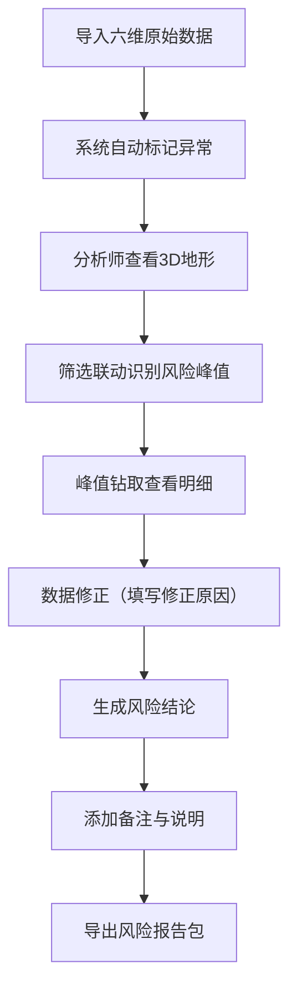
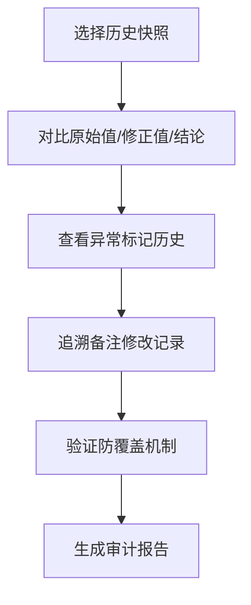

## 1. 产品概述
贷款组合风险地形是银行风控团队的可视化决策工具，将客户贷款组合以三维地形形式呈现，直观展示行业、期限和风险等级的风险分布峰值。系统支持从原始数据做账到最终结论导出的全流程，重点解决风控分析中数据追溯难、异常识别难、方案沟通难的核心痛点。

- **主要用途**：风控方案汇报、风险峰值识别、组合监控与审计
- **解决问题**：多维度风险可视化、数据变更可追溯、异常标记不丢失
- **目标用户**：银行风控分析师、风险经理、审计复核人员

## 2. 核心特性

### 2.1 用户角色
| 角色 | 注册方式 | 核心权限 |
|------|----------|----------|
| 风控分析师 | 内部系统登录 | 数据录入、地形分析、报告导出、备注编辑 |
| 风险经理 | 内部系统登录 | 方案审核、风险确认、批量操作 |
| 审计人员 | 内部系统登录 | 只读查看、历史追溯、变更审计 |

### 2.2 功能模块
1. **风险地形主页**：3D地形渲染区、筛选联动面板、峰值钻取、时间轴对比
2. **数据做账中心**：六维数据录入（客户贷款、行业标签、到期桶、风险评级、担保信息、风险报告）、原始值/修正值/结论三段式分离
3. **异常检测面板**：到期桶错位检测、担保重复识别、风险等级覆盖标记、筛选导出保留标记
4. **报告导出中心**：3D截图、当前筛选条件、异常说明、审计日志一键打包
5. **审计追踪中心**：版本快照、变更对比、备注历史、防止旧结论覆盖

### 2.3 页面详情
| 页面名称 | 模块名称 | 功能描述 |
|---------|----------|----------|
| 风险地形主页 | 3D地形渲染 | X轴-行业、Y轴-期限、Z轴-风险等级/敞口，颜色映射风险程度，高度表示敞口规模 |
| 风险地形主页 | 筛选联动面板 | 行业多选、期限范围、风险等级区间、担保类型筛选，实时联动3D视图 |
| 风险地形主页 | 峰值钻取 | 点击地形高亮区域，下钻查看明细贷款列表、客户信息、风险详情 |
| 风险地形主页 | 时间轴对比 | 历史快照回放、双期对比视图、风险迁徙可视化 |
| 数据做账中心 | 六维数据录入 | 结构化录入六类数据，支持批量导入、单条编辑 |
| 数据做账中心 | 三段式数据分离 | 原始值（不可篡改）、修正值（带原因）、结论值（审批后锁定） |
| 异常检测面板 | 异常自动检测 | 到期桶错位、担保重复、风险等级覆盖三大类异常自动识别并标记 |
| 异常检测面板 | 异常标记保留 | 筛选、导出、视图切换时异常标记始终可见，不丢失 |
| 报告导出中心 | 一键打包导出 | 3D截图（当前视角）、筛选条件JSON、异常说明列表、数据变更记录 |
| 审计追踪中心 | 版本快照 | 每次数据修改自动创建快照，支持回滚对比 |
| 审计追踪中心 | 防覆盖机制 | 编辑备注时校验旧结论状态，自动提示冲突，强制留痕 |

## 3. 核心流程

### 3.1 做账分析流程

### 3.2 审计复核流程

## 4. 用户界面设计

### 4.1 设计风格
- **主色调**：深邃海军蓝 #0F172A 为背景，营造专业金融风控氛围
- **强调色**：风险梯度色带（绿 #22C55E → 黄 #EAB308 → 橙 #F97316 → 红 #EF4444 → 深红 #991B1B）
- **辅助色**：科技青 #06B6D4 用于交互元素，琥珀金 #F59E0B 用于异常标记
- **字体**：
  - 标题：Space Grotesk，锐利几何感，体现风控严谨性
  - 正文：JetBrains Mono，等宽字体增强数据可读性
  - 数字：Roboto Mono，数字对齐便于比对
- **按钮风格**：微立体边框，hover时轻微上浮，active时内陷反馈
- **布局风格**：暗色dashboard，左侧筛选面板，中央3D主视图，底部时间轴，右侧信息抽屉
- **图标风格**：lucide线性图标，统一16px/20px/24px三档尺寸

### 4.2 页面设计概述
| 页面名称 | 模块名称 | UI元素 |
|---------|----------|--------|
| 风险地形主页 | 3D地形区 | 悬浮式玻璃态边框，WebGL渲染，鼠标拖拽旋转，滚轮缩放，右键平移 |
| 风险地形主页 | 筛选面板 | 折叠式手风琴，多选项标签云，范围滑块，实时计数显示 |
| 风险地形主页 | 峰值信息卡 | 点击峰值后弹出，毛玻璃效果，三级数据分层展示 |
| 风险地形主页 | 时间轴 | 底部横向滑动，节点式历史快照，双击切换，双指捏合缩放时间范围 |
| 数据做账中心 | 数据表格 | 斑马纹行，异常行高亮，三段式数据列组（原始/修正/结论） |
| 数据做账中心 | 编辑模态框 | 左右分栏，左侧数据字段，右侧变更原因与备注 |
| 异常检测面板 | 异常列表 | 图标化分类，颜色标记严重程度，可展开查看影响范围 |
| 报告导出中心 | 导出预览 | 右侧预览截图，左侧勾选导出内容，底部进度条 |
| 审计追踪中心 | 版本对比 | 左右分栏差异对比，红色删除线，绿色高亮新增 |

### 4.3 响应性
- **设计优先级**：桌面端优先（1920×1080），适配2K/4K大屏
- **平板适配**：筛选面板可收起为图标栏，3D区域自适应缩放
- **触控优化**：支持双指旋转、捏合缩放、长按钻取
- **断点**：1280px（平板横屏）、1024px（平板竖屏）、768px（手机横屏）

### 4.4 3D场景指引
- **环境与氛围**：深空蓝渐变背景，微弱体积光模拟CT扫描效果，营造专业风控分析室氛围
- **光照设置**：半球光提供基础照明 + 两盏方向光从左上/右下打光，形成地形阴影层次，峰值区域增加点光聚光效果
- **相机设置**：初始45°俯视角，距离地面2.5倍地形宽度，支持轨道控制器，限制最小/最大缩放距离，防止穿透地面
- **构图与焦点**：地形居中占屏幕60%，周围留出筛选面板空间，峰值区域自动计算并添加脉冲高亮效果
- **交互与动画**：
  - 载入动画：地形从平面逐行"隆起"形成3D效果
  - Hover效果：鼠标悬停的柱子升高10%并发光
  - 筛选切换：柱子高度平滑过渡动画（duration 600ms）
  - 峰值呼吸：高风险柱子有缓慢呼吸式亮度变化
- **后期处理**：Bloom泛光（风险峰值）、轻微FXAA抗锯齿、色调映射（ACES）
- **性能预算**：柱子数量控制在500以内，Draw Call < 50，帧率稳定60fps
