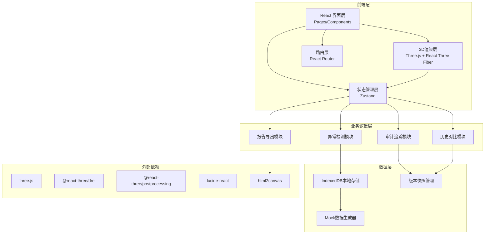
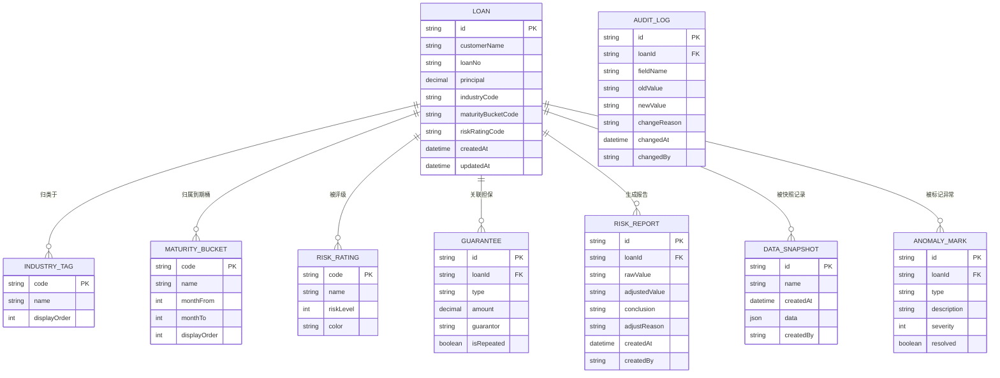

## 1. 架构设计



## 2. 技术描述

- **前端框架**：React@18 + TypeScript@5 + Vite@5
- **3D渲染**：three@^0.160.0 + @react-three/fiber@^8.15.0 + @react-three/drei@^9.92.0 + @react-three/postprocessing@^2.15.0
- **状态管理**：zustand@^4.4.0
- **路由**：react-router-dom@^6.21.0
- **样式方案**：tailwindcss@^3.4.0
- **图标**：lucide-react@^0.300.0
- **截图导出**：html2canvas@^1.4.0
- **本地存储**：IndexedDB (idb@^7.1.0)
- **初始化工具**：vite-init
- **后端**：无（纯前端应用，数据本地存储 + Mock数据）
- **数据库**：IndexedDB 本地持久化

## 3. 路由定义

| 路由 | 用途 |
|------|------|
| `/` | 重定向到 `/terrain` |
| `/terrain` | 风险地形主页 - 3D地形展示、筛选联动、峰值钻取、时间轴 |
| `/data` | 数据做账中心 - 六维数据录入、三段式数据管理 |
| `/anomaly` | 异常检测面板 - 异常列表、标记管理、批量处理 |
| `/export` | 报告导出中心 - 导出配置、预览、打包下载 |
| `/audit` | 审计追踪中心 - 版本对比、历史追溯、防覆盖验证 |

## 4. 数据模型

### 4.1 数据模型定义



### 4.2 类型定义（TypeScript）

```typescript
// 核心数据类型
interface Loan {
  id: string;
  customerName: string;
  loanNo: string;
  principal: number;
  industryCode: string;
  maturityBucketCode: string;
  riskRatingCode: string;
  createdAt: string;
  updatedAt: string;
}

interface IndustryTag {
  code: string;
  name: string;
  displayOrder: number;
}

interface MaturityBucket {
  code: string;
  name: string;
  monthFrom: number;
  monthTo: number;
  displayOrder: number;
}

interface RiskRating {
  code: string;
  name: string;
  riskLevel: number; // 1-10
  color: string;
}

interface Guarantee {
  id: string;
  loanId: string;
  type: 'mortgage' | 'pledge' | 'guarantee' | 'credit';
  amount: number;
  guarantor: string;
  isRepeated: boolean;
}

interface RiskReport {
  id: string;
  loanId: string;
  rawValue: string; // 原始值
  adjustedValue: string; // 修正值
  conclusion: string; // 最终结论
  adjustReason: string; // 修正原因
  createdAt: string;
  createdBy: string;
}

// 异常标记
type AnomalyType = 'maturity_mismatch' | 'guarantee_repeat' | 'rating_override';

interface AnomalyMark {
  id: string;
  loanId: string;
  type: AnomalyType;
  description: string;
  severity: 1 | 2 | 3; // 1:低 2:中 3:高
  resolved: boolean;
  createdAt: string;
}

// 数据快照
interface DataSnapshot {
  id: string;
  name: string;
  createdAt: string;
  data: {
    loans: Loan[];
    reports: RiskReport[];
    anomalies: AnomalyMark[];
  };
  createdBy: string;
}

// 审计日志
interface AuditLog {
  id: string;
  loanId: string;
  fieldName: string;
  oldValue: string;
  newValue: string;
  changeReason: string;
  changedAt: string;
  changedBy: string;
}

// 3D地形数据
interface TerrainDataPoint {
  industryCode: string;
  maturityCode: string;
  riskRatingCode: string;
  totalPrincipal: number;
  loanCount: number;
  avgRiskLevel: number;
  anomalyCount: number;
  loans: string[]; // loanIds
}

// 筛选条件
interface FilterConditions {
  industries: string[];
  maturityBuckets: string[];
  riskRatings: string[];
  guaranteeTypes: string[];
  hasAnomaly: boolean | null;
  principalRange: [number, number];
}

// 应用状态
interface AppState {
  loans: Loan[];
  industryTags: IndustryTag[];
  maturityBuckets: MaturityBucket[];
  riskRatings: RiskRating[];
  guarantees: Guarantee[];
  reports: RiskReport[];
  anomalies: AnomalyMark[];
  snapshots: DataSnapshot[];
  auditLogs: AuditLog[];
  filters: FilterConditions;
  selectedLoanId: string | null;
  selectedSnapshotId: string | null;
  compareSnapshotId: string | null;
  viewMode: 'terrain' | 'heatmap' | 'bar3d';
}
```

### 4.3 初始数据（Mock）

系统预置以下Mock数据：
- 12个行业标签（制造业、批发零售、房地产、基建等）
- 8个到期桶（1M内、1-3M、3-6M、6-12M、1-3Y、3-5Y、5-10Y、10Y+）
- 10个风险等级（AAA, AA, A, BBB, BB, B, CCC, CC, C, D）
- 500条贷款数据，覆盖各行业/期限/风险组合
- 30%数据带有异常标记（到期桶错位、担保重复、风险覆盖）
- 5个历史快照，用于时间轴对比
