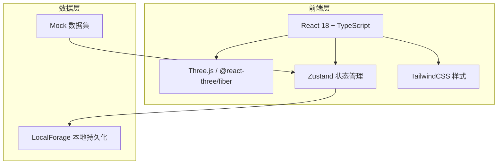

## 1. 架构设计



纯前端应用，无后端服务。所有数据通过 Mock 数据集提供，方案与备注通过 LocalForage 持久化到浏览器 IndexedDB。

## 2. 技术说明

- **前端框架**：React@18 + TypeScript + Vite
- **初始化工具**：Vite (react-ts template)
- **3D渲染**：Three.js + @react-three/fiber + @react-three/drei + @react-three/postprocessing
- **状态管理**：Zustand（轻量、无样板代码，适合3D场景高频更新）
- **样式**：TailwindCSS@3
- **本地存储**：LocalForage（IndexedDB 封装，异步非阻塞）
- **图表**：内建SVG渲染（频段响应曲线），不引入重型图表库
- **截图**：html2canvas + Canvas API toBlob
- **后端**：无
- **数据库**：无，全部为前端 Mock 数据 + LocalForage

## 3. 路由定义

| 路由 | 用途 |
|------|------|
| / | 沙盘主页：3D座位沙盘、声压热力、频段切换、筛选、对象详情、异常标注 |
| /plans | 方案管理页：方案列表、方案对比、调音备注、报告导出 |

## 4. 数据模型

### 4.1 数据模型定义

```mermaid
erDiagram
    "Seat" ||--o{ "SeatMeasurement" : has
    "Speaker" ||--o{ "SpeakerConfig" : has
    "AudienceZone" ||--o{ "Seat" : contains
    "Plan" ||--o{ "PlanSnapshot" : contains
    "Plan" ||--o{ "Note" : contains
    "Anomaly" }o--|| "Seat" : references
    "Anomaly" }o--|| "Speaker" : references

    "Seat" {
        string id PK
        string rowLabel
        int seatNumber
        float x
        float y
        float z
        string zoneId FK
    }

    "SeatMeasurement" {
        string seatId FK
        string frequencyBand
        float splDB
        string dataSource
        string measuredAt
    }

    "Speaker" {
        string id PK
        string label
        float x
        float y
        float z
        float rotationY
        string model
        float delayMs
        string zoneId FK
    }

    "SpeakerConfig" {
        string speakerId FK
        string frequencyBand
        float gainDB
        float delayMs
        string dataSource
    }

    "AudienceZone" {
        string id PK
        string name
        string color
    }

    "Plan" {
        string id PK
        string name
        string createdAt
        string frequencyBand
    }

    "PlanSnapshot" {
        string planId FK
        string seatId FK
        float splDB
    }

    "Note" {
        string id PK
        string planId FK
        string targetType
        string targetId
        string content
        string createdAt
    }

    "Anomaly" {
        string id PK
        string type
        string severity
        string message
        string seatId FK
        string speakerId FK
        string frequencyBand
        string dataSource
    }
    ```

### 4.2 数据定义语言

前端 TypeScript 类型定义：

```typescript
interface Seat {
  id: string;
  rowLabel: string;
  seatNumber: number;
  x: number; y: number; z: number;
  zoneId: string;
}

interface SeatMeasurement {
  seatId: string;
  frequencyBand: string;
  splDB: number;
  dataSource: string;
  measuredAt: string;
}

interface Speaker {
  id: string;
  label: string;
  x: number; y: number; z: number;
  rotationY: number;
  model: string;
  delayMs: number;
  zoneId: string;
}

interface SpeakerConfig {
  speakerId: string;
  frequencyBand: string;
  gainDB: number;
  delayMs: number;
  dataSource: string;
}

interface AudienceZone {
  id: string;
  name: string;
  color: string;
}

interface Anomaly {
  id: string;
  type: 'frequency_mismatch' | 'seat_occlusion' | 'delay_inversion';
  severity: 'warning' | 'error';
  message: string;
  seatId?: string;
  speakerId?: string;
  frequencyBand: string;
  dataSource: string;
}

interface Plan {
  id: string;
  name: string;
  createdAt: string;
  frequencyBand: string;
  notes: Note[];
  snapshot: { seatId: string; splDB: number }[];
}

interface Note {
  id: string;
  planId: string;
  targetType: 'seat' | 'speaker';
  targetId: string;
  content: string;
  createdAt: string;
}
```

## 5. 关键架构决策

### 5.1 迟到数据不覆盖

采用"数据合并策略"：当新数据源到达时，对每个字段检查是否已有值。若已有值，保留较早的值并记录冲突标记（`dataSourceConflict: true`），而非静默覆盖。冲突在详情卡片中以醒目标识展示，让用户决定取舍。

### 5.2 异常可读解释

所有异常（频段错配/座位遮挡/音箱延时反向）在检测时即生成 `message` 字段，用自然语言描述问题本质与可能原因。此字段直接渲染在3D标注气泡与详情卡片中，无需用户查阅日志。

### 5.3 数据溯源链

每个数值（声压、增益、延时）均携带 `dataSource` 字段，记录其来源（如"模拟计算"、"现场测量-A设备"、"手动输入"）。点击详情卡片中的任何数值，溯源面板显示该值的完整来源链。

### 5.4 3D性能策略

- 座位使用 `InstancedMesh` 渲染，支持2000+座位
- 热力颜色通过 `instanceColor` 属性批量更新，避免逐对象 setState
- 异常标注使用独立的 `<Billboard>` 组件，仅在可视范围内渲染
- OrbitControls 的 `update` 在 `useFrame` 中调度，而非每帧

### 5.5 状态管理

Zustand store 拆分为：
- `useSceneStore`：3D场景状态（相机、选中对象、频段）
- `useDataStore`：数据状态（座位、音箱、测量值、异常）
- `usePlanStore`：方案状态（方案列表、当前方案、备注）
- `useFilterStore`：筛选状态（观众区、异常类型、声压区间）
