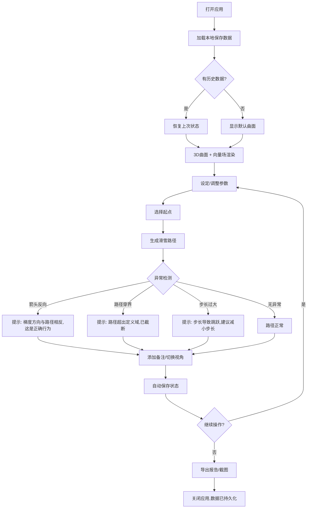

## 1. 产品概述

"向量场滑雪课堂"是一款面向高等数学教学的交互式3D可视化工具，帮助学生在三维曲面上直观理解梯度向量场与方向导数的关系。学生通过在曲面上"滑雪"（沿梯度方向移动），观察箭头方向与路径变化的对应关系，消除方向场与路径变化混淆的认知障碍。

- **核心问题**：学生常将梯度箭头的方向与路径变化方向混淆，缺乏对"梯度指向最陡上升方向"的直觉
- **目标用户**：大学数学教师（课堂演示）与学习多元微积分的学生（自主探索）
- **关键价值**：所有课堂进度、学生操作、备注批注均可本地持久化，第二天打开继续

## 2. 核心功能

### 2.1 用户角色

| 角色 | 使用方式 | 核心权限 |
|------|----------|----------|
| 教师 | 打开本地文件即可使用 | 设定曲面函数、调整参数、添加人工备注、导出课堂报告 |
| 学生 | 打开本地文件即可使用 | 选择起点、观察滑雪路径、添加学习备注、截图保存 |

### 2.2 功能模块

1. **课堂主页面**：3D曲面与梯度向量场交互视图、滑雪路径回放、参数控制面板
2. **备注与报告面板**：学生备注编辑、教师批注管理、异常处理日志、课堂报告导出

### 2.3 页面明细

| 页面名称 | 模块名称 | 功能描述 |
|----------|----------|----------|
| 课堂主页面 | 3D曲面渲染区 | 渲染用户定义的二元函数 z=f(x,y) 三维曲面，支持旋转、缩放、平移 |
| 课堂主页面 | 梯度向量场层 | 在曲面上以箭头阵列显示 ∇f，箭头长度/颜色映射梯度模，方向指向最陡上升 |
| 课堂主页面 | 滑雪路径层 | 从用户指定起点沿梯度下降方向（-∇f）生成路径，带动画回放 |
| 课堂主页面 | 视角切换栏 | 四种视角：3D曲面、向量动画、路径回放、参数总览，切换后各层数据一致 |
| 课堂主页面 | 参数控制面板 | 曲面函数编辑、网格密度、步长、起点坐标、箭头缩放因子 |
| 课堂主页面 | 异常提示浮层 | 检测箭头反向、路径穿界、步长过大，统一口径提示，二次运行说法一致 |
| 备注与报告面板 | 学生备注区 | 每条路径可附带文本备注，支持编辑与删除 |
| 备注与报告面板 | 教师批注区 | 教师对任意路径或异常添加批注，标记为重点/易错 |
| 备注与报告面板 | 异常日志 | 记录所有检测到的异常事件，含时间戳与处理口径 |
| 备注与报告面板 | 课堂报告 | 汇总曲面参数、所有路径、备注、异常日志，可导出为JSON与截图 |

## 3. 核心流程

用户打开应用后，可输入或选择曲面函数，系统自动计算梯度场并渲染。用户点击曲面设定滑雪起点，系统沿 -∇f 方向逐步生成下降路径，过程中实时检测异常。用户可在任意步骤暂停、添加备注、切换视角。所有状态自动保存到浏览器本地存储，下次打开自动恢复上一次进度。

## 4. 用户界面设计

### 4.1 设计风格

- **主色调**：深蓝黑色背景 (#0a0e1a)，搭配冰蓝色强调 (#4fc3f7) 和雪白色前景 (#e8eaf6)
- **辅助色**：警告橙 (#ff9800)、错误红 (#ef5350)、成功绿 (#66bb6a)
- **按钮风格**：圆角半透明毛玻璃风格，hover时发光
- **字体**：标题使用 JetBrains Mono（数学/代码感），正文使用 Noto Sans SC
- **布局风格**：左侧3D画布占主区域(70%)，右侧控制面板(30%)，底部状态栏
- **图标风格**：线性图标，2px描边，与冰蓝主题一致

### 4.2 页面设计概览

| 页面名称 | 模块名称 | UI元素 |
|----------|----------|--------|
| 课堂主页面 | 3D曲面渲染区 | 深色背景、曲面半透明渐变(蓝→紫)、坐标轴标签、网格线 |
| 课堂主页面 | 梯度向量场层 | 冰蓝色箭头、箭头长度映射模值、hover显示数值 |
| 课堂主页面 | 滑雪路径层 | 渐变路径线(起点绿→终点白)、路径点标记、动画粒子 |
| 课堂主页面 | 视角切换栏 | 四个Tab按钮：3D曲面/向量动画/路径回放/参数总览 |
| 课堂主页面 | 参数控制面板 | 函数输入框、滑块组(步长/密度/缩放)、起点坐标输入、应用按钮 |
| 课堂主页面 | 异常提示浮层 | 右上角toast通知，按异常类型分色，含关闭按钮 |
| 备注与报告面板 | 学生备注区 | 卡片列表、每条含文本+时间戳、编辑/删除按钮 |
| 备注与报告面板 | 教师批注区 | 置顶卡片、标记标签(重点/易错)、关联路径编号 |
| 备注与报告面板 | 异常日志 | 时间线样式、异常类型图标、展开详情 |
| 备注与报告面板 | 课堂报告 | 导出按钮(JSON+截图)、报告预览区 |

### 4.3 响应式设计

- 桌面优先设计，3D画布最小宽度800px
- 侧边面板可折叠以适配小屏幕
- 触摸设备支持双指旋转/缩放

### 4.4 3D场景指导

- **环境**：深空星域氛围，微弱环境光 + 定向主光，营造"夜间滑雪"意境
- **灯光**：一个方向主光(偏蓝白) + 环境光(暗紫) + 曲面上的点光源(沿路径发光)
- **相机**：默认透视相机，轨道控制器，阻尼启用，自动旋转可切换
- **构图**：曲面居中，路径发光粒子吸引视线，箭头场提供方向感
- **交互**：鼠标拖拽旋转、滚轮缩放、点击设定起点、hover显示梯度值
- **后处理**：辉光效果(Bloom)应用于路径和箭头、抗锯齿
- **性能预算**：箭头数量≤400、路径点≤2000、帧率≥30fps
