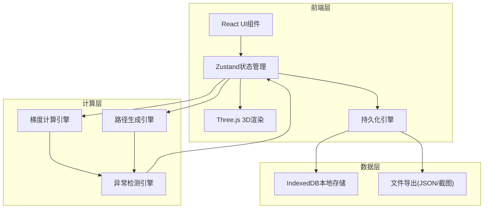
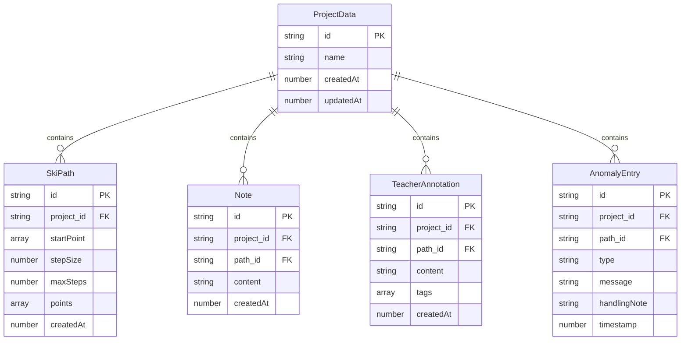

## 1. 架构设计



## 2. 技术说明

- **前端框架**：React@18 + TypeScript + Vite
- **3D渲染**：three + @react-three/fiber + @react-three/drei + @react-three/postprocessing
- **状态管理**：zustand（含 persist 中间件）
- **持久化存储**：IndexedDB（通过 idb 库），自动保存/恢复全部状态
- **样式方案**：tailwindcss@3
- **初始化工具**：vite-init（react-ts 模板）
- **后端**：无（纯前端本地应用）
- **数据库**：无服务器端数据库，全部数据存浏览器 IndexedDB

## 3. 路由定义

| 路由 | 用途 |
|------|------|
| / | 课堂主页面（3D视图 + 控制面板 + 备注系统） |

单页应用，通过面板切换实现多视图，无需多路由。

## 4. API定义

无后端API。所有数据操作通过本地IndexedDB完成。

### 4.1 持久化数据接口

```typescript
interface ProjectData {
  id: string
  name: string
  createdAt: number
  updatedAt: number
  surface: SurfaceConfig
  vectorField: VectorFieldConfig
  paths: SkiPath[]
  notes: Note[]
  teacherAnnotations: TeacherAnnotation[]
  anomalyLog: AnomalyEntry[]
  viewState: ViewState
}

interface SurfaceConfig {
  expression: string
  xRange: [number, number]
  yRange: [number, number]
  resolution: number
  colorScheme: string
}

interface VectorFieldConfig {
  arrowScale: number
  density: number
  showArrows: boolean
  colorByMagnitude: boolean
}

interface SkiPath {
  id: string
  startPoint: [number, number]
  stepSize: number
  maxSteps: number
  points: [number, number, number][]
  createdAt: number
}

interface Note {
  id: string
  pathId: string | null
  content: string
  createdAt: number
  updatedAt: number
}

interface TeacherAnnotation {
  id: string
  pathId: string | null
  content: string
  tags: ('重点' | '易错' | '注意')[]
  createdAt: number
  updatedAt: number
}

interface AnomalyEntry {
  id: string
  type: 'ARROW_REVERSED' | 'PATH_BOUNDARY' | 'STEP_TOO_LARGE'
  pathId: string
  stepIndex: number
  message: string
  handlingNote: string
  timestamp: number
}

interface ViewState {
  activeView: 'surface' | 'vector' | 'path' | 'params'
  cameraPosition: [number, number, number]
  cameraTarget: [number, number, number]
}
```

## 5. 异常处理引擎

### 5.1 异常类型与统一处理口径

| 异常类型 | 检测条件 | 处理口径（固定文案） | 自动处理 |
|----------|----------|---------------------|----------|
| 箭头反向 | 某点梯度方向与路径前进方向夹角>90° | "梯度箭头指向最陡上升方向，滑雪路径沿最陡下降方向（-∇f）前进，二者方向相反是正确行为。" | 标注但不阻断 |
| 路径穿界 | 路径点超出曲面定义域 | "路径已超出曲面定义域，已在边界处截断。建议缩小步长或调整起点。" | 截断路径 |
| 步长过大 | 单步位移>定义域宽度的1/5 | "步长过大导致路径跳跃，梯度场变化可能被跳过。建议将步长减小至当前值的1/2。" | 建议减半步长 |

### 5.2 一致性保证

- 异常检测函数为纯函数，输入相同路径参数必然产出相同结果
- 处理口径文案硬编码在常量中，不随运行次数变化
- 每次路径生成均完整执行检测流程，不做缓存跳过

## 6. 数据模型

### 6.1 数据模型图



### 6.2 IndexedDB存储结构

- **数据库名称**：`vector-ski-classroom`
- **版本**：1
- **对象仓库**：`projects`（主键 `id`，索引 `updatedAt`）
- **存储策略**：每次状态变更自动持久化，应用启动时自动加载最新项目
