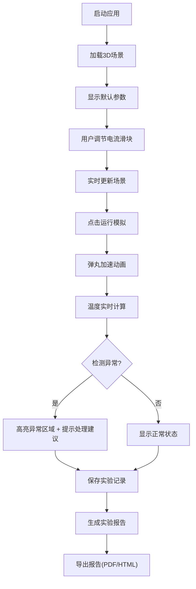

# 电磁轨道炮演示台 - 产品需求文档

## 1. 产品概述
电磁轨道炮3D交互式演示系统，为物理社团提供直观的电磁加速原理教学演示。通过实时调节线圈电流参数，可视化弹丸加速过程与热风险，辅助物理实验教学与研究。

- **主要目的**：提供沉浸式3D物理实验环境，直观展示电磁轨道炮工作原理
- **目标用户**：物理社团成员、学生、教师、科研演示人员
- **核心价值**：将抽象的电磁理论转化为可视化的3D交互体验，降低学习门槛

## 2. 核心功能

### 2.1 用户角色
| 角色 | 注册方式 | 核心权限 |
|------|----------|----------|
| 演示用户 | 无需注册 | 3D场景浏览、参数调节、实验运行、报告导出 |
| 管理员 | 本地配置 | 数据导入、系统设置、异常规则配置 |

### 2.2 功能模块
1. **3D演示台**：轨道炮模型展示、实时物理模拟、动画播放
2. **参数控制面板**：电流调节滑块、线圈参数、弹丸属性设置
3. **风险监控面板**：温度热图、异常高亮、风险预警
4. **实验历史中心**：记录管理、搜索筛选、对比分析
5. **报告生成器**：数据汇总、异常记录、一键导出
6. **对象管理器**：场景对象搜索、快速定位、异常导航

### 2.3 页面详情
| 页面名称 | 模块名称 | 功能描述 |
|---------|---------|----------|
| 主演示台 | 3D场景视图 | 轨道炮3D模型渲染、视角控制、动画播放暂停 |
| 主演示台 | 参数滑块区 | 线圈电流(0-10000A)、弹丸质量、加速级数调节 |
| 主演示台 | 实时数据面板 | 速度曲线、加速度、动能、效率实时显示 |
| 风险监控 | 温度热力图 | 轨道、线圈温度分布可视化，超温区域红色高亮 |
| 风险监控 | 异常预警栏 | 电流单位错误、弹丸穿模、温升漏算等异常提示 |
| 实验历史 | 记录列表 | 按日期/名称筛选，显示实验状态（正常/异常） |
| 实验历史 | 详情对比 | 多组实验数据对比，参数差异高亮 |
| 报告导出 | 报告预览 | 实验参数、结果、异常记录的完整报告 |
| 报告导出 | 格式选择 | 支持PDF/HTML/JSON导出 |
| 对象管理 | 搜索面板 | 按名称/类型搜索场景对象（线圈、弹丸、轨道等） |
| 对象管理 | 快速导航 | 一键定位并聚焦选中对象，异常对象优先显示 |

## 3. 核心流程

用户启动应用 → 进入3D演示台 → 调节电流等参数 → 运行模拟 → 观察弹丸加速与温度变化 → 系统检测异常并高亮提示 → 保存实验记录 → 生成包含异常记录的实验报告

数据导入流程：
选择导入文件 → 系统解析数据 → 检测同名对象/日期格式/附件延迟 → 显示冲突列表 → 用户选择处理方式（覆盖/重命名/等待）→ 完成导入

## 4. 用户界面设计

### 4.1 设计风格
- **主色调**：深空蓝 (#0a1628) 作为背景，科技蓝 (#00d4ff) 作为主色，警告橙 (#ff6b35) 作为风险提示，危险红 (#ff3366) 作为异常高亮
- **按钮风格**：圆角矩形，发光边框，悬停时有脉冲动画
- **字体**：标题使用 Orbitron（科技感字体），正文使用 JetBrains Mono（等宽易读）
- **布局风格**：暗黑科技风，玻璃拟态面板，网格化布局，科幻感HUD元素
- **图标风格**：线性SVG图标，发光效果，与科技主题统一

### 4.2 页面设计概述
| 页面名称 | 模块名称 | UI元素 |
|---------|---------|--------|
| 主演示台 | 3D场景视图 | 全屏Three.js渲染，轨道居中，镜头轨道控制，右键旋转/滚轮缩放 |
| 主演示台 | 参数滑块区 | 左侧垂直面板，滑块带刻度显示，数值实时更新，发光指示条 |
| 主演示台 | 实时数据面板 | 右下角浮动卡片，曲线图使用Chart.js，数字跳动动画 |
| 风险监控 | 温度热力图 | 3D模型表面纹理叠加，温度色阶条，超温区域闪烁 |
| 风险监控 | 异常预警栏 | 顶部横幅，不同级别不同颜色，可展开查看详情和处理建议 |
| 实验历史 | 记录列表 | 时间线布局，卡片式设计，异常记录带红色角标 |
| 报告导出 | 报告预览 | 模拟打印布局，页码导航，异常区域突出显示 |
| 对象管理 | 搜索面板 | 右上角弹出层，实时搜索，结果分类显示，点击跳转 |

### 4.3 响应式
- 桌面端优先（1920×1080），保证3D渲染区域最大化
- 平板端自适应，面板可折叠
- 移动端简化功能，保留核心演示
- 触摸操作优化：双指缩放、单指旋转

### 4.4 3D场景指导
- **环境**：深色实验室环境，地面网格，柔和环境光，聚焦于轨道炮主体
- **光照设置**：主光源+补光，金属材质高光，线圈通电时有蓝色辉光效果
- **相机设置**：默认透视相机，初始视角45度俯角，支持第一人称/第三人称切换
- **交互动画**：弹丸加速有拖尾效果，电流增大时线圈发光强度增加，温度升高时颜色从蓝变红
- **后处理**：轻微泛光效果，屏幕空间反射，提升科技感
- **性能**：模型面数控制在5万以内，60fps目标帧率
