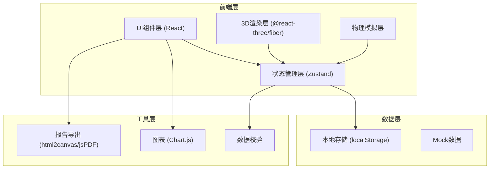
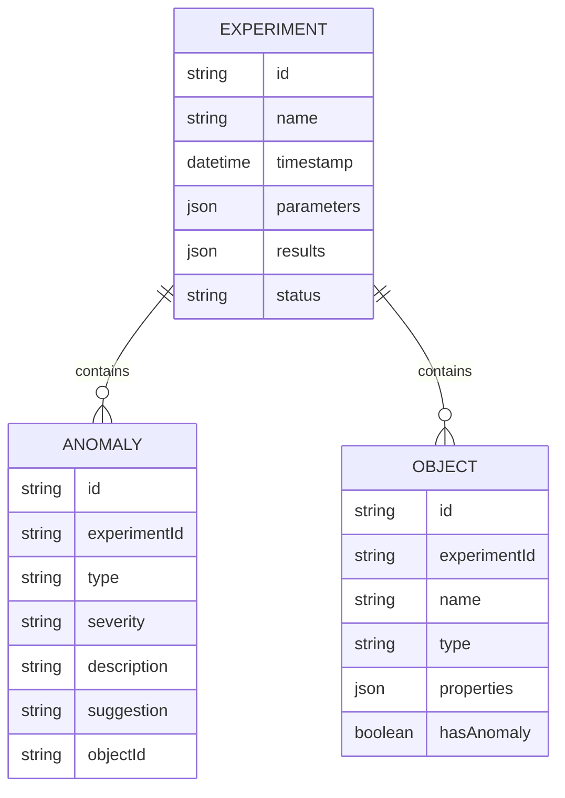

# 电磁轨道炮演示台 - 技术架构文档

## 1. 架构设计



## 2. 技术描述

- **前端框架**：React@18 + TypeScript
- **构建工具**：Vite@5
- **样式方案**：TailwindCSS@3
- **3D渲染**：Three.js + @react-three/fiber + @react-three/drei + @react-three/postprocessing
- **状态管理**：Zustand
- **图表**：Chart.js + react-chartjs-2
- **报告导出**：html2canvas + jsPDF
- **数据校验**：自定义校验器
- **本地存储**：localStorage

## 3. 路由定义

| 路由 | 页面 | 目的 |
|------|------|------|
| / | 主演示台 | 3D场景 + 参数控制 + 实时数据 |
| /history | 实验历史 | 历史记录列表 + 详情对比 |
| /report/:id | 报告预览 | 单份实验报告预览 + 导出 |

## 4. 数据模型

### 4.1 数据模型定义



### 4.2 TypeScript 类型定义

```typescript
// 实验参数
interface ExperimentParams {
  coilCurrent: number;      // 线圈电流 (A)
  coilTurns: number;        // 线圈匝数
  projectileMass: number;   // 弹丸质量 (kg)
  projectileRadius: number; // 弹丸半径 (m)
  trackLength: number;      // 轨道长度 (m)
  stageCount: number;       // 加速级数
}

// 实验结果
interface ExperimentResult {
  finalVelocity: number;    // 最终速度 (m/s)
  maxAcceleration: number;  // 最大加速度 (m/s²)
  kineticEnergy: number;    // 动能 (J)
  maxTemperature: number;   // 最高温度 (°C)
  efficiency: number;       // 效率 (%)
  duration: number;         // 加速时间 (ms)
}

// 异常记录
interface Anomaly {
  id: string;
  type: 'current_unit' | 'collision' | 'temp_missing' | 'duplicate_name' | 'date_format' | 'attachment_delay';
  severity: 'info' | 'warning' | 'error';
  description: string;
  suggestion: string;
  objectId?: string;
  resolved: boolean;
}

// 场景对象
interface SceneObject {
  id: string;
  name: string;
  type: 'coil' | 'projectile' | 'track' | 'sensor';
  position: [number, number, number];
  properties: Record<string, any>;
  hasAnomaly: boolean;
}

// 实验记录
interface Experiment {
  id: string;
  name: string;
  timestamp: Date;
  params: ExperimentParams;
  result: ExperimentResult;
  anomalies: Anomaly[];
  objects: SceneObject[];
  status: 'draft' | 'running' | 'completed' | 'error';
}
```

## 5. 核心模块结构

```
src/
├── components/
│   ├── ThreeScene/        # 3D场景组件
│   │   ├── Track.tsx      # 轨道模型
│   │   ├── Coil.tsx       # 线圈模型
│   │   ├── Projectile.tsx # 弹丸模型
│   │   └── index.tsx      # 场景入口
│   ├── ControlPanel/      # 参数控制面板
│   │   ├── Slider.tsx     # 滑块组件
│   │   └── index.tsx
│   ├── RiskMonitor/       # 风险监控
│   │   ├── HeatMap.tsx    # 热力图
│   │   └── AlertBar.tsx   # 异常提示栏
│   ├── DataPanel/         # 实时数据面板
│   │   ├── VelocityChart.tsx
│   │   └── index.tsx
│   ├── ObjectSearch/      # 对象搜索
│   │   └── SearchPanel.tsx
│   ├── History/           # 实验历史
│   │   ├── RecordList.tsx
│   │   └── CompareView.tsx
│   └── Report/            # 报告导出
│       ├── Preview.tsx
│       └── ExportButton.tsx
├── store/                 # 状态管理
│   ├── useExperimentStore.ts
│   └── useSceneStore.ts
├── physics/               # 物理模拟
│   ├── simulation.ts      # 电磁模拟
│   └── heat.ts            # 热计算
├── utils/                 # 工具函数
│   ├── validator.ts       # 数据校验
│   ├── export.ts          # 导出工具
│   └── anomaly.ts         # 异常检测
├── types/                 # 类型定义
│   └── index.ts
├── pages/                 # 页面
│   ├── Main.tsx
│   ├── History.tsx
│   └── Report.tsx
└── App.tsx
```

## 6. 异常检测规则

| 异常类型 | 检测条件 | 处理建议 |
|---------|---------|---------|
| 电流单位错误 | 电流值 < 10 或 > 100000 | 提示检查单位，建议退回重新输入 |
| 弹丸穿模 | 弹丸位置与轨道碰撞检测失败 | 建议调整弹丸尺寸，可人工确认 |
| 温升漏算 | 模拟结束后温度数据缺失 | 提示补充温度传感器数据，建议补材料 |
| 同名对象 | 导入时检测到重复名称 | 提供重命名/覆盖选项 |
| 日期格式 | 日期解析失败或格式不统一 | 自动标准化格式，记录警告 |
| 附件延迟 | 附件上传时间比主表晚 > 12小时 | 提示数据可能不完整，可等待或继续 |
