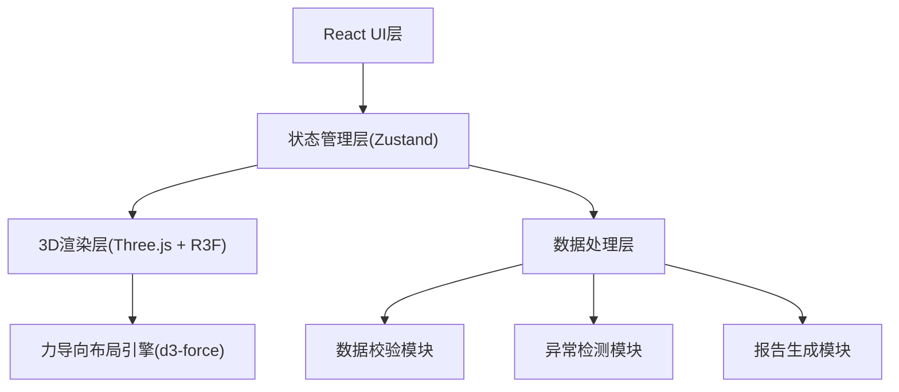
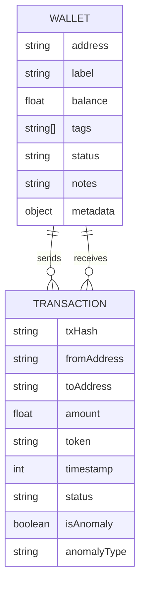

## 1. 架构设计



## 2. 技术描述

- **前端框架**: React@18 + TypeScript
- **构建工具**: Vite
- **样式方案**: TailwindCSS@3 + CSS Modules
- **3D引擎**: three@0.160 + @react-three/fiber + @react-three/drei
- **后处理**: @react-three/postprocessing
- **状态管理**: zustand@4
- **力导向布局**: d3-force
- **图表**: recharts@2
- **数据模拟**: Mock数据内置，无需后端
- **文件导出**: jspdf + papaparse

## 3. 路由定义

| 路由 | 用途 |
|------|------|
| / | 主工作台（唯一页面） |

## 4. 数据模型

### 4.1 数据模型定义



### 4.2 类型定义

```typescript
// 钱包地址
interface Wallet {
  id: string;
  address: string;
  label: string;
  balance: number;
  tokens: TokenBalance[];
  tags: string[];
  status: 'normal' | 'warning' | 'anomaly' | 'pending' | 'rejected';
  notes: string;
  firstSeen: number;
  lastActive: number;
  metadata: Record<string, any>;
}

// 交易记录
interface Transaction {
  id: string;
  txHash: string;
  from: string;
  to: string;
  amount: number;
  token: string;
  timestamp: number;
  status: 'confirmed' | 'pending' | 'failed';
  isAnomaly: boolean;
  anomalyType?: 'merge_error' | 'time_mismatch' | 'cycle_transfer' | 'suspicious';
  notes?: string;
  workflowStatus?: 'draft' | 'submitted' | 'returned' | 'approved';
}

// 3D节点
interface Node3D {
  id: string;
  x: number;
  y: number;
  z: number;
  vx: number;
  vy: number;
  vz: number;
  wallet: Wallet;
  isSelected: boolean;
  isHighlighted: boolean;
}

// 3D连线
interface Edge3D {
  id: string;
  source: string;
  target: string;
  transaction: Transaction;
  isHighlighted: boolean;
  isAnomaly: boolean;
}

// 应用状态
interface AppState {
  wallets: Wallet[];
  transactions: Transaction[];
  selectedWallet: string | null;
  highlightedPath: string[];
  timeRange: [number, number];
  filterOptions: FilterOptions;
  forceParams: ForceParams;
  isPlaying: boolean;
  playSpeed: number;
}
```

## 5. 核心模块结构

```
src/
├── components/
│   ├── ThreeDScene/          # 3D场景组件
│   │   ├── NetworkGraph.tsx  # 网络图谱
│   │   ├── WalletNode.tsx    # 钱包节点
│   │   ├── TransactionEdge.tsx # 交易连线
│   │   └── StarsBackground.tsx # 星空背景
│   ├── SidePanel/            # 侧边面板
│   │   ├── WalletDetail.tsx  # 钱包详情
│   │   ├── TagEditor.tsx     # 标签编辑器
│   │   └── WorkflowStatus.tsx # 工作流状态
│   ├── ControlPanel/         # 控制面板
│   │   ├── ForceParams.tsx   # 力导向参数
│   │   ├── FilterOptions.tsx # 筛选选项
│   │   └── TimelinePlayer.tsx # 时间轴播放器
│   └── ExportModal/          # 导出模态框
├── store/
│   └── useAppStore.ts        # 全局状态
├── hooks/
│   ├── useForceSimulation.ts # 力导向模拟
│   ├── useAnomalyDetection.ts # 异常检测
│   └── useDataSync.ts        # 数据同步
├── utils/
│   ├── mockData.ts           # 模拟数据
│   ├── exportReport.ts       # 报告导出
│   └── validators.ts         # 数据校验
└── types/
    └── index.ts              # 类型定义
```
