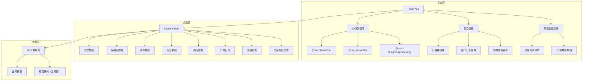
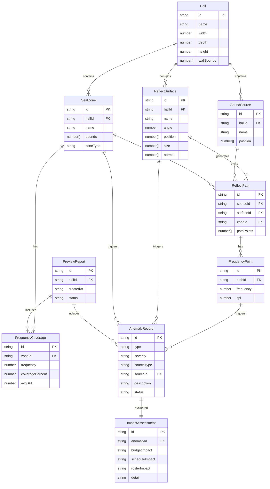

## 1. 架构设计



## 2. 技术选型

- **前端框架**：React@18 + TypeScript
- **构建工具**：Vite
- **样式方案**：Tailwind CSS@3
- **状态管理**：Zustand
- **3D渲染**：Three.js + @react-three/fiber + @react-three/drei + @react-three/postprocessing
- **路由**：react-router-dom@6
- **图标**：lucide-react
- **后端**：无（纯前端，Mock数据）
- **数据持久化**：内存 + localStorage

## 3. 路由定义

| 路由 | 用途 |
|------|------|
| `/` | 3D厅堂总览页（默认首页） |
| `/report` | 预演报告页 |
| `/compare` | 方案对比页 |

## 4. 数据模型

### 4.1 核心数据模型定义



### 4.2 数据结构 TypeScript 定义

```typescript
interface Hall {
  id: string;
  name: string;
  width: number;
  depth: number;
  height: number;
  wallBounds: [number, number, number, number, number, number];
}

interface ReflectSurface {
  id: string;
  hallId: string;
  name: string;
  angle: number;
  position: [number, number, number];
  size: [number, number];
  normal: [number, number, number];
}

interface SoundSource {
  id: string;
  hallId: string;
  name: string;
  position: [number, number, number];
}

interface SeatZone {
  id: string;
  hallId: string;
  name: string;
  bounds: { min: [number, number, number]; max: [number, number, number] };
  zoneType: 'orchestra' | 'mezzanine' | 'balcony' | 'vip';
}

interface ReflectPath {
  id: string;
  sourceId: string;
  surfaceId: string;
  zoneId: string;
  pathPoints: [number, number, number][];
}

interface FrequencyPoint {
  id: string;
  pathId: string;
  frequency: number;
  spl: number;
}

interface FrequencyCoverage {
  id: string;
  zoneId: string;
  frequency: number;
  coveragePercent: number;
  avgSPL: number;
}

type AnomalyType = 'SURFACE_THROUGH_WALL' | 'ZONE_MAPPING_ERROR' | 'FREQUENCY_MISSING';
type AnomalySeverity = 'critical' | 'warning' | 'info';
type AnomalyStatus = 'pending' | 'confirmed' | 'dismissed';

interface AnomalyRecord {
  id: string;
  type: AnomalyType;
  severity: AnomalySeverity;
  sourceType: 'ReflectSurface' | 'SeatZone' | 'FrequencyPoint';
  sourceId: string;
  description: string;
  status: AnomalyStatus;
  traceChain: TraceLink[];
}

interface TraceLink {
  entity: string;
  id: string;
  label: string;
}

interface ImpactAssessment {
  id: string;
  anomalyId: string;
  budgetImpact: 'none' | 'low' | 'medium' | 'high';
  scheduleImpact: 'none' | 'low' | 'medium' | 'high';
  rosterImpact: 'none' | 'low' | 'medium' | 'high';
  detail: string;
}

interface PreviewReport {
  id: string;
  hallId: string;
  createdAt: string;
  status: 'draft' | 'final';
  anomalyIds: string[];
  coverageIds: string[];
}

interface Scheme {
  id: string;
  name: string;
  surfaces: ReflectSurface[];
  sourcePosition: [number, number, number];
}
```

## 5. 异常检测规则

| 异常类型 | 检测逻辑 | 3D表现 |
|----------|----------|--------|
| 反射面穿墙 | 反射面顶点坐标超出hall.wallBounds | 反射面红色轮廓闪烁，穿墙部分用虚线标注 |
| 座区映射错 | zoneId引用不存在的座区ID | 座区黄色警告边框，缺失区域用问号标注 |
| 频率缺失 | 座区在某频段无FrequencyPoint记录 | 座区热力图该频段灰色，频率表该行红色标记 |

## 6. 追溯链结构

每条异常记录携带完整追溯链，从最顶层到最底层：

```
厅堂(Hall) → 反射面(ReflectSurface) / 座区(SeatZone) / 频率点(FrequencyPoint)
  → 反射路径(ReflectPath) → 声源(SoundSource)
  → 预演报告(PreviewReport) → 异常记录(AnomalyRecord) → 影响评估(ImpactAssessment)
```

在信息面板中，追溯链以面包屑形式展示，每级可点击跳转到对应的3D对象或数据视图。

## 7. 文件结构规划

```
src/
  components/
    scene/               # 3D场景组件
      HallModel.tsx       # 厅堂3D模型
      ReflectSurface3D.tsx # 反射面3D对象
      SoundSource3D.tsx   # 声源3D对象
      SeatZone3D.tsx      # 座区3D对象+热力图
      ReflectPathLine.tsx # 反射路径线
      AnomalyHighlight.tsx # 异常高亮效果
      SceneController.tsx # 相机控制+聚焦
    panel/               # 信息面板组件
      TraceBreadcrumb.tsx  # 追溯链面包屑
      FrequencyTable.tsx   # 频率分析表
      ImpactBadge.tsx      # 影响评估徽章
      AnomalyCard.tsx      # 异常条目卡片
      AnomalyBar.tsx       # 底部异常条栏
    report/              # 预演报告组件
      ReportView.tsx
      AnomalyTimeline.tsx
    compare/             # 方案对比组件
      CompareView.tsx
      DualScene.tsx
      ScreenshotExport.tsx
  hooks/
    useAnomalyDetect.ts   # 异常检测hook
    useTraceChain.ts      # 追溯链构建hook
    useCameraFocus.ts     # 相机聚焦hook
    useScreenshot.ts      # 截图导出hook
  store/
    useHallStore.ts       # Zustand主store
  data/
    mockNormal.ts         # 正常样例数据
    mockErrorProne.ts     # 易错样例数据（含异常）
  pages/
    HallOverview.tsx      # 3D厅堂总览页
    ReportPage.tsx        # 预演报告页
    ComparePage.tsx       # 方案对比页
  utils/
    reflectCalc.ts        # 反射路径计算
    anomalyDetect.ts      # 异常检测算法
    heatmap.ts            # 热力图颜色映射
```
