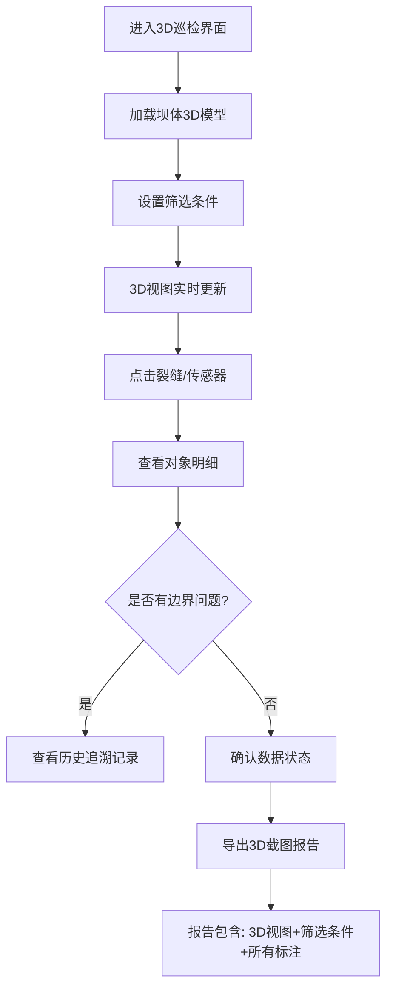

## 1. 产品概述
水坝3D巡检可视化工具是专为土木团队设计的专业级3D可视化平台，将裂缝点、渗压数据、应力监测结果整合在同一坝体3D模型上，实现多维度数据的联动展示与分析。

- 核心目标：解决水坝巡检数据分散、边界情况难以追踪、历史数据易丢失等问题
- 目标用户：土木巡检团队、水坝维护工程师、安全评估人员

## 2. 核心功能

### 2.1 用户角色
| 角色 | 登录方式 | 核心权限 |
|------|----------|----------|
| 巡检工程师 | 系统账号登录 | 3D视图操作、数据筛选、对象查看、截图导出、历史追溯 |
| 管理员 | 管理员账号 | 数据管理、用户管理、系统配置 |

### 2.2 功能模块
1. **3D视图主界面**：坝体3D模型渲染、裂缝标注、传感器点位、应力云图
2. **数据筛选面板**：时间范围、数据类型、异常等级、传感器状态筛选
3. **对象明细面板**：裂缝详情、传感器数据、应力分析、巡检照片
4. **历史追溯模块**：边界情况记录、人工确认标记、数据变更历史
5. **导出报告模块**：3D截图导出、筛选条件留存、标注说明、自动报告生成

### 2.3 页面详情
| 页面名称 | 模块名称 | 功能描述 |
|---------|----------|----------|
| 3D巡检主界面 | 3D视图区 | Three.js坝体模型渲染、可旋转缩放、裂缝/传感器/应力叠加显示 |
| 3D巡检主界面 | 左侧筛选面板 | 多维度筛选条件（时间、类型、状态、等级），筛选结果实时联动3D视图 |
| 3D巡检主界面 | 右侧明细面板 | 点击对象显示详情：裂缝属性、传感器读数、应力值、巡检照片 |
| 3D巡检主界面 | 顶部工具栏 | 视图切换、图层控制、截图按钮、报告导出、历史记录入口 |
| 历史追溯页 | 变更历史列表 | 坐标系修正记录、传感器断点修复、裂缝去重处理、人工确认标记 |
| 历史追溯页 | 对比视图 | 前后数据对比、处理前后3D视图对比 |
| 报告导出页 | 导出配置 | 选择导出内容、设置图片分辨率、添加说明文字 |

## 3. 核心流程
用户进入3D巡检主界面，通过左侧筛选面板选择时间范围和数据类型，3D视图实时更新显示对应数据。点击3D模型上的裂缝或传感器，右侧面板显示详细信息。发现异常数据可查看历史处理记录。确认当前数据后，点击导出按钮，系统自动将3D视图、当前筛选条件、所有标注打包生成可分享的报告截图。

## 4. 用户界面设计

### 4.1 设计风格
- **主色调**: 工业蓝 (#165DFF) - 代表专业、可靠、工程属性
- **辅助色**: 警示红 (#F53F3F) - 异常等级标识；预警橙 (#FF7D00) - 警告状态；正常绿 (#00B42A) - 正常状态
- **中性色**: 深灰背景 (#1D2129) - 3D视图深色背景；浅灰文字 (#C9CDD4) - 保证可读性
- **按钮风格**: 直角微圆角 (4px)，工业感边框，hover时轻微发光
- **字体**: JetBrains Mono (数字显示) + PingFang SC (中文) - 工程数据可读性优先
- **布局风格**: 三栏式专业工具布局，左侧筛选、中间3D、右侧详情，固定工具栏
- **图标风格**: 线性工业风图标，粗细一致 (2px)

### 4.2 页面设计概述
| 页面名称 | 模块名称 | UI元素 |
|---------|----------|--------|
| 3D巡检主界面 | 3D视图区 | 深色背景、坝体模型灰色金属质感、裂缝红色发光线条、传感器彩色圆点、应力云图半透明渐变 |
| 3D巡检主界面 | 左侧筛选面板 | 深色面板、分组折叠、下拉选择器、滑块范围、状态标签 |
| 3D巡检主界面 | 右侧明细面板 | 卡片式布局、数据表格、图片缩略图、历史时间轴 |
| 3D巡检主界面 | 顶部工具栏 | 图标按钮组、分割线、下拉菜单、导出按钮突出显示 |
| 历史追溯页 | 变更历史 | 时间轴布局、变更类型标签、处理前后对比、人工确认印章 |

### 4.3 响应式
- Desktop-first设计，主界面为宽屏优化 (≥1440px)
- 平板端：左右面板可折叠收起
- 移动端：简化为单栏布局，优先保证3D视图显示

### 4.4 3D场景指导
- **环境**: 深色工业风背景，微弱环境光 + 主方向光，突出模型轮廓
- **光照设置**: 主光45度角，冷色调；补光柔和，暖色调；边缘光勾勒坝体轮廓
- **相机设置**: 轨道控制器，默认透视相机，可切换正交视图
- **交互动画**: 点击对象时轻微放大+发光效果；筛选变化时平滑过渡；异常数据脉动动画
- **后处理**: 泛光效果 (Bloom) 用于高亮异常点；轻微抗锯齿
- **性能**: 坝体模型面数控制在5万面以内，使用实例化渲染大量传感器
