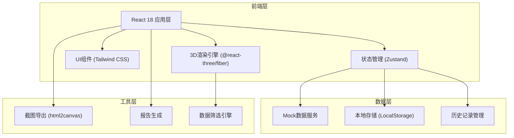
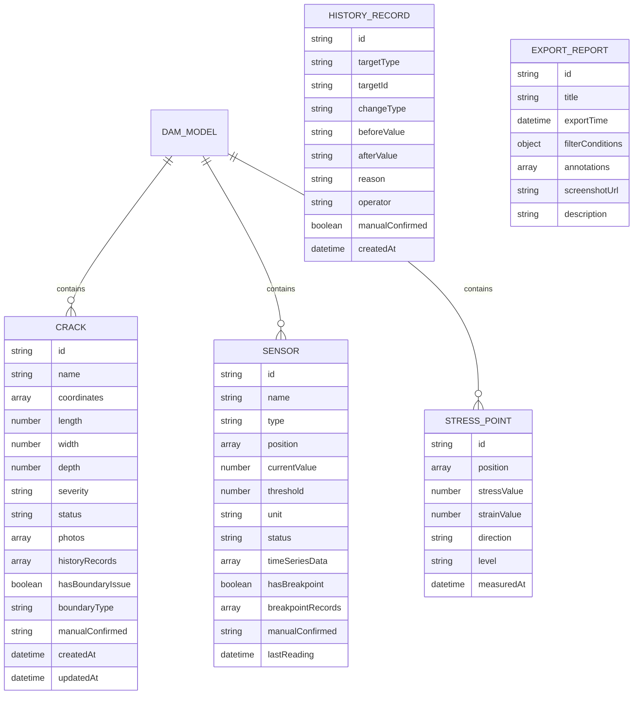

## 1. 架构设计



## 2. 技术描述
- **前端框架**: React@18 + TypeScript + Vite@5
- **3D引擎**: three@0.160 + @react-three/fiber@8 + @react-three/drei@9 + @react-three/postprocessing@2
- **状态管理**: Zustand@4 (轻量级，适合3D应用的高频状态更新)
- **样式方案**: Tailwind CSS@3 + SCSS
- **UI组件**: 自研工业风组件库
- **截图导出**: html2canvas@1 + 自定义Three.js渲染器截图
- **图标**: Lucide React (线性工业风图标)
- **后端**: 无后端，使用Mock数据 + LocalStorage持久化

## 3. 路由定义
| 路由 | 用途 |
|------|------|
| / | 3D巡检主界面 |
| /history | 历史追溯页面 |
| /export | 报告导出配置页 |

## 4. 数据模型

### 4.1 数据模型定义



### 4.2 Mock数据结构说明

**裂缝数据边界情况：**
- 正常裂缝：坐标正确、属性完整
- 坐标系错误裂缝：坐标偏移、带有boundaryType标记
- 重复裂缝：相同位置多条记录、historyRecords包含去重处理记录
- 已人工确认：manualConfirmed字段标记确认人和时间

**传感器数据边界情况：**
- 正常传感器：连续读数、状态正常
- 断点传感器：hasBreakpoint=true、timeSeriesData有缺失段
- 坐标偏移：position与实际位置不符、带有修正记录

## 5. 核心模块设计

### 5.1 3D场景模块
- DamModel: 坝体几何体生成 + 材质
- CrackRenderer: 裂缝线条渲染、发光效果
- SensorPoints: 传感器实例化渲染、状态颜色映射
- StressCloud: 应力云图着色器材质
- SelectionHelper: 点击选择、高亮效果

### 5.2 状态管理模块
```typescript
interface AppState {
  // 筛选条件
  filters: {
    timeRange: [Date, Date]
    dataTypes: ('crack' | 'sensor' | 'stress')[]
    severityLevel: string[]
    sensorStatus: string[]
    showBoundaryIssues: boolean
  }
  // 选中对象
  selectedObject: { type: string; id: string } | null
  // 视图状态
  viewMode: 'perspective' | 'orthographic'
  visibleLayers: { dam: boolean; cracks: boolean; sensors: boolean; stress: boolean }
  // 数据
  cracks: Crack[]
  sensors: Sensor[]
  stressPoints: StressPoint[]
  historyRecords: HistoryRecord[]
  // 操作
  setFilters: (filters: Partial<AppState['filters']>) => void
  selectObject: (obj: { type: string; id: string } | null) => void
  toggleLayer: (layer: keyof AppState['visibleLayers']) => void
}
```

### 5.3 导出模块
- ScreenshotExporter: 捕获Three.js canvas + DOM元素合成
- ReportGenerator: 生成包含筛选条件、标注、说明的完整报告
- WatermarkOverlay: 在导出图片上添加时间戳和筛选条件水印

## 6. 关键技术点
1. **Three.js性能优化**: 实例化渲染(InstancedMesh)大量传感器点、LOD层级
2. **筛选联动机制**: Zustand订阅筛选条件变化，自动更新3D场景可见性
3. **历史记录追踪**: 每条边界数据都有完整的变更链，不可自动覆盖人工确认标记
4. **截图合成技术**: 组合WebGL渲染结果和DOM标注，保证导出内容完整
5. **着色器应力云图**: 使用自定义ShaderMaterial实现应力值的颜色映射
