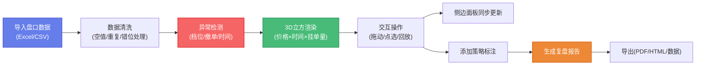

## 1. 产品概述

期货盘口深度立方是面向量化交易员的3D盘口复盘工具，通过三维可视化（价格-时间-挂单量）直观展示盘口坍塌、流动性变化等关键市场行为，解决传统2D盘口难以发现的时间维度异常问题。

- **核心用户**：量化交易员、盘手、风控人员
- **解决问题**：传统盘口复盘无法同时观测价格、时间、挂单量三者联动关系；脏数据（空值、重复、错位）导致分析偏差；异常交易行为难以定位
- **产品价值**：通过3D深度立方立体呈现盘口演化，内置异常检测算法自动标记可疑行为，支持策略标注和复盘报告导出，提升盘后分析效率300%

## 2. 核心功能

### 2.1 用户角色

| 角色 | 使用场景 | 核心需求 |
|------|----------|----------|
| 量化交易员 | 策略复盘、异常排查 | 3D交互、时间回放、异常高亮、策略标注 |
| 风控人员 | 异常交易审计 | 异常检测、报告导出、数据溯源 |
| 盘手 | 盘感训练、行为分析 | 多维度切换、档位对比、数据导入 |

### 2.2 功能模块

1. **3D深度立方主视图**：价格（X轴）、时间（Y轴）、挂单量（Z轴）三维立方体，买/卖盘分层着色，异常点高亮闪烁
2. **时间回放控制**：时间轴拖拽、播放/暂停、倍速控制、关键帧跳转
3. **档位切换系统**：买卖档位切换、深度档位筛选、价格档位错位检测
4. **异常检测引擎**：自动识别档位错位、撤单重复、时间粒度混乱三类核心异常
5. **交互选择系统**：3D对象点选、框选、拖拽旋转、缩放平移
6. **侧边信息面板**：选中对象详情、异常解释、档位数据、策略备注同步更新
7. **策略标注系统**：时间点标注、区域标注、策略备注、标签分类
8. **报告导出模块**：PDF/HTML复盘报告、截图导出、数据导出

### 2.3 页面详情

| 页面名称 | 模块名称 | 功能描述 |
|-----------|-------------|---------------------|
| 主工作台 | 3D深度立方场景 | Three.js渲染的三维盘口可视化，支持轨道控制、点选交互 |
| 主工作台 | 顶部工具栏 | 文件导入、视图切换、异常检测开关、导出按钮 |
| 主工作台 | 底部时间轴 | 时间滑动条、播放控制、关键帧标记、时间粒度选择 |
| 主工作台 | 左侧控制面板 | 档位筛选、买卖盘切换、颜色映射、显示选项 |
| 主工作台 | 右侧信息面板 | 选中对象详情、异常解释、档位数据表格、策略备注编辑 |
| 主工作台 | 策略标注面板 | 标注列表、新增标注、标签管理、搜索筛选 |
| 数据导入 | 数据解析器 | 支持Excel/CSV导入，自动处理合并单元格、临时列、重命名 |
| 报告预览 | 报告生成器 | 复盘报告预览、模板选择、导出格式选择 |

## 3. 核心流程

用户典型操作流程：
1. 导入包含盘口快照、成交记录的Excel文件（含合并单元格、临时列）
2. 系统自动清洗数据并检测异常，异常点在3D视图中红色闪烁
3. 用户拖拽旋转3D立方，观察价格-时间-挂单量的立体关系
4. 拖动时间轴回放，或点选特定立方体查看详细数据
5. 发现异常时，侧边面板自动显示异常类型、原因分析、影响评估
6. 用户添加策略标注，记录当时的决策逻辑和后续改进
7. 导出包含异常分析、策略标注的完整复盘报告

## 4. 用户界面设计

### 4.1 设计风格

**设计理念**：专业金融交易终端风格 × 科技感3D可视化 × 暗色主题护眼

- **主色调**：深空灰 `#0f1419` 背景，霓虹蓝 `#00d4ff` 买盘，霓虹红 `#ff4757` 卖盘，琥珀金 `#ffc107` 标注
- **辅助色**：异常红 `#ff3366`，正常绿 `#00ff88`，警告橙 `#ff9500`
- **字体**：
  - 数字显示：`JetBrains Mono`（等宽、专业、易读）
  - 正文标题：`Noto Sans SC`（中文清晰、现代感）
- **按钮风格**：扁平化微立体，hover时有辉光效果，按下有深度反馈
- **布局风格**：三面环绕式（左控制+中3D+右信息），底部时间轴贯穿全局
- **视觉特效**：3D立方半透明玻璃质感、异常点脉冲闪烁、选中对象外发光、面板毛玻璃背景

### 4.2 页面设计概述

| 页面名称 | 模块名称 | UI Elements |
|-----------|-------------|-------------|
| 主工作台 | 3D深度立方 | 半透明立方体网格、买卖盘渐变色、异常点红色脉冲、选中对象金色边框、轨道控制器、坐标轴标签 |
| 主工作台 | 顶部工具栏 | 毛玻璃背景、图标按钮组、下拉菜单、状态指示灯、导入按钮带文件拖拽区 |
| 主工作台 | 底部时间轴 | 深色轨道、进度条渐变填充、关键帧菱形标记、播放按钮环形动画、时间刻度文字 |
| 主工作台 | 左侧控制面板 | 可折叠面板、分组标题、滑块控件、开关按钮、颜色选择器、档位复选框 |
| 主工作台 | 右侧信息面板 | 分栏布局、数据表格斑马纹、异常卡片红色边框、备注输入框、同步更新动画 |
| 主工作台 | 策略标注 | 标签云、时间线布局、标注卡片hover效果、新增按钮浮动在右下角 |

### 4.3 响应性

- **桌面端**（1920×1080+）：完整三面环绕布局，3D区域占60%宽度
- **平板端**（1024-1920）：左右面板可收起为图标抽屉，3D区域自适应
- **移动端**（<1024）：单页滚动布局，3D区域全屏，面板改为底部弹窗
- **触摸优化**：支持双指缩放旋转，长按选中，滑动时间轴

### 4.4 3D场景指引

- **环境氛围**：深空黑背景 + 微弱网格地板 + 蓝色体积光，营造金融数据空间感
- **光照设置**：主光（冷白，45°角）+ 环境光（低强度）+ 点光源（随选中对象移动）
- **相机设置**：初始透视相机，位置(15, 15, 15)，看向原点，开启轨道控制（旋转、缩放、平移）
- **构图焦点**：深度立方居中，异常点通过大小/颜色/动画成为视觉焦点
- **交互动画**：
  - 时间切换：立方体面平滑过渡动画（300ms ease-out）
  - 选中对象：缩放1.1倍 + 金色外发光 + 标签弹出
  - 异常检测：红色脉冲动画（scale 1.0→1.2→1.0，opacity 0.5→1.0→0.5）
  - 拖拽旋转：惯性缓动效果
- **后处理效果**：Bloom辉光（异常和选中对象）、FXAA抗锯齿、轻微景深
- **性能预算**：单帧渲染<16ms（60fps），最大立方体数量≤2000个，超出时自动降采样

---

**文档版本**：v1.0  
**创建日期**：2026-05-30  
**最后更新**：2026-05-30
