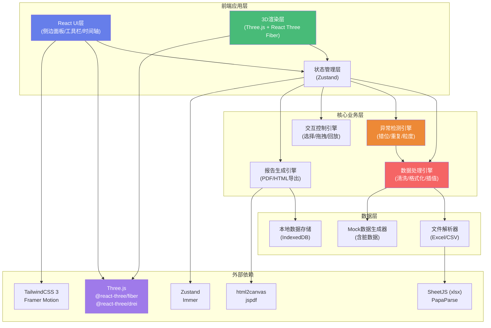
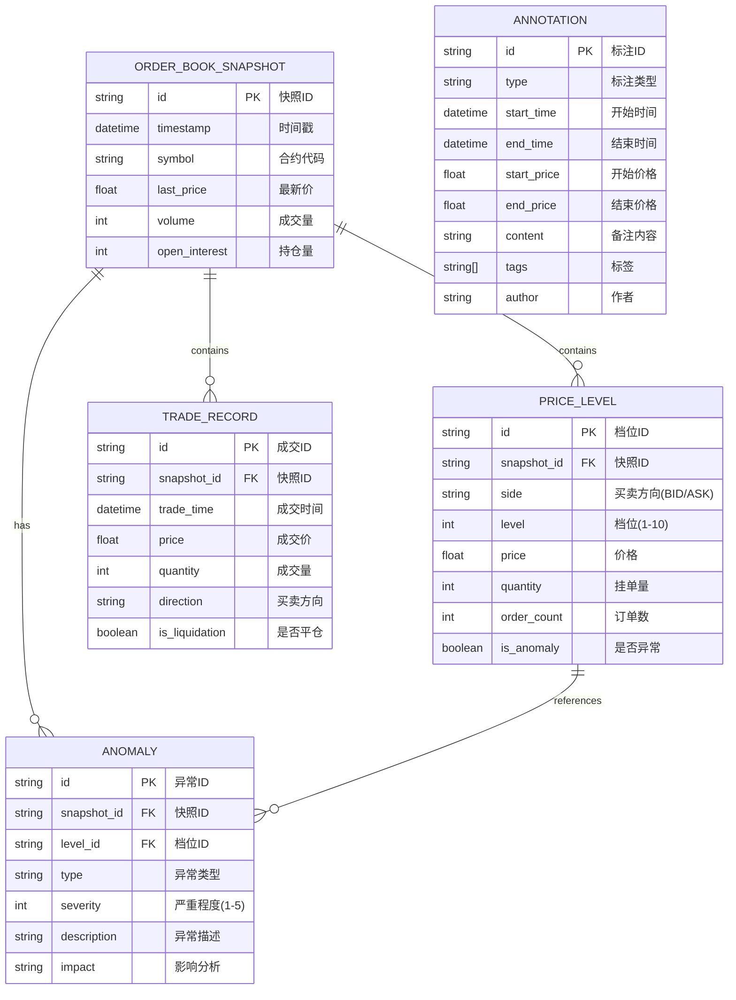

## 1. 架构设计



## 2. 技术描述

- **前端框架**：React@18.2 + TypeScript@5
- **构建工具**：Vite@5
- **3D引擎**：Three.js@0.160 + @react-three/fiber@8.15 + @react-three/drei@9.92 + @react-three/postprocessing@2.15
- **状态管理**：Zustand@4.4 + Immer@10
- **样式方案**：TailwindCSS@3.4 + Framer Motion@11
- **文件解析**：xlsx@0.18 (SheetJS) + papaparse@5.4
- **报告导出**：jspdf@2.5 + html2canvas@1.4
- **后端**：无（纯前端应用，数据本地处理）
- **数据库**：IndexedDB（本地缓存）

## 3. 核心目录结构

```
src/
├── components/
│   ├── layout/              # 布局组件
│   │   ├── TopToolbar.tsx   # 顶部工具栏
│   │   ├── LeftPanel.tsx    # 左侧控制面板
│   │   ├── RightPanel.tsx   # 右侧信息面板
│   │   └── Timeline.tsx     # 底部时间轴
│   ├── viewer3d/            # 3D视图组件
│   │   ├── DepthCube.tsx    # 深度立方主体
│   │   ├── CubeMesh.tsx     # 单个立方体网格
│   │   ├── Axes.tsx         # 坐标轴
│   │   └── GridFloor.tsx    # 网格地板
│   ├── panels/              # 面板组件
│   │   ├── InfoPanel.tsx    # 信息详情
│   │   ├── AnomalyCard.tsx  # 异常卡片
│   │   ├── AnnotationList.tsx # 标注列表
│   │   └── ReportPreview.tsx # 报告预览
│   └── ui/                  # 基础UI组件
├── store/                   # 状态管理
│   ├── useDataStore.ts      # 数据状态
│   ├── useUIStore.ts        # UI状态
│   └── useAnnotationStore.ts # 标注状态
├── engine/                  # 核心引擎
│   ├── dataProcessor.ts     # 数据处理引擎
│   ├── anomalyDetector.ts   # 异常检测引擎
│   └── reportGenerator.ts   # 报告生成引擎
├── types/                   # 类型定义
│   ├── data.ts              # 数据类型
│   ├── anomaly.ts           # 异常类型
│   └── annotation.ts        # 标注类型
├── utils/                   # 工具函数
│   ├── fileParser.ts        # 文件解析
│   ├── colorMapping.ts      # 颜色映射
│   └── mockData.ts          # Mock数据生成
├── hooks/                   # 自定义Hooks
│   ├── useCubeSelection.ts  # 立方体选择
│   ├── useTimelinePlayback.ts # 时间回放
│   └── useAnomalyHighlight.ts # 异常高亮
└── App.tsx                  # 应用入口
```

## 4. 数据模型

### 4.1 核心数据类型



### 4.2 关键数据结构

```typescript
// 盘口快照
interface OrderBookSnapshot {
  id: string;
  timestamp: number;
  symbol: string;
  lastPrice: number;
  volume: number;
  openInterest: number;
  bids: PriceLevel[];
  asks: PriceLevel[];
  trades: TradeRecord[];
}

// 价格档位
interface PriceLevel {
  id: string;
  side: 'bid' | 'ask';
  level: number;
  price: number;
  quantity: number;
  orderCount?: number;
  anomalies: Anomaly[];
}

// 异常类型
type AnomalyType = 
  | 'price_misalignment'    // 档位错位
  | 'duplicate_cancellation' // 撤单重复
  | 'time_grain_chaos'       // 时间粒度混乱
  | 'null_value'             // 空值
  | 'duplicate_entry'        // 重复项
  | 'boundary_extreme';      // 边界异常

// 异常检测结果
interface Anomaly {
  id: string;
  type: AnomalyType;
  severity: 1 | 2 | 3 | 4 | 5;
  description: string;
  impact: string;
  dataPoint: {
    timestamp?: number;
    price?: number;
    level?: number;
    value?: number;
    expected?: number;
  };
}

// 三维坐标点
interface Cube3D {
  id: string;
  x: number;      // 价格
  y: number;      // 时间索引
  z: number;      // 挂单量
  width: number;  // 价格档位宽度
  height: number; // 时间窗口高度
  depth: number;  // 挂单量深度
  color: string;
  opacity: number;
  isBid: boolean;
  timestamp: number;
  price: number;
  quantity: number;
  level: number;
  anomalies: Anomaly[];
  isSelected: boolean;
  isHighlighted: boolean;
}
```

## 5. 异常检测算法设计

### 5.1 档位错位检测 (price_misalignment)

**算法逻辑**：
1. 计算相邻档位的理论价差：`expectedGap = tickSize * 1`
2. 检测实际价差与理论价差的偏差：`actualGap = price[i+1] - price[i]`
3. 若 `|actualGap - expectedGap| > tickSize * 0.5` 则标记为错位
4. 检测档位跳空：若 `actualGap > tickSize * 2` 则标记为严重错位

**鲁棒性处理**：
- 跳过空值档位，不影响后续检测
- 处理重复价格（合并后再检测）
- 边界档位（买1卖1）放宽阈值至 `tickSize * 1.0`

### 5.2 撤单重复检测 (duplicate_cancellation)

**算法逻辑**：
1. 追踪同一价格档位的挂单量变化序列
2. 检测模式：`quantity(t) > 0 → quantity(t+1) = 0 → quantity(t+2) ≈ quantity(t)`
3. 计算撤单-重挂的时间间隔，若 `< 3 * tickInterval` 则标记为重复撤单
4. 统计短时间内（1s）同一档位的撤单次数，若 `> 5次` 标记为高频异常

**鲁棒性处理**：
- 允许挂单量±5%的误差（考虑部分成交）
- 排除大单拆分导致的正常波动
- 处理时间戳重复（取平均值）

### 5.3 时间粒度混乱检测 (time_grain_chaos)

**算法逻辑**：
1. 计算相邻快照的时间间隔序列 `intervals = t[i+1] - t[i]`
2. 检测间隔标准差：`std(intervals) > mean(intervals) * 0.5` 标记为混乱
3. 检测缺失快照：`interval > expectedInterval * 3` 标记为数据缺失
4. 检测时间倒流：`t[i+1] < t[i]` 标记为严重异常

**鲁棒性处理**：
- 自动识别基础时间粒度（取众数）
- 插值补全缺失数据（线性插值）
- 时间戳排序，忽略重复时间戳

### 5.4 脏数据处理

| 数据问题 | 处理策略 | 说明 |
|---------|---------|------|
| 空值 (NaN/null) | 标记+插值 | 标记为null_value异常，用前后值线性插值填充用于显示 |
| 重复项 | 去重+标记 | 保留最新一条，标记为duplicate_entry异常 |
| 边界值 | 标记+保留 | 超出3σ范围的极值标记为boundary_extreme，保留显示 |
| 合并单元格 | 展开填充 | 解析Excel时自动展开，值向下填充 |
| 临时列/重命名 | 模糊匹配 | 基于列名语义模糊匹配（如"买一价"/"Bid1"/"买1"） |
| 数据类型错误 | 强制转换 | 字符串转数字，失败标记并设为0 |

## 6. 3D渲染性能优化

### 6.1 实例化渲染 (InstancedMesh)
- 使用 `InstancedMesh` 批量渲染立方体，减少Draw Call
- 最大2000个立方体，超出时自动降采样（按时间/价格聚合）
- 动态LOD：远距离时合并相邻立方体

### 6.2 状态更新优化
- 仅更新变化的立方体矩阵，不重建整个场景
- 异常高亮使用 `onBeforeRender` 钩子动态更新颜色
- 选中效果使用后处理Bloom，不修改几何体

### 6.3 内存管理
- 离屏立方体不销毁，仅设置 `visible = false`
- 时间切换时复用几何体，仅更新位置/颜色
- 组件卸载时调用 `dispose()` 释放BufferGeometry和Material

## 7. 交互系统设计

### 7.1 3D交互
- **轨道控制**：鼠标左键旋转、滚轮缩放、右键平移
- **点选**：Raycaster检测，点击立方体触发选中事件
- **框选**：按住Shift+左键拖拽，框选多个立方体
- **悬浮提示**：鼠标悬停显示价格、时间、挂单量信息

### 7.2 同步机制
- 选中立方体 → 更新UI Store → 侧边面板订阅更新 → 渲染详情
- 时间轴拖动 → 更新当前时间索引 → 3D视图过滤显示 → 面板同步
- 档位筛选 → 更新可见性Mask → 3D视图显示/隐藏立方体

---

**文档版本**：v1.0  
**创建日期**：2026-05-30  
**最后更新**：2026-05-30
