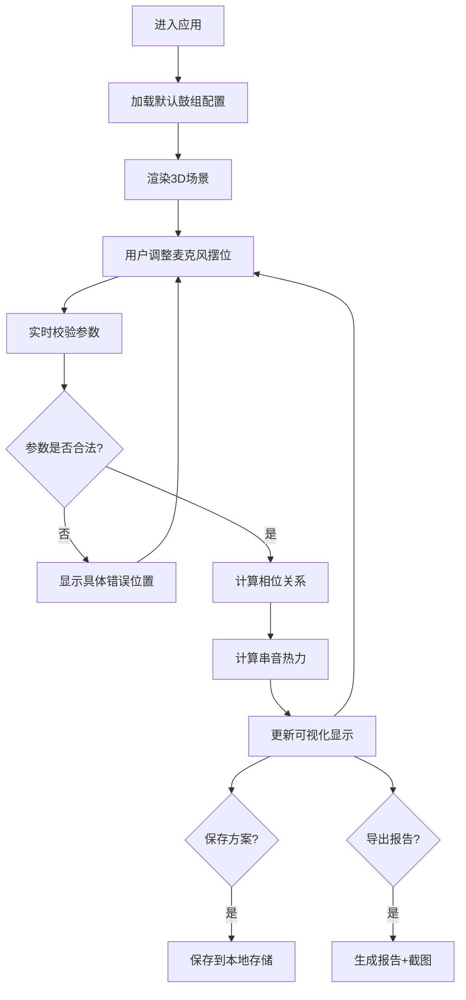

## 1. 产品概述

鼓组摆位拾音模拟器是一款面向录音师、音频工程师和鼓手的专业3D可视化工具，用于在录音棚环境中模拟和分析鼓组麦克风的摆位效果。通过直观的3D交互界面，用户可以实时调整麦克风位置、角度，观察距离、相位和串音对录音质量的影响，导出专业的拾音方案报告。

- **目标用户**：录音师、音频工程师、专业鼓手、音乐制作人
- **解决问题**：传统鼓组拾音依赖经验，无法直观预判相位抵消、麦克风遮挡、串音干扰等问题
- **产品价值**：将抽象的声学概念可视化，降低试错成本，提升拾音方案的可复现性和专业性

## 2. 核心功能

### 2.1 用户角色

| 角色 | 注册方式 | 核心权限 |
|------|----------|----------|
| 录音师 | 无需注册，本地使用 | 完整3D摆位、参数调整、方案保存、报告导出 |
| 鼓手 | 无需注册，本地使用 | 查看摆位方案、理解拾音意图 |

### 2.2 功能模块

1. **3D摆位主界面**：鼓组3D模型展示、麦克风拖拽交互、多视角切换
2. **参数控制面板**：距离调节、角度调节、极性模式选择、相位开关
3. **相位检测系统**：实时相位分析、反向警告、可视化相位关系线
4. **串音热力图**：麦克风间串音强度可视化、色彩编码热力显示
5. **方案管理**：保存当前摆位方案、加载历史方案、方案列表管理
6. **拾音报告**：生成完整拾音方案报告、导出PNG截图、导出PDF/文本报告
7. **异常校验系统**：数据格式校验、单位错误检测、遮挡检测、相位反向检测

### 2.3 页面详情

| 页面名称 | 模块名称 | 功能描述 |
|----------|----------|----------|
| 主界面 | 3D场景区 | 展示鼓组3D模型，支持旋转、缩放、平移，麦克风拖拽摆位 |
| 主界面 | 左侧控制面板 | 鼓件选择、麦克风添加/删除、参数精确输入 |
| 主界面 | 右侧信息面板 | 相位状态、串音热力数据、实时拾音参数统计 |
| 主界面 | 顶部工具栏 | 方案保存/加载、报告导出、视图重置、帮助 |
| 主界面 | 底部状态栏 | 校验结果提示、错误详情、操作指引 |

## 3. 核心流程

用户进入应用后，系统加载默认鼓组和麦克风配置。用户可通过拖拽调整麦克风位置，或在控制面板精确输入参数。系统实时计算相位关系和串音数据，并以可视化方式呈现。当出现相位反向、距离单位错误或麦克风遮挡时，在底部状态栏显示具体错误位置和修复建议。用户可保存当前方案，或导出包含截图和参数的完整拾音报告。

## 4. 用户界面设计

### 4.1 设计风格

**设计方向**：专业录音棚工业风，深色主题配合精准的声学可视化

- **主色调**：深灰蓝 `#0f172a`（背景），炭黑 `#1e293b`（面板）
- **强调色**：琥珀橙 `#f59e0b`（相位警告），翠绿 `#10b981`（正常状态），玫红 `#ef4444`（错误/相位反向），天蓝 `#3b82f6`（选中/激活）
- **中性色**：石板灰系列（`#64748b` `#94a3b8` `#cbd5e1`）
- **字体**：
  - 显示字体：`Space Grotesk` - 现代工业感，适合专业音频工具
  - 正文字体：`JetBrains Mono` - 等宽字体，数字和参数显示更专业
- **按钮风格**：微立体、圆角4px、悬停有轻微发光效果
- **图标风格**：线性图标（lucide-react），保持简洁专业

### 4.2 页面设计概述

| 页面名称 | 模块名称 | UI元素 |
|----------|----------|--------|
| 主界面 | 3D场景区 | 深色空间背景、网格地板、鼓组模型金属质感、麦克风发光指示、相位关系连接线、串音热力球 |
| 主界面 | 左侧控制面板 | 卡片式分组、滑杆调节器、数字输入框、下拉选择器、颜色标签状态指示 |
| 主界面 | 右侧信息面板 | 相位仪表盘、串音热力矩阵、参数统计卡片、警告列表 |
| 主界面 | 顶部工具栏 | 半透明玻璃态、图标按钮、下拉菜单 |
| 主界面 | 底部状态栏 | 错误高亮显示、步骤指示器、友好错误文案 |

### 4.3 响应式

- **桌面端优先**：1920×1080及以上分辨率为主要目标
- **面板自适应**：左右面板可折叠，3D场景区域自动伸缩
- **触控支持**：支持触屏设备的3D场景旋转缩放
- **最低分辨率**：1366×768，保证核心功能可用

### 4.4 3D场景指导

- **环境与氛围**：深色录音棚空间，柔和的环境光，避免分散注意力的反射
- **光照设置**：主光从上方45°照射鼓组，辅助光勾勒麦克风轮廓，每个麦克风有独立的点光源指示当前状态
- **相机设置**：默认透视相机，初始位置为鼓组正前方3米高2米处，支持轨道控制器（OrbitControls）
- **构图焦点**：鼓组为中心，麦克风通过颜色和发光效果突出显示
- **交互与动画**：
  - 麦克风选中时脉动发光
  - 拖拽时显示距离标尺
  - 相位变化时连接线颜色平滑过渡
  - 串音热力球大小和颜色实时更新
- **后处理效果**：轻微泛光（Bloom）让发光物体更有质感，细微颗粒噪点增加专业感
- **性能预算**：鼓组不超过2000个三角面，单场景保持60fps以上

