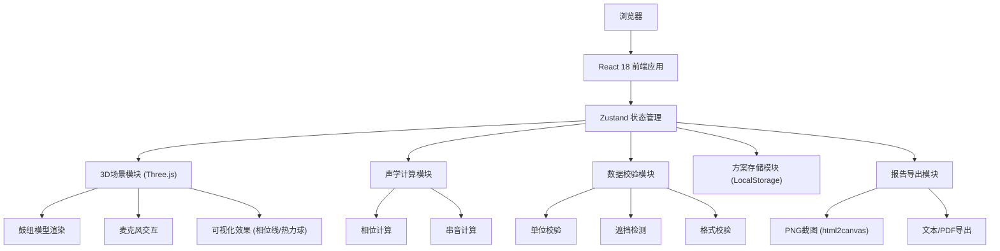
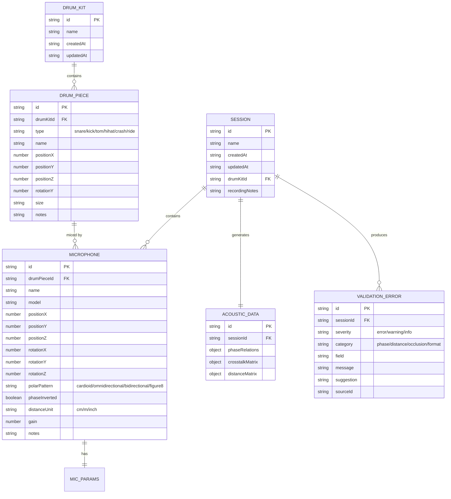

## 1. 架构设计



## 2. 技术描述

- **前端**：React@18 + TypeScript + Vite
- **3D引擎**：three@^0.160.0 + @react-three/fiber@^8.15.12 + @react-three/drei@^9.92.7
- **后处理**：@react-three/postprocessing@^2.15.11
- **状态管理**：zustand@^4.4.7
- **样式**：tailwindcss@^3.4.0
- **图标**：lucide-react@^0.294.0
- **截图**：html2canvas@^1.4.1
- **后端**：无（纯前端应用，数据存储在LocalStorage）
- **数据库**：LocalStorage（浏览器本地存储）

## 3. 路由定义

| 路由 | 用途 |
|------|------|
| / | 主界面 - 3D摆位、参数控制、可视化 |

## 4. 数据模型

### 4.1 数据模型定义



### 4.2 TypeScript 类型定义

```typescript
// 鼓件类型
export type DrumPieceType = 'snare' | 'kick' | 'tom1' | 'tom2' | 'floorTom' | 'hihat' | 'crash' | 'ride';

// 麦克风极性模式
export type PolarPattern = 'cardioid' | 'omnidirectional' | 'bidirectional' | 'figure8';

// 距离单位
export type DistanceUnit = 'cm' | 'm' | 'inch';

// 错误严重程度
export type Severity = 'error' | 'warning' | 'info';

// 错误分类
export type ErrorCategory = 'phase' | 'distance' | 'occlusion' | 'format' | 'unit';

export interface Position3D {
  x: number;
  y: number;
  z: number;
}

export interface Rotation3D {
  x: number;
  y: number;
  z: number;
}

export interface DrumPiece {
  id: string;
  type: DrumPieceType;
  name: string;
  position: Position3D;
  rotationY: number;
  size: string;
  notes?: string;
}

export interface Microphone {
  id: string;
  drumPieceId: string;
  name: string;
  model?: string;
  position: Position3D;
  rotation: Rotation3D;
  polarPattern: PolarPattern;
  phaseInverted: boolean;
  distanceUnit: DistanceUnit;
  gain: number;
  notes?: string;
}

export interface PhaseRelation {
  mic1Id: string;
  mic2Id: string;
  phaseDiff: number;
  isCoherent: boolean;
  correlation: number;
}

export interface CrosstalkData {
  sourceMicId: string;
  targetMicId: string;
  level: number;
  frequency: string;
}

export interface ValidationError {
  id: string;
  severity: Severity;
  category: ErrorCategory;
  field?: string;
  message: string;
  suggestion: string;
  sourceId?: string;
}

export interface Session {
  id: string;
  name: string;
  createdAt: string;
  updatedAt: string;
  drumPieces: DrumPiece[];
  microphones: Microphone[];
  recordingNotes?: string;
}

export interface AcousticAnalysis {
  phaseRelations: PhaseRelation[];
  crosstalkMatrix: CrosstalkData[];
  distanceMatrix: Record<string, number>;
  errors: ValidationError[];
}

export interface DrumKitStore {
  session: Session;
  selectedMicId: string | null;
  selectedDrumId: string | null;
  analysis: AcousticAnalysis;
  isLoading: boolean;
  showCrosstalk: boolean;
  showPhaseLines: boolean;
}
```

## 5. 模块结构

```
src/
├── components/
│   ├── three/
│   │   ├── DrumKit3D.tsx        # 鼓组3D模型
│   │   ├── DrumPiece3D.tsx      # 单个鼓件3D
│   │   ├── Microphone3D.tsx     # 麦克风3D模型
│   │   ├── PhaseLine3D.tsx      # 相位关系线
│   │   ├── CrosstalkSphere.tsx  # 串音热力球
│   │   └── Scene.tsx            # 3D场景容器
│   ├── controls/
│   │   ├── LeftPanel.tsx        # 左侧控制面板
│   │   ├── MicControl.tsx       # 麦克风参数控制
│   │   ├── DrumPieceControl.tsx # 鼓件参数控制
│   │   └── Slider.tsx           # 通用滑杆组件
│   ├── panels/
│   │   ├── RightPanel.tsx       # 右侧信息面板
│   │   ├── PhaseInfo.tsx        # 相位信息
│   │   ├── CrosstalkMatrix.tsx  # 串音矩阵
│   │   └── StatsCards.tsx       # 统计卡片
│   ├── toolbar/
│   │   ├── TopToolbar.tsx       # 顶部工具栏
│   │   └── SaveLoadMenu.tsx     # 保存加载菜单
│   └── statusbar/
│       ├── BottomStatusBar.tsx  # 底部状态栏
│       └── ErrorDisplay.tsx     # 错误显示组件
├── hooks/
│   ├── useAcousticAnalysis.ts   # 声学分析hook
│   ├── useValidation.ts         # 数据校验hook
│   ├── useDragControls.ts       # 拖拽控制hook
│   └── useSessionStorage.ts     # 方案存储hook
├── store/
│   └── useDrumKitStore.ts       # Zustand状态管理
├── utils/
│   ├── acousticMath.ts          # 声学计算工具
│   ├── validation.ts            # 校验工具
│   ├── unitConversion.ts        # 单位转换
│   ├── exportReport.ts          # 报告导出
│   └── constants.ts             # 常量定义
├── types/
│   └── index.ts                 # 类型定义
├── pages/
│   └── MainPage.tsx             # 主页面
├── App.tsx
├── main.tsx
└── index.css
```

## 6. 核心算法

### 6.1 相位计算

```typescript
// 计算两个麦克风之间的相位关系
function calculatePhaseRelation(mic1: Microphone, mic2: Microphone, speedOfSound: number = 343): PhaseRelation {
  const distance = getDistance(mic1.position, mic2.position);
  const timeDiff = distance / speedOfSound;
  const referenceFreq = 1000; // 1kHz参考频率
  const wavelength = speedOfSound / referenceFreq;
  const phaseDiff = (distance % wavelength) / wavelength * 360;
  
  // 考虑极性方向
  const directionFactor = calculateDirectionFactor(mic1, mic2);
  const adjustedPhaseDiff = phaseDiff * directionFactor;
  
  // 检查是否反向
  const totalPhaseDiff = Math.abs(adjustedPhaseDiff + (mic1.phaseInverted ? 180 : 0) - (mic2.phaseInverted ? 180 : 0));
  const isCoherent = totalPhaseDiff < 30 || totalPhaseDiff > 330;
  
  return {
    mic1Id: mic1.id,
    mic2Id: mic2.id,
    phaseDiff: adjustedPhaseDiff,
    isCoherent,
    correlation: isCoherent ? 0.9 : 0.3
  };
}
```

### 6.2 串音计算

```typescript
// 计算麦克风之间的串音
function calculateCrosstalk(sourceMic: Microphone, targetMic: Microphone, drumPiece: DrumPiece): CrosstalkData {
  const distanceToSource = getDistance(drumPiece.position, sourceMic.position);
  const distanceToTarget = getDistance(drumPiece.position, targetMic.position);
  
  // 距离衰减（反平方定律）
  const levelDiff = 20 * Math.log10(distanceToSource / distanceToTarget);
  
  // 极性模式影响
  const sourcePolarFactor = getPolarPatternGain(sourceMic.polarPattern, calculateAngle(sourceMic, drumPiece));
  const targetPolarFactor = getPolarPatternGain(targetMic.polarPattern, calculateAngle(targetMic, drumPiece));
  
  const crosstalkLevel = Math.max(-60, levelDiff + sourcePolarFactor - targetPolarFactor);
  
  return {
    sourceMicId: sourceMic.id,
    targetMicId: targetMic.id,
    level: crosstalkLevel,
    frequency: 'mid'
  };
}
```

### 6.3 遮挡检测

```typescript
// 检测麦克风与鼓件之间是否有遮挡
function detectOcclusion(mic: Microphone, drumPiece: DrumPiece, allPieces: DrumPiece[]): ValidationError | null {
  const lineStart = new Vector3(mic.position.x, mic.position.y, mic.position.z);
  const lineEnd = new Vector3(drumPiece.position.x, drumPiece.position.y, drumPiece.position.z);
  
  for (const piece of allPieces) {
    if (piece.id === drumPiece.id) continue;
    
    const piecePos = new Vector3(piece.position.x, piece.position.y, piece.position.z);
    const distance = distanceToLineSegment(piecePos, lineStart, lineEnd);
    
    // 如果其他鼓件在麦克风与目标鼓件的连线上且距离很近
    if (distance < 0.3) { // 30cm以内视为遮挡
      return {
        id: generateId(),
        severity: 'warning',
        category: 'occlusion',
        field: 'position',
        message: `麦克风「${mic.name}」与鼓件「${drumPiece.name}」之间被「${piece.name}」遮挡`,
        suggestion: `建议将麦克风向侧面移动至少30cm，或调整高度避开遮挡物`,
        sourceId: mic.id
      };
    }
  }
  return null;
}
```

