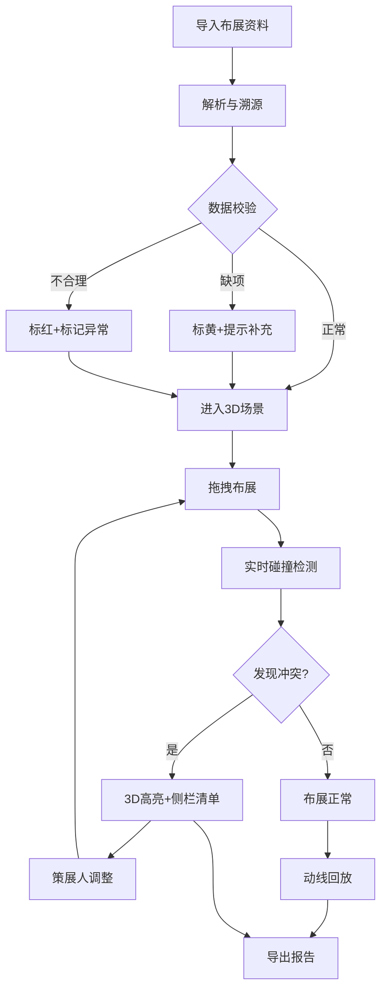

## 1. 产品概述

艺术展墙面动线图 — 面向策展人的 3D 布展规划工具。在三维展厅中同时呈现展墙模型、作品挂放、灯光布局、观众动线与安全距离，帮助策展人在布展前通过多视角查看、拖拽布展和自动碰撞检测，发现作品重叠、灯光遮挡与动线回流问题，并生成可溯源的布展报告。

- 目标用户：策展人、展览设计师、美术馆布展团队
- 核心价值：将分散在邮件、群消息和旧表格中的布展资料统一导入 3D 场景，实时检测空间冲突，避免现场翻车

## 2. 核心功能

### 2.1 用户角色

| 角色 | 注册方式 | 核心权限 |
|------|----------|----------|
| 策展人 | 无需注册（本地工具） | 导入数据、3D 布展、冲突检测、报告导出 |

### 2.2 功能模块

1. **3D 展厅页面**：三维场景展示、多视角切换、拖拽布展、碰撞高亮、动线回放
2. **数据导入页面**：展墙/作品/灯光/动线/安全距离/报告批量导入，出处溯源，异常标记
3. **冲突报告页面**：冲突清单（重叠/遮挡/回流）、受影响条目、处理顺序、视角截图导出

### 2.3 页面详情

| 页面名称 | 模块名称 | 功能描述 |
|----------|----------|----------|
| 3D 展厅页面 | 三维场景 | 展墙、地面、天花板渲染，OrbitControls 自由视角，视角切换后标注与明细保持对齐 |
| 3D 展厅页面 | 作品挂放 | 拖拽作品至墙面，自动吸附，尺寸比例真实，安全距离可视化（半透明区域） |
| 3D 展厅页面 | 灯光系统 | 点光源/聚光灯放置与范围预览，遮挡高亮 |
| 3D 展厅页面 | 动线回放 | 观众路径曲线，按时间轴回放行走，回流段红色标注 |
| 3D 展厅页面 | 碰撞检测 | 实时检测作品重叠、灯光遮挡、安全距离不足，3D 中用颜色与轮廓高亮冲突区域 |
| 3D 展厅页面 | 标注面板 | 侧边栏显示当前选中对象的属性、出处、冲突状态 |
| 数据导入页面 | 批量导入 | 支持 JSON/CSV/文本粘贴，解析展墙/作品/灯光/动线/安全距离/布展报告 |
| 数据导入页面 | 出处溯源 | 每条记录携带来源标签（邮件/群消息/表格/手动），导入后保留不丢失 |
| 数据导入页面 | 异常标记 | 缺项记录标黄、明显不合理记录标红，显示处理顺序编号 |
| 冲突报告页面 | 冲突清单 | 按类型（重叠/遮挡/回流）列出所有冲突，每条标注影响的作品/灯光/动线段 |
| 冲突报告页面 | 处理顺序 | 冲突按严重程度排序，展示解决依赖链 |
| 冲突报告页面 | 报告导出 | 含视角截图、冲突明细表、数据出处，导出为 JSON/HTML |

## 3. 核心流程

策展人将分散的布展资料（展墙模型、作品尺寸、灯光参数、观众路径、安全距离、旧报告）批量导入系统，系统解析并溯源每条记录的出处。数据进入 3D 场景后，策展人可自由切换视角查看展厅，拖拽作品布展。系统实时检测三种冲突：作品重叠、灯光遮挡、动线回流，在 3D 场景中以颜色/轮廓高亮，并在侧边栏列出受影响条目。策展人可沿时间轴回放观众动线，定位回流段。最终导出包含视角截图、冲突清单和处理顺序的布展报告。

## 4. 用户界面设计

### 4.1 设计风格

- **主色调**：深炭灰 (#1a1a2e) + 纯白展墙 (#f5f5f0)，冲突用琥珀色 (#f59e0b) 和珊瑚红 (#ef4444) 标注
- **辅助色**：安全距离半透明青 (#06b6d440)，动线渐变蓝 (#3b82f6)，灯光暖黄 (#fbbf24)
- **按钮风格**：圆角微阴影，hover 时发光边框
- **字体**：标题用 Playfair Display（衬线，策展感），正文用 DM Sans（清晰可读），数据用 JetBrains Mono
- **布局风格**：左侧 3D 场景占主区域，右侧属性/冲突面板，底部时间轴
- **图标**：lucide-react 线性图标

### 4.2 页面设计概览

| 页面名称 | 模块名称 | UI 元素 |
|----------|----------|---------|
| 3D 展厅页面 | 三维场景 | 深色背景、展墙白色材质、地面网格、OrbitControls、右上角视角预设按钮 |
| 3D 展厅页面 | 作品挂放 | 拖拽手柄、安全距离半透明圆弧、冲突时红色轮廓闪烁 |
| 3D 展厅页面 | 灯光系统 | 灯光图标+范围圆、遮挡时图标变暗+连线红色 |
| 3D 展厅页面 | 动线回放 | 蓝色路径曲线、回放按钮、底部时间轴滑块、回流段红色加粗 |
| 3D 展厅页面 | 标注面板 | 右侧抽屉：对象名称/出处/冲突状态/操作按钮 |
| 数据导入页面 | 批量导入 | 拖拽上传区、文本粘贴框、解析预览表格、出处标签列 |
| 数据导入页面 | 异常标记 | 行级颜色：白=正常、黄=缺项、红=不合理，左侧序号列 |
| 冲突报告页面 | 冲突清单 | 分组折叠列表：重叠组/遮挡组/回流组，每条可点击跳转3D视角 |
| 冲突报告页面 | 报告导出 | 导出按钮、格式选择（JSON/HTML）、进度条 |

### 4.3 响应式

桌面优先设计。3D 场景最低 1024×600，侧栏可折叠适配 1366px 以下。移动端暂不支持完整 3D 交互，仅提供报告查看。

### 4.4 3D 场景指引

- **环境**：中性 HDRI，展厅氛围光，微弱环境反射
- **灯光**：AmbientLight 基础照明 + 用户添加的 PointLight/SpotLight 实时渲染
- **摄像机**：PerspectiveCamera，FOV 50°，OrbitControls 限制俯仰角，6 个预设视角（正面/背面/左/右/俯瞰/自由）
- **构图**：展厅居中，展墙沿边缘，作品挂墙，动线在地面高度
- **交互**：Raycaster 拾取对象，DragControls 拖拽作品，hover 时对象描边高亮
- **后处理**：选中对象 Bloom 发光、冲突对象红色 OutlinePass
- **性能预算**：60fps，作品数 ≤ 200，灯光数 ≤ 50
