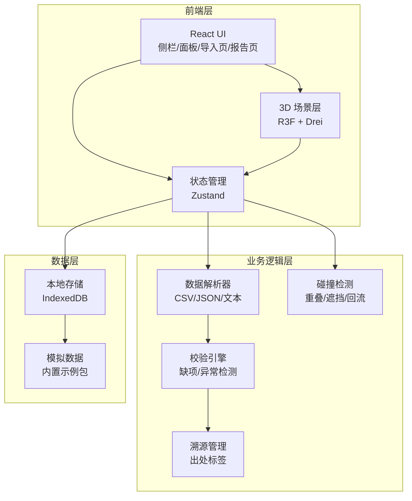
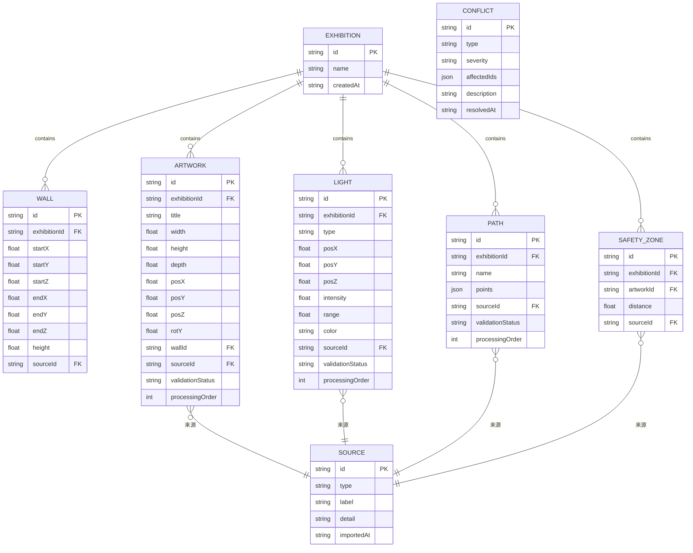

## 1. 架构设计



## 2. 技术说明

- **前端**：React@18 + TypeScript + Tailwind CSS@3 + Vite
- **3D 渲染**：Three.js + @react-three/fiber + @react-three/drei + @react-three/postprocessing
- **状态管理**：Zustand
- **数据解析**：PapaParse（CSV）、原生 JSON.parse、自定义文本正则
- **持久化**：IndexedDB（Dexie.js）
- **导出**：html2canvas + jsPDF（报告）、原生 Blob（JSON）
- **初始化工具**：vite-init
- **后端**：无（纯前端本地工具）

## 3. 路由定义

| 路由 | 用途 |
|------|------|
| `/` | 3D 展厅主页面 |
| `/import` | 数据导入页面 |
| `/report` | 冲突报告与导出页面 |

## 4. API 定义

无后端 API。所有数据在浏览器本地处理。

## 5. 服务器架构图

无后端服务。

## 6. 数据模型

### 6.1 数据模型定义



### 6.2 数据定义语言

```sql
-- 以下为概念模型，实际使用 IndexedDB + Dexie.js 存储

CREATE TABLE exhibition (
  id TEXT PRIMARY KEY,
  name TEXT NOT NULL,
  created_at TEXT NOT NULL
);

CREATE TABLE wall (
  id TEXT PRIMARY KEY,
  exhibition_id TEXT NOT NULL REFERENCES exhibition(id),
  start_x REAL, start_y REAL, start_z REAL,
  end_x REAL, end_y REAL, end_z REAL,
  height REAL NOT NULL,
  source_id TEXT REFERENCES source(id)
);

CREATE TABLE artwork (
  id TEXT PRIMARY KEY,
  exhibition_id TEXT NOT NULL REFERENCES exhibition(id),
  title TEXT,
  width REAL, height REAL, depth REAL,
  pos_x REAL, pos_y REAL, pos_z REAL,
  rot_y REAL DEFAULT 0,
  wall_id TEXT REFERENCES wall(id),
  source_id TEXT REFERENCES source(id),
  validation_status TEXT DEFAULT 'normal',
  processing_order INTEGER
);

CREATE TABLE light (
  id TEXT PRIMARY KEY,
  exhibition_id TEXT NOT NULL REFERENCES exhibition(id),
  type TEXT NOT NULL,
  pos_x REAL, pos_y REAL, pos_z REAL,
  intensity REAL DEFAULT 1,
  range REAL,
  color TEXT DEFAULT '#ffffff',
  source_id TEXT REFERENCES source(id),
  validation_status TEXT DEFAULT 'normal',
  processing_order INTEGER
);

CREATE TABLE path (
  id TEXT PRIMARY KEY,
  exhibition_id TEXT NOT NULL REFERENCES exhibition(id),
  name TEXT,
  points TEXT NOT NULL,
  source_id TEXT REFERENCES source(id),
  validation_status TEXT DEFAULT 'normal',
  processing_order INTEGER
);

CREATE TABLE safety_zone (
  id TEXT PRIMARY KEY,
  exhibition_id TEXT NOT NULL REFERENCES exhibition(id),
  artwork_id TEXT NOT NULL REFERENCES artwork(id),
  distance REAL NOT NULL,
  source_id TEXT REFERENCES source(id)
);

CREATE TABLE source (
  id TEXT PRIMARY KEY,
  type TEXT NOT NULL,
  label TEXT NOT NULL,
  detail TEXT,
  imported_at TEXT NOT NULL
);

CREATE TABLE conflict (
  id TEXT PRIMARY KEY,
  type TEXT NOT NULL,
  severity TEXT NOT NULL,
  affected_ids TEXT NOT NULL,
  description TEXT,
  resolved_at TEXT
);
```
